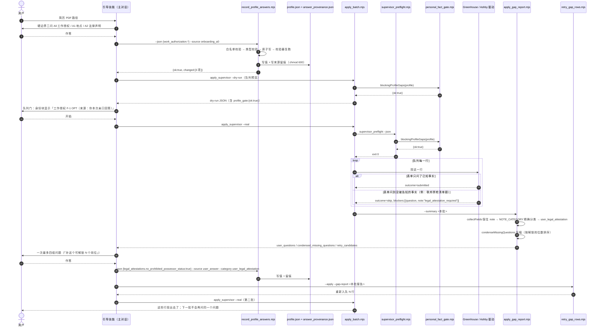
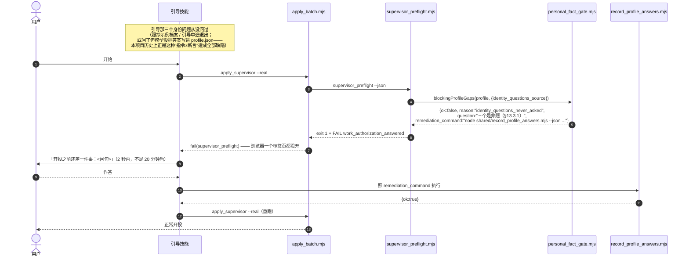
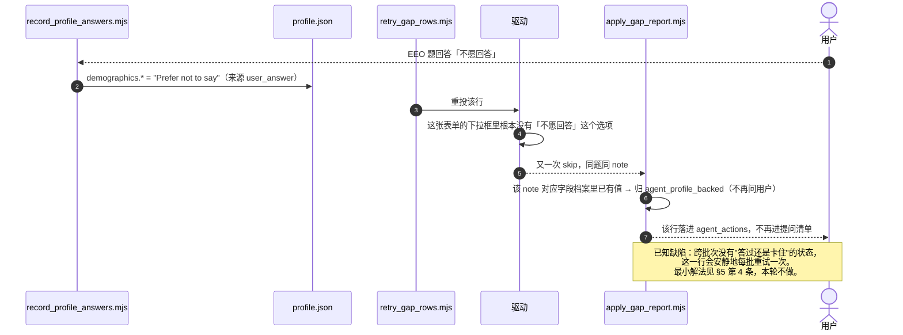
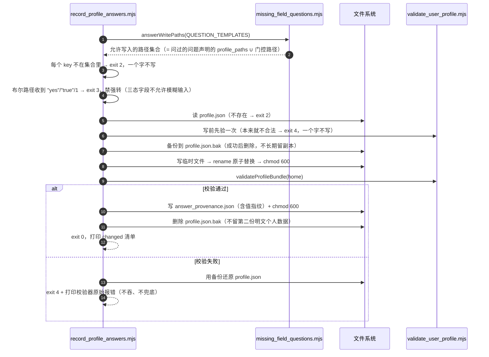
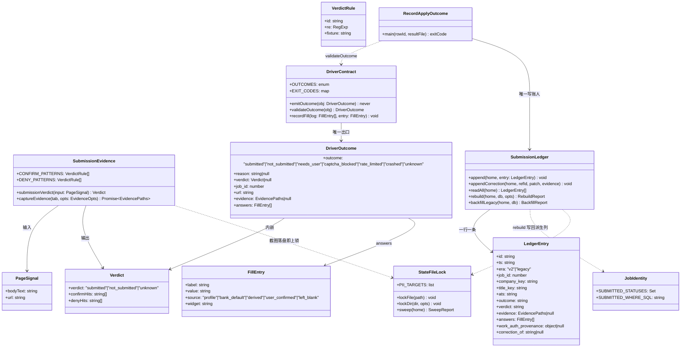
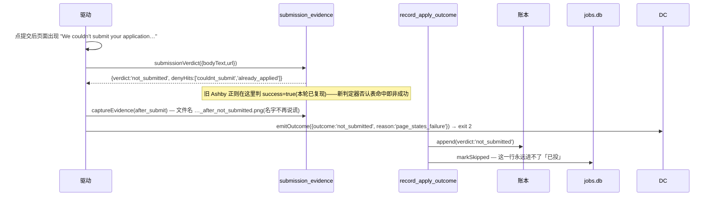
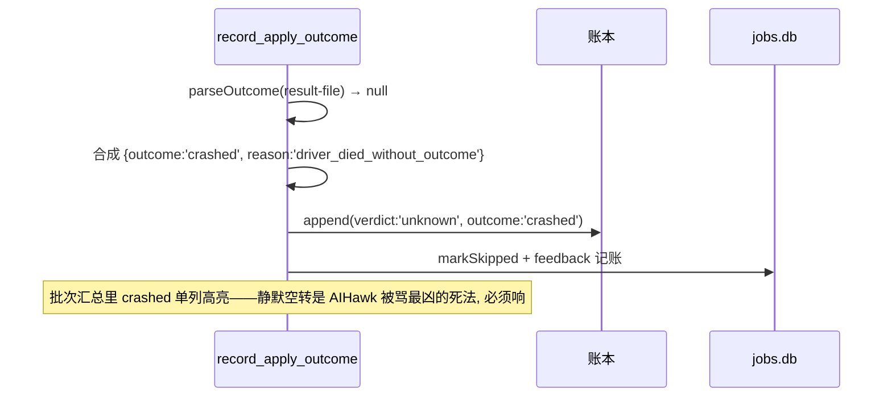

> **本版是可施工定稿（第四版）。** 批次 A 已施工（10 个提交）并经 verify 独立验收；
> 批次 B 的 B0+B1 已提交、领先 `origin/main` 18 个提交、**全部未推送**。
>
> **关卡 8 拍板两件事，本版已落地**：① 那道表单题**一开始就问他一句「你要我怎么办」**
> （采用 pm 的 Q4，我原方案里「真投时碰一次问一次」的分支**已删除，不留备选**）；
> ② 其他情形（既非公民 / 绿卡、也非留学生）**追加 Q5**，而不是让「别替我答」一把覆盖整族。
> 定稿漏斗与真值表见 §13.3.1，**门谓词与 Q4 的接缝**写死在 §13.3.3 末尾，
> builder 的照做清单见 §13.11，提交切分见 §13.12，
> pm 查出的第 19 处编造（签证状态被逐字打给雇主）见 **ADR-12** 与 §13.10。
> **本次修正的起点是关卡 7 拍板人当面纠正的一条设计前提**——
> 「F-1 学生不需要先批下工作许可才能投工作，他是先投完工作之后才会批下工作许可。」
> 这条推翻的是第 13.3 节（工作授权提问设计）的因果方向，连带推翻 ADR-1（提问时机分流决策）的判据结论。
> **改了哪些、依据是什么，逐条列在第 13.1 节的修正清单第 13-16 行**；
> 前提错误的**连坐排查**在第 10.3 节（共查出 15 处）；**新的架构决策记录是 ADR-11（前提纠正）**；
> 迁移代价与验证方案在第 13.9 节。每处正文修改都保留了「原来怎么说 / 为什么错 / 现在怎么说」，
> 因为这份设计以后还要被人读——**尤其是这一次，被推翻的东西刚刚通过了三轮全绿的验收**。

# DESIGN — 被阻塞的问题怎么变成一句问用户的话 + 出厂模板预填的处置

> 边界声明（第 1-2 轮）：**只出设计**，除本文件外没有改动任何文件，没有跑投递，没有读写 `~/.mrweirdo-jobs/`。
>
> 边界声明（第 3-4 轮，2026-07-26 关卡 7 与关卡 8 之后）：仍**只改本文件**、**没写一行实现代码**、没跑真实投递、
> 没开浏览器、没提交表单、没发邮件、没做任何 git 写操作。
> **为了实测那条 80% 判据读了创始人家目录**（三个文件只读，数据库以只读模式打开）——
> **跑前跑后各拍一次 `stat` 快照，841 条目逐行零差异 = 零写入**；
> 共享临时目录 `/tmp/mrweirdo-onboard` 跑前跑后均 169 个文件，未删未改。

---

## 0. 给拍板人（人话版，不需要懂编程）

### 0.1 现在这个死结是什么

把产品想成一家帮你代填表格的代办公司。表格上有一栏「你有没有美国工作授权？」

- **上个月以前**：代办员遇到这一栏，不管你说过没说过，一律替你打勾「有」。这是**说谎**。
- **上两轮修完之后**：代办员学会了「你没告诉过我，我就不填」。这是对的。**但是**——他把这张没填完的表格塞回抽屉，**不告诉你他卡在哪一栏**。你只看到「今天投了 0 家」，不知道为什么。
- **更麻烦的是**：新用户拿到的空白档案里，这一栏被工厂**预先打好了「有」**。所以对大多数新用户来说，代办员根本没机会卡住——他照着那个假勾直接填了。

于是产品现在被夹在两个都不能接受的状态之间：

| 只做一件事 | 结果 |
|---|---|
| 只把工厂预填的假勾清掉 | 代办员天天卡住，**每一行都卡**，而且**从不告诉你卡在哪** → 产品从「说谎」变成「一声不吭什么都不干」 |
| 只教代办员开口问 | 工厂预填的假勾还在，他压根不会卡住，**照样说谎** |

**所以这不是两个 bug，是一件事的两半。必须同一批上线。**

还有一处必须一起说清楚的细节：代办员卡住之后，系统内部有一张分类表决定「这一栏该问用户、还是系统自己能填」。今天这张表把工作授权、性别种族、退伍军人身份**全部归到「系统自己能填」**。所以卡住的行不但不会问你，还会被派回给系统「你自己填」——系统填不出来，再卡住，再派回去。**这是一个不出声的死循环**，也是「卡住但不知道卡在哪」的真正机器。

### 0.2 我的方案：一个新用户会经历什么

方案只有一句话：**关于你本人的事实，工厂一律不预填；能填的只有两个来源——你亲口说的，或者从你简历里读到的。凡是没来源的，要么当场问你，要么这一行不投。**

落成三层：

**第一层：出厂即空白。** 所有「关于你本人」的格子（工作授权、人口统计学、法律声明）出厂全是空的。空 = 没人说过。这是最便宜也最可靠的「区分用户亲口说的 vs 工厂默认」的办法——因为工厂什么都没说。

**第二层：一道门，只拦一件事。**
> **⚠️ 2026-07-26 关卡 7 之后本层已改写，下面是现在的说法**（原说法「工作授权这一格不填就整行投不出去、
> 判据是几乎每一行都投不出去、今天全项目只有这一格够格」**已被实测证伪**，见 §13.3.3 与 ADR-11）。

那道门现在只拦一种情况：**引导那三个身份问题，你一次都没被问过**（比如档案是照抄示例来的）。
这时候停下来问一句是真的有用——问完就有答案。
**只要你被问过，无论答成什么样，都直接放行**：答不上来的那部分不再拦整批，
而是**只停下真的问到那道题的那几行**（实测：约 20 行里停 1 行），其余照投。
**注意这不是「投递前把所有问题都问一遍」**（那条 2026-06 已经拍板不做，也确实会把上手门槛抬到没人愿意用）。

**第三层：其余的，等真实表格问了才问你。** 别的事实（法律声明、居住地、EEO 自愿披露、学历……）继续走现在这条路：真投的时候某张表格问到了 → 那一行停下、一个字都不填 → 批次结束后系统把这一批真实表格问到的问题**压缩合并**成最少的几个问题一次问你 → 你答完自动存进档案 → 自动重投那些行。这条路本来就在（`missing_field_questions.mjs` 那套压缩逻辑真的在跑），本轮只是把「工作授权 / 法律声明 / EEO」这几类**接进这条路**——今天它们被那张分类表挡在门外。

**再加一个收口动作：你答完的东西，用代码写回档案，不再靠 AI 自觉。** 今天的说明书写着「用户答完后更新档案」——那是一句写给 AI 的话，不是代码。本轮新增一个专门的记录命令：只允许写它问过的那几个格子，写完立刻校验，同时记一笔「这个值是谁在什么时候说的」。这样下次就不用再问你（自动复用），出了事也查得到来源。

**新用户的完整体感（改完之后）：**

1. 装好，发一份简历给它。
2. 它问 3 个硬边界问题（工作授权 / 地点 / 法律声明）——**和今天一样，一个都没多问**。
3. 给你看要投的队列，你说「开始」。
4. **如果第 2 步的答案没落进档案（AI 走神了），这里 2 秒内停下来补问一句，而不是让你等 20 分钟再看到 0 投递。**
5. 投完给你一份总结：投出去几家、几家因为缺什么停下了。
6. 它一次问你最多 4 组问题（按「补这个能解锁几个岗位」排序），你答完自动重投。
7. 你答过的东西永久生效，第二批不会再问。

### 0.3 分几批上线，每批的风险

| 批次 | 内容 | 上线后会怎样 | 风险 |
|---|---|---|---|
| **A（必须整批一起上）** | 分类表纠偏 + 答案写回代码 + 开工前那道门 + 清掉工厂预填 | 新用户体感如上；现有唯一用户（你）**逐格零变化**（你的档案 4 个格子都填了，那道门直接放行） | 低。中途任何一个提交点掉链子都不会比今天更糟（见 §11 的提交顺序论证） |
| **B（A 之后，可隔天）** | ① 工作授权改成对号入座的问法（关卡 3 拍板）② 另外 6 处同类编造：居住地、逃犯/管制药物那一组、是否年满 18、学籍、担保话术、学历 ③ 出厂模板再清三处（GPA / 学位 / 最早到岗日）④ 求职信与投递截图**上锁** ⑤ 投递截图不再把失败标成成功、且改成整页拍 | 这些题从「替你说」改成「问你一次」。会**多问 1-2 组问题**；截图从「看着有其实没用」变成真能当证据；同机其他账号不再读得到你的求职信和截图 | 中。**必须在 A 之后**——A 没上就把它们改成阻塞，等于再造一遍今天这个死结 |
| **C（收尾，可拖）** | 删死配置、退伍军人选项排序、国家写死、投递答案留痕（F6） | 用户无感 | 低 |

**没有任何一批会让产品短期变得更不可用**——这一条我在 §11 逐个提交点验证过，不是口号。

**~~两个需要你一句话拍板的~~ → 你已经在关卡 2 拍过板了，两条都不是我给的选项，我按你的改了：**

1. **「你是否年满 18 岁」** —— 你说：**引导时问一次，不默认也不阻塞**。
   我原来只想到「改成停下问」和「保留写死」二选一，你指出还有第三条：顺口问一句就完了，
   答了就有据、没答也别拿它拦人。改法见 §10-C。
2. **「你是否拥有不受限制的工作授权」** —— 你说：**未知就阻塞，问清楚再投**，我的「保留保守答案」被否了。
   你的理由比我的成本账硬：**答错两个方向都伤**——国际生说成「有」是不实陈述，公民说成「没有」会被直接刷。
   我算的只是「多卡几行 vs 多问一句」。改法见 §10-H。

**第三条你在关卡 3 拍的，改动更大**：**工作授权不许再问「你有没有工作授权」**
（你的原话：这没人能知道），改成能对号入座的问法——「你是美国公民或绿卡吗」「你是持 F-1 的留学生吗」。
这条把批次 B 的提问设计整个换了一遍，人话版见下面这段，细节在 §13.3。

**新问法长什么样（你会看到的）**：一次一个是非题，问的都是你查得到、说得出的事，
不出现 CPT / OPT 这类术语，也不要求你判断自己「算不算有授权」——那是法律结论，由代码去推。
如果你真的说不清楚（比如不确定学校批没批工作许可），它**不会瞎猜也不会闷着**，
而是告诉你去哪儿问（学校国际学生办公室、你的 I-20 那一栏、工作许可卡）。

> **⚠️ 2026-07-26 关卡 7 之后改**：原来这里写的是「**这一批先不投**，你查到了一条命令就能续上」。
> 那句话建立在「留学生必须先批下工作许可才能投」这个错误前提上——**你当面纠正了它**
> （「他是先投完工作之后才会批下工作许可」）。现在的说法是：
> **「问到这道题的那几行我停下来留着，其余照投」**——实测约 20 行里停 1 行（§13.3.3）。

**还有一件你可能想知道的**：这一轮复核发现**产品还有一个平台（Lever）从头到尾没被检查过**，
它那边至今对「你是否有在美国工作的授权」无条件答「有」——和我们刚在另外两个平台上修掉的是同一个毛病，
而且你历史上确实有 5 家公司是走这个平台投的。修它的零件都是现成的，工程量小。
**要不要把它一起放进这一批，需要你或 lead 一句话**（§13.6）。

---

## 1. Implementation Approach

### 1.1 需求难点（三条，逐条对应一个设计选择）

**难点一：三态字段已经修好了，但「阻塞」这个信号是个哑弹。**
上两轮把 `authorized_to_work_us` 等字段从真假判断改成显式三分支，缺值返回阻塞（`answer_routing.mjs:184-241`），驱动侧也接线了（Ashby `:546` 走 `pending_for_main_claude`、Greenhouse `:1512` 走 `needs_user_answer`）。信号发出来了，**但没有接收方**：

> **🔧 修正 5（2026-07-26）— 「驱动侧也接线了」这句只对 Greenhouse 成立。**
> - **原来怎么说**：两个平台都已把阻塞信号接到结果里，断的只有报告侧。
> - **为什么错**：Ashby 侧 `ashby_apply_driver.mjs:1142` 组装待答清单时写的是
>   `addPendingQuestion(pending, { question: m, selector, tag })` —— **`a.note` 整个丢掉**。
>   我核实时只读到 `:546` 发出了 note，没有跟到它被写进结果文件的那一步就下了结论。
>   工作授权因为题面正则兜住了、看起来没事，**但 Ashby 的法律声明与居住地 note 永远到不了
>   note 查表**——而批次 B 恰恰依赖它。这是「读代码只读到一半就下结论」的教训。
> - **现在怎么说**：Greenhouse 已接线；**Ashby 未接线，修法与验收写在 §13.5**，
>   属批次 B 的第一件事（同行修复、净增 0）。且施工时另查明 `:1142` 还有第二个洞
>   （只有能定位到文本框的题才进清单，下拉框题连带 note 一起蒸发），一并在 §13.5 处置。

- `apply_gap_report.mjs:91` 收集阻塞项时写的是 `push(b.question || b, 'blocker')`。`b` 是 `{question, note, detail}`，取了 `b.question`（字符串）之后，**`note` 被整个丢掉**（`push` 只在收到对象时读 `note`，见 `:86`）。驱动辛辛苦苦标注的 `work_authorization_required` 到这里就没了。
- 就算 note 侥幸留下来，`classifyField` `:137` 那条超长正则会把 `legally authorized|authorized to work|gender|race|veteran|disability` 判成 `agent_profile_backed`（系统按档案自动填），于是这些行落进 `agent_actions`，动作文案是 `Do not ask the user first. Fill from existing profile`（`:368`）——**系统被告知"你自己从档案里填"，而档案里恰恰没有**。下一轮重试再卡住，再被派回来。**这是一个不发声的死循环，也是「卡住但不知道卡在哪」的真正机器。**

所以 F5 不是「改一条正则」，是**修一条从驱动到提问的信号通路**，三段都要通：note 保住 → 按 note 精确分类 → 分类进得了 `user_*` 与 `RETRYABLE_CATEGORIES`。

**难点二：「什么时候问」不能一刀切。**
本项目有两条互相拉扯的既有约束：

- 已实现且带覆盖校验的设计：问题集从**真实岗位表单反推 + 压缩**（`missing_field_questions.mjs:137-181`，`condenseMissingQuestions` 带 coverage invariant 断言）。
- 2026-06 拍板：**不做投递前探测**。

一刀切「投递前问完」→ 违反拍板、且把上手门槛从 3 个问题抬到 20 个，直接打击「有人用」这个第一判据。

> **⚠️ 2026-07-26 关卡 7 之后改**：这里原来还有一句「一刀切『全部投递后问』→ 工作授权这一格会让第一批
> **100% 空跑**」。**实测证伪：5.6%，不是 100%**（72 个真实投递、263 条真实题面，用出货驱动跑出来的，
> 见 §13.3.3）。那句话是本轮被推翻的因果的一个副本。

**取舍论证（选中的方案，判据已于 2026-07-26 补齐第二个必要条件）**：
> **① 某个事实缺失会阻塞的行占比 ≥ 80%，并且 ② 这个事实用户一句话答得出（可获得性）
> ⇒ 才前置一道门；任一条不满足 → 一律走投递后压缩提问。**
> 第 ② 条是关卡 7 之后补的：只满足 ①、不满足 ② 的门不是门，是墙——用户答不出来就永远过不去（ADR-11）。

按补齐后的判据过一遍今天的全部个人事实字段：**没有任何一格够格**，工作授权也不够格
（实测阻塞面 5.6%，且对「还没批下许可的留学生」这个常态用户**不可获得**）。
法律声明、居住地、EEO、学历本来就只阻塞一部分行 → 全部走投递后。
**判据不违反「不做投递前探测」这一点没变**：它不探测任何表单。
那道门的代码保留，但谓词换成「引导那三个问题问过没问过」（§13.3.3）——
它检查的是**引导完成度**，不是工作授权本身。

**难点三：所有缺陷的共同根因是「代码分不出用户亲口说的和出厂默认」，而最贵的解法未必是最好的。**
理论上最彻底的解法是给每个字段包一层 `{value, source}`。实测代价：全仓库 40+ 处读点要改，其中两个驱动文件已超行数上限、**净增必须为 0**（`.claude/file_size_limits.json`，BUILD §15 方向 1 记录过 hook 是按单次编辑前后比的，"先减后加"都不成立）。做不到，也不该做。

选中的是**两层**：
- **第一层（免费且可靠）：出厂一律 null。** 非 null ⇒ 一定有人说过。这已经是 `legal_attestations` 的既有体例（`profile.template.json:47-52` 自带 `_notes`），上一轮 `demographics` 也照这个体例改完了（`:54-61`）。工作授权只是补上第三块。
- **第二层（增量、只读用途）：`answer_provenance.json` 旁挂文件**，记录每个个人事实的来源（用户亲口 / 引导 A0 / 引导 A2 / 简历推断 / 历史遗留未核实）+ 值指纹 + 时间。**明确不参与填表判断**（填表只看三态值就够了）——理由见 ADR-4。

### 1.2 方案总览：一条信号通路 + 一道门 + 一个写回口

```
出厂空白 ──► 引导 A0/A2 ──► [记录命令] ──► profile.json ──┐
                                       + provenance      │
                                                          ▼
                       ┌──────  [开工前那道门：只查「引导那三个身份问题问过没问过」]
                       │  从没问过 → 2 秒停下 + 三个是非题 + 一条可直接执行的记录命令
                       │  问过了（无论答成什么样）→ 放行，缺的格子改由下面按行阻塞处理
                       ▼
                   真实投递 ──► 驱动遇到没被告知的事实 ──► 整行阻塞，一个字不填
                                                          │ blockers:[{question, note}]
                                                          ▼
                                          [缺口报告：按 note 精确分类 → user_*]
                                                          │
                                                          ▼
                                        [压缩成最少的几组问题（既有机制）]
                                                          │
                                                          ▼
                                    用户回答 ──► [记录命令：白名单校验 + 写回 + 留痕]
                                                          │
                                                          ▼
                                             [重投那些行（既有机制）]
```

其中 **既有、不改**：压缩提问（`condenseMissingQuestions`）、重投（`retry_gap_rows.mjs`）、驱动侧阻塞（上两轮已完成）。
**新增**：`personal_fact_gate.mjs`（那道门的纯判定）、`record_profile_answers.mjs`（写回口）、`answer_provenance.mjs`（留痕读写）。
**改造**：`apply_gap_report.mjs`（信号通路三段）、`missing_field_questions.mjs`（问题模板搬家 + 新增类目 + 导出写入白名单）、`supervisor_preflight.mjs` / `apply_batch.mjs`（挂门）、`profile.template.json`（清预填）。

### 1.3 一个必须点名的实现陷阱（不写清楚 builder 一定会踩）

`classifyField` 里现有的 `note` 变量是 `field.note || outcome.reason`（`:110`）——**行级 reason 会冒充字段级 note**。而 `classifyUnsubmitted()`（`greenhouse_apply_driver.mjs:1761-1775`）返回的行级 reason 里，`profile_full_address_required` / `company_relationship_answer_required` / `legal_attestation_required` 这几个字符串**恰好和字段级 note 同名**。

所以新增的 note→类目查表**必须只读 `field.note`，绝不能读那个带 reason 兜底的变量**。否则一行因为法律声明被拦，同一行里的「你的 GPA 是多少」也会被打上「法律声明」标签，问出一句驴唇不对马嘴的话——看起来像修好了，行为是错的。

### 1.4 一个必须遵守的硬约束（上一轮真红过）

`.claude/skills/mrweirdo-onboard/SKILL.md` 现在 **495 行，CI 门禁上限 500**（`scripts/public_alpha_gate.mjs:121`）。本设计要求 SKILL.md 的净增 **≤ 4 行**，所有新增说明文字落到 `references/` 两个文件里（不受门禁）。两个驱动文件净增必须 = 0。

---

## 2. File List

### 批次 A（必须整批一起上线）

| 文件 | 新建/修改 | 行数影响 | 干什么 |
|---|---|---:|---|
| `shared/missing_field_questions.mjs` | 修改 | 181 → ~265 | `QUESTION_TEMPLATES` 从 `apply_gap_report.mjs` 搬进来（成为唯一真相源）+ 新增 3 个类目模板 + 导出 `answerWritePaths()` 写入白名单 |
| `shared/apply_gap_report.mjs` | 修改 | 533 → **564（实测）** | 模板搬走（-68）；`collectFields` 保住 note；新增 note→类目查表 + **「该类目是否已答」谓词**（见 §3.2 修正）；把个人事实从超长正则里摘出来改成「档案有值才算系统能填」；补 `RETRYABLE_CATEGORIES` 与 `onboarding_candidates` 名单 |
| `shared/personal_fact_gate.mjs` | **新建** | ~75 | 纯函数：`blockingProfileGaps(profile)` —— 那道门的判定 + 人话问句 + 可直接执行的记录命令 |
| `shared/answer_provenance.mjs` | **新建** | ~95 | 纯 + IO：来源留痕的读 / 写 / 指纹 / 一次性回填 |
| `shared/record_profile_answers.mjs` | **新建** | ~155 | CLI：白名单校验 → 类型校验 → 原子写 profile.json → 写留痕 → 重跑校验器，任一步失败整体回滚 |
| `shared/supervisor_preflight.mjs` | 修改 | 246 → ~253 | `checks` 数组加一项 `work_authorization_answered`（硬失败 ⇒ 真实批次拒绝开工） |
| `shared/apply_batch.mjs` | 修改 | 427 → ~434 | dry-run 路径也算一次门（只算不拦），把问句放进 dry-run 输出，让队列门在用户说「开始」**之前**就能看见 |
| `shared/profile.template.json` | 修改 | 131 → ~134 | `work_authorization` 三个布尔 → `null`、`visa_status` → `""`，加 `_notes`（与 `legal_attestations` / `demographics` 同体例） |
| `scripts/secure_profile_files.sh` | 修改 | 10 → ~16 | 新增一个「存在才 chmod」的可选清单，收 `answer_provenance.json` |
| `.claude/skills/mrweirdo-onboard/SKILL.md` | 修改 | 495 → **≤ 499** | Step 5 队列门的身份块加「来源」；Step 6 把「更新档案」改成调记录命令。**每处只许一行** |
| `.claude/skills/mrweirdo-onboard/references/run-and-database.md` | 修改 | +~35 | 记录命令用法、门被拦时的处置、重投流程 |
| `.claude/skills/mrweirdo-onboard/references/intake-and-profile.md` | 修改 | +~15 | A0/A2 答案必须经记录命令落盘，不许直接手写 JSON |
| `test/apply_gap_report.test.mjs` | 修改 | +~90 / 改 1 条断言 | 见 §12.4（**改断言需要显式授权，理由已写明**） |
| `test/personal_facts_guard.test.mjs` | 修改 | +~25 | 模板三个工作授权布尔必须为 null（防 I 项回潮） |
| `test/personal_fact_gate.test.mjs` | **新建** | ~90 | 门的三态 + 现有真实用户档案形状必须放行 |
| `test/record_profile_answers.test.mjs` | **新建** | ~140 | 白名单拒写、类型拒写、校验失败回滚、幂等、留痕正确 |
| `test/missing_info_loop.test.mjs` | **新建** | ~120 | **闭环证明**：阻塞结果 → 缺口报告 → 按模板写回 → 重跑报告 → 问题清单变空 |
| `CHANGELOG.md` | 修改 | +~8 | 登记表要求 |

批次 A 合计：新建 5 个源文件 + 3 个测试文件，修改 10 个文件。**没有任何文件触碰行数上限。**

> **修正（2026-07-26，依据施工实测 + 验收复核）**：`apply_gap_report.mjs` 我原估「533 → 约 500」
> （模板搬走 -67，新增约 34）。**为什么错**：低估了 note 查表 + 已答谓词 + 说明性注释的体量，
> 而且「模板搬走」并不能自动折抵新增。**实际是 533 → 564**（施工记录里写的 570 是工作副本上的
> 中间数，验收在提交树上按 `wc -l` 复核为 564，以 564 为准）。距 800 行上限仍有 236 行余量，
> **结论不变：无行数风险**。教训记在这里：行数预估只在「离上限还很远」时可以粗估，
> 一旦某文件逼近上限，估算必须换成先写后量。

### 批次 B（A 之后）— 2026-07-26 按拍板与实测重排

> 分成四个子包，**顺序即依赖顺序**。B0 是新加的前置（不先做它，B2 的法律声明与居住地在 Ashby 侧根本传不出来）。
> 详细设计见 §13.3 - §13.6。

| 子包 | 文件 | 行数影响 | 干什么 |
|---|---|---|---|
| **B0 接线** | `shared/ashby_apply_driver.mjs` | 1170 → **≤ 1170（净增 0，硬约束）** | `:1142` 保住 `a.note`；无文本框的阻塞题也要能出得来（§13.5） |
| **B1 问法** | `shared/missing_field_questions.mjs` | 372 → ~420 | 工作授权问句改「对号入座」式（关卡 3 拍板）+ 新增 `user_education_credentials` 类目（§13.3） |
| B1 | `shared/work_auth_identity.mjs` | **新建** ~110 | 身份答案 → 三个布尔的纯函数映射表 + 「说不清楚」的处置（§13.3） |
| B1 | `.claude/skills/mrweirdo-onboard/references/intake-and-profile.md` | +~30 | A0 改成两问对号入座、A2 加半句年满 18；删掉与本设计矛盾的那段「留 null 让门去问」 |
| B1 | `shared/personal_fact_gate.mjs` | 76 → ~95 | 门被拦时输出「去哪里查清楚」的指引 + 同一批不重复问 |
| **B1′ 前提纠正 + 定稿漏斗**（关卡 7 / 关卡 8 后新增，**在已提交的 B1 之上叠加**，见 §13.9 与 §13.12） | `shared/work_auth_identity.mjs` | 182 → ~250 | Q3 换问法换选项、删掉 CPT / EAD 术语；**新增 Q4 / Q5 与 `form_answer_policy` 枚举**；「说不清楚」补写 `requires_sponsorship_future: true`；`other_status` 接 Q5；`BLOCKED_BECAUSE` / `WHAT_HAPPENS_NEXT` 两句文案改成「其余照投」；`visa_status` 收敛成枚举 + 原话另存 `_user_words` |
| B1′ | `shared/apply_gap_report.mjs` | 564 → ~575 | 新 note `work_authorization_deferred_by_user` → 新类目 `user_work_authorization_self_serve`（照抄外部表单类目的体例） |
| **B1″ 第 19 处编造**（ADR-12，可与 B1′ 分两轮派，见 §13.10） | `shared/answer_templates.mjs` | 55 → ~60 | `authSummary()` 不读 `visa_status`；`requires_sponsorship_future` 三态三分支 |
| B1″ | `shared/answer_bank.json` | −1 处 | 「你什么时候能到岗」那条模板删掉 `{{WORK_AUTH_SUMMARY}}`（**唯一一处现有真实用户可见的输出变化**） |
| B1″ | `shared/greenhouse_apply_driver.mjs` | 1914 → **≤ 1914（净增 0 硬约束）** | 删掉三处对 `visa_status` 的正则推断（`:589-594` / `:711-713` / `:722-723`），改三态读 + 读不出即阻塞。删正则应为净减 |
| B1″ | `shared/answer_buckets.mjs` | +~8 | `authorizedWithoutSponsorship` 同上改三态 |
| B1″ | `test/personal_facts_guard.test.mjs` | +~30 | `visa_status` / `_user_words` 读点白名单守卫（新增读点 = 测试红） |
| B1′ | `shared/personal_fact_gate.mjs` | 126 → ~140 | **谓词从「值在不在」换成「三个身份问题问过没问过」**（读来源留痕）；顶部那段 80% 注释按实测重写 |
| B1′ | `shared/supervisor_preflight.mjs` | — | 检查项语义改成引导完成度；`:168-175` 那段「二十行全卡」的注释按实测（20 行里约 1 行）重写 |
| B1′ | `shared/missing_field_questions.mjs` | — | 门问句里「几乎每一份投递表单都会卡住」「这一批先不投」两句改掉 |
| B1′ | `.claude/skills/mrweirdo-onboard/references/intake-and-profile.md` | −~10 | 删掉「The batch cannot start with them unanswered」整段与三件套里的「这一批先不投」 |
| B1′ | `test/work_auth_identity.test.mjs` / `test/personal_fact_gate.test.mjs` | +~40 | 真值表 20 格改 24 格（新增「一次都没问过」一行）；门的新谓词先红后绿；**新增一条钉住实测的回归**：给定「留学生 + 还没批」的档案，门必须放行 |
| **B2 判定** | `shared/greenhouse_value_rules.mjs` | 210 → ~285 | 接收从驱动搬出来的判定：禁枪清单（D）、居住地三态（B）、学籍三态（F）、年满 18（C）、无限制授权（H） |
| B2 | `shared/greenhouse_apply_driver.mjs` | 1914 → **≤ 1914（净增 0）** | 只留委托调用。D 项 10 条分支合并成 1 条 ⇒ 净减，腾出额度给 B/F/C/H |
| B2 | `shared/answer_templates.mjs` | 55 → ~59 | G 项：担保话术三态，没问过就不写那半句（**不阻塞**，理由见 §10-G） |
| B2 | `shared/profile.template.json` | +~6 | M/N/O 三处出厂值清空（GPA / 学位 / 最早到岗日）+ `_notes` 说明 |
| B2 | `shared/lever_apply_driver.mjs` | 489 → ~530 | **S 项：Lever 从未被扫过**（§13.6）。委托既有 `deriveWorkAuthAnswers()` / `workAuthGapFor()`；学籍 / 年满 18 / 亲属题同批处置。**需 lead 拍板是否纳入本批** |
| **B3 留证与上锁** | `shared/submission_evidence.mjs` | **新建** ~150 | 投递留证：先读页面文案定判定，再按判定命名，整页截图（§13.7） |
| B3 | `shared/state_file_lock.mjs` | **新建** ~70 | 写入侧统一上锁 + 一次性扫描补锁（§13.4） |
| B3 | `shared/cdp.mjs` | 378 → ~395 | `screenshot` 加整页开关；落盘即 `chmod 600`（所有截图的唯一收口） |
| B3 | `shared/cover_letter_materials.mjs` | 363 → ~370 | 求职信 HTML / PDF 落盘即上锁，目录 700 |
| B3 | `shared/supervisor_preflight.mjs` | 260 → ~270 | 每次真实批次开工前扫一遍补锁（覆盖用户手放的 `cover_letter.pdf`） |
| B3 | `scripts/secure_profile_files.sh` | 29 → ~33 | 改成调用同一个上锁模块，不再自己维护第二份清单 |
| B3 | 8 个 `-auto` 技能说明书的截图段 | 各 −1 / +1 行 | 把「模型拼文件名」换成「调 `submission_evidence.mjs`」（§13.7） |
| **测试** | `test/greenhouse_value_rules.test.mjs` / 新建 `test/work_auth_identity.test.mjs` / `test/prohibited_possessor.test.mjs` / `test/lever_driver.test.mjs` / `test/submission_evidence.test.mjs` / `test/state_file_lock.test.mjs` | +~450 | 每条新判定的三态全分支 + 身份映射真值表 + 留证判定的三种页面 + 上锁的权限位断言 |
| 测试 | `test/personal_facts_guard.test.mjs` | +~40 | **出厂默认值反向白名单守卫**（§10.2 那条固化扫法的机器动作） |

### 批次 C（收尾）

`shared/answer_bank.json`（删死键）、两个驱动的内置兜底 bank、`greenhouse_apply_driver.mjs:1640-1641`（退伍军人候选序）、`:1594`（国家）、`:1632`（全职意向）、`test/json_shapes.test.mjs`、F6 投递答案留痕（另出设计）、`missing_field_questions.mjs` 第 18 / 32 行两条中文问句里的被弃用旧叫法顺手改掉。

---

## 3. 数据结构与接口

```mermaid
classDiagram
    class ProfileJson {
        <<file ~/.mrweirdo-jobs/profile.json>>
        +personal: PersonalBlock
        +education: EducationBlock
        +work_authorization: WorkAuthorizationBlock
        +legal_attestations: LegalAttestationsBlock
        +demographics: DemographicsBlock
        +standard_qa: object
    }

    class WorkAuthorizationBlock {
        <<three-state 三态：true / false / null=没问过>>
        +visa_status: string
        +authorized_to_work_us: boolean|null
        +requires_sponsorship_now: boolean|null
        +requires_sponsorship_future: boolean|null
    }

    class LegalAttestationsBlock {
        +conflicting_obligations: boolean|null
        +no_prohibited_possessor_status: boolean|null
        +relatives_in_federal_government_or_contractors: boolean|null
        +at_least_18: boolean|null
    }

    class DemographicsBlock {
        +race: string|null
        +hispanic_or_latino: string|null
        +gender: string|null
        +veteran_status: string|null
        +disability_status: string|null
    }

    class AnswerProvenanceJson {
        <<file ~/.mrweirdo-jobs/answer_provenance.json, chmod 600>>
        +version: number
        +entries: Map~string, ProvenanceEntry~
    }

    class ProvenanceEntry {
        +source: ProvenanceSource
        +value_fingerprint: string
        +recorded_at: string
        +asked_by: string|null
        +category: string|null
    }

    class ProvenanceSource {
        <<enumeration>>
        user_answer
        onboarding_a0
        onboarding_a2
        resume_inferred
        legacy_unverified
    }

    class AnswerProvenanceModule {
        <<module shared/answer_provenance.mjs · 纯函数 + 单点 IO>>
        +fingerprint(value: any) string
        +readProvenance(home: string) AnswerProvenanceJson
        +recordEntries(home: string, changes: Change[], meta: RecordMeta) AnswerProvenanceJson
        +sourceFor(home: string, path: string, currentValue: any) ProvenanceSource|"unknown"
        +backfillLegacy(home: string, profile: ProfileJson) number
    }

    class PersonalFactGate {
        <<module shared/personal_fact_gate.mjs · 纯函数、零 IO>>
        +GATED_PATHS: string[]
        +blockingProfileGaps(profile: ProfileJson) GateResult
    }

    class GateResult {
        +ok: boolean
        +missing_paths: string[]
        +category: string
        +question: string
        +remediation_command: string
    }

    class MissingFieldQuestions {
        <<module shared/missing_field_questions.mjs · 纯函数>>
        +QUESTION_TEMPLATES: Map~string, QuestionTemplate~
        +QUESTION_GROUPS: QuestionGroup[]
        +answerWritePaths(templates) Map~string, string[]~
        +isUserFillableCategory(category: string, templates) boolean
        +validateQuestionGroups(groups, templates) void
        +buildMissingFieldRanking(entries: GapEntry[], templates) RankItem[]
        +condenseMissingQuestions(entries: GapEntry[], templates, groups) CondensedItem[]
    }

    class QuestionTemplate {
        +priority: number
        +profile_paths: string[]
        +question: string
        +answer_type: string
        +value_type: "boolean"|"string"|"enum"
        +enum_values: string[]|null
    }

    class ApplyGapReport {
        <<CLI shared/apply_gap_report.mjs>>
        +NOTE_CATEGORY: Map~string, string~
        +RETRYABLE_CATEGORIES: Set~string~
        +collectFields(outcome: DriverOutcome) GapField[]
        +classifyField(field: GapField, outcome: DriverOutcome) string
    }

    class GapField {
        +label: string
        +source: string
        +note: string|null
        +options: string[]|null
    }

    class DriverOutcome {
        <<JSONL 每行一条，驱动 stdout>>
        +outcome: string
        +reason: string
        +blockers: Blocker[]
        +missing: string[]
        +job_id: number
    }

    class Blocker {
        +question: string
        +note: string
        +detail: object|null
    }

    class RecordProfileAnswers {
        <<CLI shared/record_profile_answers.mjs>>
        +parseArgs(argv: string[]) RecordOptions
        +validateAnswers(answers, writePaths) ValidationResult
        +applyAnswers(profile: ProfileJson, answers) Change[]
        +main(argv: string[]) number
    }

    class Change {
        +path: string
        +from: any
        +to: any
    }

    ProfileJson *-- WorkAuthorizationBlock
    ProfileJson *-- LegalAttestationsBlock
    ProfileJson *-- DemographicsBlock
    AnswerProvenanceJson *-- ProvenanceEntry
    ProvenanceEntry --> ProvenanceSource
    AnswerProvenanceModule ..> AnswerProvenanceJson : 读写
    PersonalFactGate ..> ProfileJson : 只读
    PersonalFactGate --> GateResult : 返回
    MissingFieldQuestions *-- QuestionTemplate
    ApplyGapReport ..> MissingFieldQuestions : import 模板 + 压缩
    ApplyGapReport --> GapField : collectFields 产出
    ApplyGapReport ..> DriverOutcome : 解析
    DriverOutcome *-- Blocker
    RecordProfileAnswers ..> MissingFieldQuestions : answerWritePaths 白名单
    RecordProfileAnswers ..> ProfileJson : 原子写
    RecordProfileAnswers ..> AnswerProvenanceModule : 记来源
    RecordProfileAnswers --> Change : 返回
```



> 说明：本项目全部是 ESM 纯函数模块，没有 class、没有构造器。上图的 `<<module>>` 框把模块当类画，方法签名 = 导出的函数签名，**类型注解就是 builder 要写进 JSDoc 的那份**。

### 3.1 三个新模块的精确契约

```js
// shared/personal_fact_gate.mjs —— 纯函数，零 IO，可单测
export const GATED_PATHS = [
  'work_authorization.authorized_to_work_us',
  'work_authorization.requires_sponsorship_future',
];

/**
 * @param {object} profile  ~/.mrweirdo-jobs/profile.json 已解析对象
 * @returns {{ok: boolean, missing_paths: string[], category: string,
 *            question: string, remediation_command: string}}
 * ok=false 当且仅当 GATED_PATHS 里任一格既不是 true 也不是 false。
 * 只认 boolean：字符串 "true" / "Yes" 一律视为未回答（Fail Fast，禁强转）。
 */
export function blockingProfileGaps(profile = {}) { /* ... */ }
```

```js
// shared/answer_provenance.mjs
export function fingerprint(value)                  // sha256(JSON.stringify(value)).slice(0,16)
export function readProvenance(home)                // 缺文件 → {version:1, entries:{}}
export function recordEntries(home, changes, meta)  // meta: {source, asked_by, category}
export function sourceFor(home, path, currentValue) // 指纹对不上 → 'unknown'（陈旧留痕不撒谎）
export function backfillLegacy(home, profile)       // 一次性：有值但无留痕 → legacy_unverified
```

```js
// shared/record_profile_answers.mjs  CLI
// node shared/record_profile_answers.mjs \
//   --json '{"work_authorization.authorized_to_work_us": true,
//            "work_authorization.requires_sponsorship_future": true,
//            "work_authorization.visa_status": "F-1 OPT"}' \
//   --source user_answer --category user_work_authorization --asked-by queue_gate [--dry-run]
//
// 退出码：0 成功 / 2 参数或白名单违规 / 3 类型违规 / 4 写后校验失败（已回滚）
// stdout：{ok, changed:[{path,from,to}], skipped:[], provenance_written:N, validation:{ok,issues}}
```

### 3.2 缺口报告新增的两张表（数据，不是代码逻辑）

> **🔧 修正 1（2026-07-26）— 本文件曾经自相矛盾，照字面实现会出静默缺陷。**
>
> - **原来怎么说**：本节把 note→类目写成一张**无条件查表**——「命中即返回该类目」；
>   而 §4.3（失败路 2）描述的正确行为是「该 note 对应字段档案里已有值 → 归 `agent_profile_backed`，
>   不再问用户」。**同一份设计的两处互相打架**，builder 按哪一处写都能自圆其说。
> - **为什么错**：结果文件（`apply-result-*.jsonl`）在用户答完之后**会被重读**（重投前后各跑一次
>   缺口报告，`retry_gap_rows.mjs` 的输入就是它）。note 记录的是**驱动当时**为什么停下，
>   不是**现在**还缺不缺。无条件查表 ⇒ 用户答完、档案已经有值了，同一个问题**每一批都会再问一遍**，
>   永远问下去。闭环测试（`missing_info_loop.test.mjs`：写回后重跑报告，问题清单必须变空）当场抓到。
> - **现在怎么说**：**查表命中之后必须再过一道「这个类目档案里已经有答案了吗」的谓词**
>   （实现为 `CATEGORY_ANSWERED`，每个类目一条，与同类目的题面路径规则镜像）。
>   已答 → `agent_profile_backed`（系统按档案填，不再问）；未答 → 返回该 `user_*` 类目。
>   **判定的最终发言权归档案，不归 note。** note 只负责「问哪一件事」，档案负责「还问不问」。
>   没有这道谓词，本设计的闭环闭不上——这不是优化，是必需条件。
>
> 所以下表要读成：**note → 类目候选**，最终归属 = `CATEGORY_ANSWERED[类目]() ? agent_profile_backed : 类目`。
> 新增任何一个 note 映射时，**必须同时给它的类目补一条 `CATEGORY_ANSWERED` 条目**；
> 没有条目的类目一律按「未答」处理（宁可多问一次，不可替用户认定已答）。

**note → 类目候选（只查 `field.note`，绝不查带 reason 兜底的变量，理由见 §1.3）**

| 驱动发出的 note | 归到哪一类 | 今天归到哪（错在哪） |
|---|---|---|
| `work_authorization_required` | `user_work_authorization` | note 被丢 → 题面命中超长正则 → `agent_profile_backed`（系统自填，填不出来） |
| `sponsorship_future_required` | `user_work_authorization` | 同上 |
| `legal_attestation_required` | `user_legal_attestation` | `unknown_user_fact`（问得出来，但问句是万能句，用户看不懂在问什么） |
| `current_residence_required` | `user_full_address` | 落 `unknown_user_fact` |
| `profile_full_address_required` | `user_full_address` | 已正确（保持） |
| `specific_city_fact_unconfirmed` | `user_logistics_fact` | 已正确（保持） |
| `external_form_completion_required` | `user_external_form_completion` | 走题面正则，间接正确 |
| `export_control_answer_required` | `user_legal_attestation` | `unknown_user_fact` |
| `contractual_obligations_answer_required` | `user_compliance_relationship_or_restriction` | 走题面正则 |
| `company_relationship_answer_required` | `user_compliance_relationship_or_restriction` | 走题面正则 |
| `government_related_relative_answer_required` | `user_government_relative_compliance` | 走题面正则 |
| `english_fluency_answer_required` / `language_proficiency_not_in_profile` | `user_language_or_skill_level` | 走题面正则 |
| `availability_commitment_answer_required` / `part_time_availability_answer_required` | `user_earliest_start_date` | 走题面正则 |
| `location_not_in_profile_preferences` | `user_work_location_commitment` | 走题面正则 |
| 表里没有的 note | **不处理**，继续走原有题面正则 | —— |

**新增 3 个问题类目（模板）**

| 类目 | priority | profile_paths | 问句要点 | value_type |
|---|---:|---|---|---|
| `user_work_authorization` | **0.5** | `work_authorization.visa_status` / `.authorized_to_work_us` / `.requires_sponsorship_now` / `.requires_sponsorship_future` | **问法按关卡 3 拍板重做成「对号入座」式，见 §13.3**；三个布尔由身份答案推导，不再让用户自己判断「我算不算有工作授权」 | 每条路径各自的真实类型（三个布尔 + `visa_status` 是字符串） |
| `user_legal_attestation` | **5.5** | `legal_attestations.no_prohibited_possessor_status`（批次 B 加 `.at_least_18`） | 一句话说明这是联邦表格的固定一组题，一次确认覆盖全组；**「No 或不确定 = 我跳过问到这组题的岗位，不替你回答」**——这句出口是本设计里唯一做对了的一处，工作授权那组要照抄它（§13.3） | boolean |
| `user_demographics_eeo` | 15 | `demographics.race` / `.hispanic_or_latino` / `.gender` / `.veteran_status` / `.disability_status` | **必须写明自愿**：默认「不愿回答」，只有你主动说才填；这张表格没有「不愿回答」选项时你可以让我跳过这个岗位 | string |

> **🔧 修正 2（2026-07-26）— priority 不许取 0。**
> - **原来怎么说**：§12.1（给 builder 的改法）写「直接给新类目取 0 / 5.5 / 15」。
> - **为什么错**：`categoryPriority()` 的写法是 `templates[category]?.priority || 99`。**0 是假值**，
>   会被 `|| 99` 吃掉，于是「最该先问的那一格」排到全部问题的**最后**——排序反而垫底，
>   而 Step 6（引导第 6 步）每批只问四组，等于永远问不到。这是一个「看起来实现了、行为正好相反」的缺陷，
>   施工时靠实算排序才发现。
> - **现在怎么说**：`user_work_authorization` 取 **0.5**（比既有最小值 1 小、且是真值）；
>   `user_legal_attestation` 取 5.5（插在既有 5 与 6 之间，不动任何既有条目）。
>   **通用规则：本项目的 priority 永远不许取 0**，除非先把 `|| 99` 改成 `??`（本轮不改，
>   改它会影响所有既有类目的排序，收益为零）。

> **🔧 修正 3（2026-07-26）— `value_type` 不是每条路径都是字符串。**
> - **原来怎么说**：§12.1（给 builder 的改法）写「既有模板一律补 `value_type: 'string'`（现状就是字符串）」。
> - **为什么错**：**现状不是字符串**。`legal_attestations.conflicting_obligations` 与
>   `.relatives_in_federal_government_or_contractors` 是 boolean；`standard_qa` 下的
>   `language_proficiency` / `location_logistics` / `company_relationships` /
>   `work_location_commitments` / `external_form_confirmations` 五处是 object。照字面写，
>   写回口的类型校验会对**一半类目**判 exit 3 / exit 4，用户答完写不进去——同样是「看起来做了、
>   实际闭不上环」。
> - **现在怎么说**：模板的 `value_type` 记该类目**多数路径**的类型，另加一个
>   `path_value_types: { <路径>: <类型> }` 覆盖表记录例外（如 `user_work_authorization`
>   的 `visa_status` 是 string、其余三条是 boolean）。写回口按「先查覆盖表、再退回 `value_type`」
>   取类型。**新增任何模板时，作者必须逐条路径核对档案里的真实类型，禁止照抄一个默认值。**

**为什么 EEO 的 priority 给到 15**：它排在所有实质性缺口之后，Step 6「最多问四组」的额度先给能解锁岗位的问题。它只在**表单没有「不愿回答」选项、驱动真的填不进去**时才会冒出来——那时候它确实是一个用户决策（自己选一个 / 跳过这个岗位），系统无权代答。

**为什么不需要动 `QUESTION_GROUPS`**：`validateQuestionGroups()` 只校验已声明的分组；新类目走 `condenseMissingQuestions` 的 singleton 分支（`missing_field_questions.mjs:160-172`）自动成为独立问题。工作授权本来就该独立问（一个问题四个选项），EEO 更不该和别的题捆在一起。**零改动拿到正确行为。**

---

## 4. 调用流

### 4.1 正常路：新用户从装好到投出去



### 4.2 失败路 1（本设计的核心保护）：引导那三个身份问题一次都没问过

> **⚠️ 2026-07-26 关卡 7 之后改**：本路原名「工作授权没落进档案」，触发条件是「那两个布尔没有值」。
> 现在触发条件收窄成 **「三个身份问题一次都没被问过」**（读来源留痕判定）——
> 问过了但答不出来的用户**不再走这条路**，他走 §4.3 的按行阻塞。
> 下面的时序图除第 5-6 步的判定依据外其余不变；图中的问句
> 「你的工作授权状态是？（四选一）」是**更早一版的旧问句**，现行问法见 §13.3.1 三个是非题。



**对照没有这道门时会发生什么**（也就是「只清模板不修 F5」的世界）：20 行全部真的打开浏览器 → 每行加载页面、填一半、卡在某个从没被问过的事实 → 大量 skip → 用户等了 20 分钟看到很少的投递 → 缺口报告把这些行判给「系统自己填」→ 系统填不出来 → 重投 → 再卡。

> **⚠️ 2026-07-26 关卡 7 之后的两处更正**：
> ① 原文写的是「全部 skip …… 投出 0 家」。**只有在「三个身份问题一次都没问过」时才接近这个下场**；
> 对一个问过、但答不出工作授权那一格的用户，实测只有 **4/72 = 5.6%** 的行会卡（§13.3.3）。
> ② 因此「这道门是它唯一的解药」这句要收窄成：**它是「引导没跑完」这一种情况的解药**，
> 不是「工作授权答不出来」的解药——后者的解药是按行阻塞 + 压缩提问（§4.3 那条路，本来就在跑）。

### 4.3 失败路 2：用户答完，同一行又被同一题卡住



### 4.4 写回口内部（Fail Fast，档案要么整体更新、要么原样不动）



---

## 5. Anything UNCLEAR

1. **本项目缺 `.claude/arnold/roles/architect.md`（architect 岗位补充说明）。** 已确认该文件不存在（同目录只有 `_README.md` / `builder.md` / `lead.md`）。本设计的「项目铁律」是从 `PROJECT_MEMORY.md` 四条长期原则、`builder.md` 家规、登记表 `ci_smoke.main_chain` 反推的（§9）。**若另有未成文的架构家规，请补进那个文件，我会按它复核本设计。**

2. ~~「你是否年满 18 岁」要不要改成阻塞？~~ **已拍板（关卡 2 ②），本条关闭。**
   拍板结果是**第三条路，我给的两个选项都不是**：**引导时问一次，不默认、不阻塞**。
   我原来只想到「改成阻塞」与「保留写死」两选一，拍板人指出还有「问一次就好了，答了就有据，
   没答就别拿它拦人」。处置改法见 §10-C 与 §13.3。

3. ~~「不受限制的工作授权」未知时的保守答 `No` 要不要保留？~~ **已拍板（关卡 2 ③），本条关闭。**
   拍板结果**否掉了我的建议**：未知一律**阻塞，问清楚再投**。拍板人的理由比我的成本账更硬——
   「答错双向都伤：国际生说成有是不实陈述、公民说成没有会被直接刷」。
   我原来的算法只算了「多卡几行」的成本，没把「保守答案本身也是一次替用户陈述」算进去。
   处置改法见 §10-H。

4. **跨批次「答过仍被卡」没有状态，本设计未解**（§4.3）。最小解法：在 `feedback` 表新增一列 `blocked_note`，同一 `(job_id, note)` 连续两批出现即把该行标 `permanently_blocked`、不再重投也不再提问。**代价是一次数据表结构变更（不可逆）**，且登记表 `ci_smoke.schema_upgrade_path` 那格是空的（没有登记「改表要同步改哪几处」）。所以我把它拆出去，建议随 F6 审计留痕一起单独设计，不塞进本轮。

5. **EEO 题在表单不提供「不愿回答」选项时，用户说「跳过这个岗位」要不要落成永久偏好？**（新增一个 `demographics.decline_and_skip_rows` 字段）**本轮不加**——按字段克制原则，先看真实发生频次再说；现在加等于凭空猜一个用户行为。真实批次跑过之后如果这条反复出现，再补。

6. ~~**本设计假设「引导流程 A0 的答案原本就应该落进 `work_authorization`」**~~ **前一半仍成立，后一半已作废（关卡 7）。**
   仍成立的部分：A0 的答案该落进那四个规范键，这是既有约定（`references/intake-and-profile.md:52-57`；
   `validate_user_profile.mjs:59-73` 要求四个键必须存在，但**允许为 null**）。
   **作废的部分**：原文写「如果拍板人认为 A0 本来就允许留空 …… 那样的话产品就只剩『每一行都卡』这一条路了」——
   **拍板人正是这个意思**（对还没批下许可的留学生，那几格本来就该留空），
   而「每一行都卡」经实测是错的：**4/72 = 5.6%**（§13.3.3）。
   这句反问当时把「我不希望是这样」写成了「事实不可能是这样」，**是本轮前提错误在 §5 里的落点**。

7. **「说不清楚自己的工作授权状态」这条出口，本设计已改过两次；第二次是关卡 7 推翻的**（见 §13.3 与 ADR-7 / ADR-11）。
   第一次改（2026-07-26 上午）：验收发现文档两处互相矛盾——引导说明书说「答不出来就留 null，让开工前那道门去问」
   （结果是门永远拦着、整批一行投不出去，死锁），而本文件 §6 说「写 `false`」（**那是一次编造**，
   与 RISK_REPORT F1 否掉的「默认值从 Yes 掉头改成 No」同型）。**两条都不对**，
   当时的处置是第三条：不写任何布尔 + 告诉他去哪里查 + **这一批先不投**。
   **第二次改（关卡 7）**：最后那半句「这一批先不投」同样是错的——
   它建立在「先有许可才能投」上。现在：**不写任何布尔 + 告诉他去哪里查 + 其余照投、只停问到那道题的行**。

8. **本设计（以及批次 A、B 的全部改动）只覆盖 Greenhouse 与 Ashby 两个平台，Lever 从头到尾没进过扫描范围**——
   这是我这份设计最大的一处范围漏洞，2026-07-26 复核时才发现，详见 §13.6。
   `shared/lever_apply_driver.mjs:265` 至今仍是 `return chooseOption(field, ['Yes', …]) \|\| 'Yes'`，
   **对「你是否有在美国工作的授权」无条件答 Yes**，与批次 A 修掉的 Greenhouse 缺陷逐字同款；
   担保题、学籍题、年满 18 题同样是两态压三态。而取证报告里 **50 张截图有 5 家是真实 Lever 投递**，
   这条路是活的。**需要拍板人决定它进批次 B 还是单开一轮**（我的建议：进批次 B，因为该文件 489 行、
   离 800 上限还远，判定函数可以直接复用已有的 `deriveWorkAuthAnswers()` / `workAuthGapFor()`，工程量小）。

9. ~~**门的判据阈值（阻塞面 ≥ 80% ⇒ 前置）是我定的**，没有真实批次数据背书（41 天零投递）~~
   **本条 2026-07-26 已用真实数据结清，结论与我原来的判断相反。**
   我当时说「第一批真投跑完后应该用真实数据复核」——**其实不用等，真实数据早就在硬盘上**：
   创始人家目录里 99 条投递现场记录、72 个互不相同的真实投递、263 条真实题面。
   **我没去找它，这是本轮方法上最该记住的一条**：我把「没有数据」当成了「拿不到数据」。
   重量结果：常态用户 5.6%、最坏 22.2%、门实际阻塞 100%（§13.3.3）。
   判据本身保留并补上第二个必要条件（可获得性），结论是**今天没有任何一格够格设前置门**（ADR-11）。
   **仍然待复核的是语料偏向**：`still_missing` 只记「驱动没填上的题」，
   所以 5.6% 是下界；第一批真投跑完后应当用新语料重跑同一脚本，把下界收窄成点估计。

10. ~~**依赖 pm 结论的一处分支（需拍板）**：那句 `Are you authorized to work in the United States?`
    对一个还没拿到许可的留学生该答什么~~ **关卡 8 已拍板，本条关闭。**
    结果是**我给的两条分支都没被选**——选的是 pm 的第三条路：**引导里一次问清「你要我怎么办」**（Q4）。
    我原来的分支 B（真投时碰一次问一次）**按拍板删除，不保留为备选**。
    我错在把它当成「什么时候问」的成本问题，**没看见早晚之间他掌握的信息一样多**（§13.3.4）。

11. **本轮仍然悬着的三件（逐条写清是谁该定，不静默跳过）**：
    ① **Q5 的残余踩线风险** —— 对少数「其他情形」的人，诚实回答「将来要不要公司帮忙」
       需要他先判断自己现在的身份能不能一直用下去，**那已经挨着法律判断**。
       我给了三条护栏并落成测试，但**风险由拍板人认或不认**，退路（删 Q5、让 policy 覆盖担保题）现成（§13.3.4）。
    ② **现有真实用户会看见的那一处输出变化** —— ADR-12 的 R1 会删掉他到岗回答尾部那句工作授权自述。
       我建议删，**但必须拍板人点头**（§13.10）。
    ③ **`requires_sponsorship_future`（将来要不要担保）要不要也给一个「你要我怎么答」的出口** ——
       pm 先提、我同意：它恰恰是雇主初筛的主力题，而我们对它零出口。
       **本轮不做**（会再多一题且无证据支持），**列进首轮访谈的验证项**。

---

## 6. 8 项质量属性取舍表

| 质量属性 | 指标（本设计的承诺） | 显式牺牲了什么 |
|---|---|---|
| **Performance 性能** | 门的判定：纯对象取值 + 4 次 `===` 比较，**< 1 ms**（无 IO，profile 已被 preflight 读进内存）。缺口报告新增 note 查表是 O(1) 哈希，每字段新增 2 条正则，**30 行批次的报告生成新增 < 10 ms**（现值量级为百毫秒）。写回命令：读 + 写 2 个小 JSON + 一次校验器子进程，**< 300 ms**。**上述为设计预算，builder 交活时须贴实测值**（本轮禁跑真实投递，无法在设计阶段测端到端） | 门在 `--real` 路径上多跑一次 profile 读取（preflight 自己已经读过，实际零新增 IO）。为了做到「要么整体更新要么原样不动」，写回命令用了备份 + 重命名 + 复跑校验器，比直接写慢约 200 ms——**用延迟换档案永不残缺** |
| **Scalability 扩展性** | 新增一个「关于本人的事实」类问题的成本：**1 条 note 映射 + 1 个问题模板 = 2 处改动，0 处驱动改动**。今天同样的事要改 4 处（驱动分支 / 分类正则 / 模板 / 重试白名单） | 牺牲了「一条正则搞定一切」的紧凑：`classifyField` 会多出 3 个条件分支，文件从 533 长到约 500（因为模板搬走反而净减）。多了 3 个新文件要维护 |
| **Security 安全** | 写回命令**只能写白名单路径**（白名单 = 问过的问题自己声明的 `profile_paths`，模板即权限，不存在"能问不能写"或"能写没问过"的缝）。新文件 `answer_provenance.json` **chmod 600**。留痕只存路径 + 指纹 + 时间，**不存值本身**（不因为审计需求增加一份明文个人数据副本） | 白名单让「临时手改一个没在问题模板里的字段」这条路走不通——只能改模板或手编 JSON。这是有意的：本轮全部缺陷都源自"随手写档案，没人知道值从哪来" |
| **Maintainability 可维护性** | 问题模板成为**唯一真相源**：一处定义同时决定「问什么 / 允许写哪些格 / 压缩怎么分组 / 重试放不放行」。所有个人事实判定进纯函数模块，两个超限驱动**净增 0 行**（批次 B 的 D 项合并后净减，给 B/F/C 腾额度） | 模板从 `apply_gap_report.mjs` 搬进 `missing_field_questions.mjs` 会让 `git blame` 断一次；`missing_field_questions.mjs` 从 181 涨到约 265 行（上限 800，安全） |
| **Reliability 可靠性** | 写回失败一律整体还原：档案要么是更新后的完整状态、要么与改动前逐字节相同（exit 4 + 打印校验器原始报错）。门只认 boolean，字符串 `"true"` 一律当没回答（**禁强转，Fail Fast**）。留痕带值指纹，指纹对不上就报 `unknown` 而不是撒谎。闭环有测试兜底（`missing_info_loop.test.mjs`：阻塞 → 提问 → 写回 → 问题清单变空） | 门是硬失败，但**拦的东西已于 2026-07-26 关卡 7 之后换掉**：从「档案缺工作授权 ⇒ 整批拒绝开工」换成「引导那三个身份问题从没问过 ⇒ 整批拒绝开工」。**为什么必须换**：原写法说「这是一次知情的停下，不是死锁」——对一个还没批下工作许可的留学生（**这是常态**），他知道卡在哪、也知道怎么解，但**解不了**，因为那个格子在他身上还不存在。对他那就是死锁，实测代价是 100% 的行投不出去。现在：那几格不写照旧（写 `false` 是编造，方向保守也仍是编造，RISK_REPORT F1 否过同型），但**只停真的问到那道题的行**（实测 5.6%），其余照投，缺口原文进报告 → 压缩提问 → 写回 → 重投。**牺牲**：用户选「别替我答」（Q4 的 C 档，默认）时那 5.6% 的行进「你自己填最后一格」清单，产品在最核心场景只做到一半；门改看来源留痕后，**留痕坏掉会让门误放行**（后果是按行阻塞，不是编造答案，可接受） |
| **Interoperability 互操作** | 驱动 → 报告 → 提问 → 写回 全链路只用两个既有信号名（`needs_user_answer` / `pending_for_main_claude`）和一个既有 note 字段，**不发明新协议**。两个 ATS 平台的差异（Ashby 用 pending、Greenhouse 用 unanswerable，BUILD §12 已论证是有意为之）在报告层被统一吸收 | 沿用 note 字符串当契约 = 弱类型契约，驱动侧改一个 note 拼写不会有编译错误。缓解：新增测试断言「NOTE_CATEGORY 里每个键都能在 `shared/*.mjs` 里 grep 到」，改名即红 |
| **Compliance 合规** | 兑现红线「不编造个人事实」的**可执行断言**：出厂全空 + 三态阻塞 + 分类归 `user_*`。EEO 自愿披露**默认拒答**，只有用户主动说才填，问句里必须写明自愿。全部数据留在本机（与免责声明一致），留痕不外传 | EEO 在表单不提供拒答选项时会去问用户——**比今天多打扰一次**。这是有意的：另一条路是永久静默跳过该岗位且不告诉用户，那正是本轮要消灭的行为 |
| **Cost 成本** | 零新增服务、零依赖、零外部调用。用户侧问题总量：引导 3 问（**不变**）+ 门 0-1 问（只在 A0 没落盘时）+ 每批最多 4 组（**不变，既有上限**）。工程量：批次 A 约 900 行（含约 350 行测试），批次 B 约 250 行，批次 C 约 150 行 | 新增 5 个源文件 = 5 份长期维护负担。批次 B 会让「多问 1-2 组问题」成为常态，换来的是不再替用户做法律陈述——**这个换法我认为必须做，但它确实是把摩擦从系统转移给了用户** |

---

## 7. ADR（架构决策记录）

### ADR-1：按「阻塞面」分流提问时机，只有工作授权走前置门

> **⚠️ 本条已被 ADR-11（2026-07-26 关卡 7 之后新增的前提纠正记录）部分推翻。**
> 判据本身（量化、可复核）保留并**加了第二个必要条件「可获得性」**；
> 「只有工作授权走前置门」这个结论**作废**——实测重量下来是 5.6%，不是 ≥80%（§13.3.3 那道门的去留）。
> 下面原文一字不改地留着，作为「当时是怎么想的」的证据。

- **Status**：Superseded in part by ADR-11（2026-07-26）；原 Status：Proposed（待拍板人确认）
- **Date**：2026-07-25
- **Context**：两条既有约束打架——「问题集从真实表单反推 + 压缩」（已实现、带覆盖校验）vs「工作授权缺失会让 100% 的行投不出去」。用户口述希望「投递前问完」，但他自己 2026-06 拍板过「不做投递前探测」。
- **Decision**：定量判据——**某事实缺失导致阻塞的行占比 ≥ 80% ⇒ 前置一道门；否则一律走投递后压缩提问。** 今天只有 `authorized_to_work_us` 与 `requires_sponsorship_future` 越线。这道门不探测任何表单，只是把引导 A0 的既有问题变成代码断言。
- **Consequences**：+ 第一批不会空跑；+ 上手门槛不变（仍是 3 个硬边界问题）；+ 判据可量化、以后新字段照着量就行。− 多了一个「批次可能在开工前被拒」的失败模式，说明书要教会主对话怎么处置。− 阈值没有真实批次数据背书，第一批真投后须复核。
- **Alternatives**：① 全部投递后问 → 第一批 100% 空跑，用户等 20 分钟看到 0 投递（**这正是 lead 点名禁止的中间态**）。② 全部投递前问 → 违反 2026-06 拍板，上手门槛从 3 问抬到 20 问，直接打击「有人用」。③ 缺工作授权时只跳过受影响的行、不拦整批 → 因为受影响的是全部行，等价于方案 ①。

### ADR-2：出厂模板一律 null，把「谁说的」做成结构性事实

- **Status**：Proposed
- **Date**：2026-07-25
- **Context**：本轮全部缺陷的共同根因是「代码分不出用户亲口说的和出厂默认」。RISK_REPORT 的决定性证据：真实档案的 5 个人口统计学值与模板出厂值**逐字节完全一致**，而引导流程从没问过这些题。
- **Decision**：所有「关于用户本人」的字段出厂一律 `null` / `""`，并在同一个 JSON 块里用 `_notes` 写清楚为什么空着（沿用 `legal_attestations` 与 `demographics` 的既有体例）。**非 null ⇒ 一定有人说过**，这个不变量由测试守卫。
- **Consequences**：+ 免费拿到 90% 的来源可区分性，零运行期开销；+ 与 `intake-and-profile.md:70-71` 那句 `nullable unless explicit` 终于对齐（今天模板自己违反自己的规范）；+ `validate_user_profile.mjs:71` 用的是 `typeOfNullable`，null 合法，**校验器不用改**。− 模板从「能直接跑的示例」退化成「形状说明」，照抄模板的人会得到一份必须补齐的档案（这正是想要的）。
- **Alternatives**：① 每个字段包 `{value, source}` → 全仓 40+ 读点要改，两个超限驱动净增必须为 0，**物理上做不到**。② 留预填但另存一份「出厂值快照」做对比 → 用户碰巧同意默认值时无法区分，等于没解决。③ 只清工作授权、留住其它 → 下一个平台照样复发（RISK_REPORT 教训第 2 条）。

### ADR-3：缺口分类改由「驱动发出的 note」主导，题面正则退为兜底

- **Status**：Proposed
- **Date**：2026-07-25
- **Context**：`classifyField` 今天靠一条约 40 个分支的题面正则（`:137`）判断归属，而题面来自各家表单、写法千奇百怪。同一件事驱动内部其实已经有精确标识（note），却在 `collectFields` 里被丢掉了。
- **Decision**：`collectFields` 保住 note（把整个 blocker 对象传下去）；`classifyField` 先查 note→类目表（**只查字段自己的 note**），查不到再走原有题面正则。个人事实从超长正则里摘出来，改成「档案里有明确值才算系统能填」——照抄同文件 GPA `:171` 与语言 `:166-170` 的既有正确写法。
- **Consequences**：+ 分类准确度不再依赖题面措辞；+ 新增一类问题的成本从 4 处改动降到 2 处；+ 与红线原文（`PRD-v3.md:230` 指定 `user_*` 分类为执行机制）终于一致。− note 是弱类型契约，拼写改了不会编译报错（用 grep 断言测试兜住）。− 必须只读字段级 note，读了那个带行级 reason 兜底的变量就会张冠李戴（§1.3）。
- **Alternatives**：① 继续加长那条正则 → 越长越脆，且解决不了「档案有值时不该再问」这一半。② 让驱动直接输出类目名 → 把产品分类知识塞进两个超限驱动文件，净增必须为 0，且分类逻辑会分裂成两份。

### ADR-4：来源留痕只用于报告与审计，不参与填表判断

- **Status**：Proposed
- **Date**：2026-07-25
- **Context**：有了 `answer_provenance.json` 之后，很自然会想「只有 source=user_answer 的值才允许填表」。
- **Decision**：**不这么做。** 填表判断只看三态值（已实现、已被 146 条测试覆盖）。留痕只用于：队列门显示来源、F6 审计、以及将来判断哪些事实值得复核。现有真实用户的档案没有留痕，一次性回填为 `legacy_unverified`，**不因此改变任何填表行为**。
- **Consequences**：+ 状态空间不翻倍（三态 × 五种来源 = 15 种组合的噩梦）；+ 现有唯一用户逐格零变化；+ 留痕文件损坏 / 丢失不影响投递，是纯增益组件。− 「用户亲口说的」和「模型从简历推断的」在填表时同等对待。缓解：`intake-and-profile.md:145-147` 本来就禁止把签证 / GPA / 人口统计学 / 法律声明 / 背景调查 / 搬迁标成推断值，本设计在写回口再加一道白名单，等于把那条禁令也落成了代码。
- **Alternatives**：① 留痕参与判断 → 现有用户所有字段变成 `legacy_unverified`，第一批全部阻塞，**当场制造"比现在更糟"的中间态**。② 不做留痕 → 队列门无法回答「这个值是谁说的」，F6 也没有地基。

### ADR-5：答案写回必须走代码，白名单等于问题模板

- **Status**：Proposed
- **Date**：2026-07-25
- **Context**：今天 `SKILL.md:428` 写的是「用户答完后更新档案」——一句给模型的自然语言指令。`PROJECT_MEMORY.md` 第 1 条长期原则的实证正是：**写在文档里的红线等于没有。**
- **Decision**：新增 `record_profile_answers.mjs`，可写路径集合**由问题模板的 `profile_paths` 生成**（模板即权限）。类型不匹配 Fail Fast（三态字段只收 `true` / `false`，`"yes"` 一律拒绝）。写后立刻复跑校验器，失败整体回滚。
- **Consequences**：+ 「问了什么」和「能写什么」在结构上不可能脱节；+ 答案落在驱动读的同一个 `profile.json`，**下次复用是自动的、不需要额外机制**；+ 主对话不再有机会手写 JSON 写错字段名（`standard_answers` 那类错配的成因）。− 想临时改一个没在模板里的字段就得先加模板（有意为之）。− 多一个 CLI 要维护、要写用法说明。
- **Alternatives**：① 继续让模型直接写 JSON → 就是今天这个 bug 的成因，直接违反项目记忆第 1 条。② 让缺口报告自己写回 → 报告是只读分析工具，让它有写档案的权限会把两个职责焊死。

### ADR-6：EEO 自愿披露在表单不提供拒答选项时，问用户而不是静默跳过

- **Status**：Proposed
- **Date**：2026-07-25
- **Context**：驱动对 EEO 五题一律拒答（上一轮已统一）。但如果某张表单的下拉框里根本没有「不愿回答」这个选项，这一行就会永久卡住。今天这类字段被判成 `agent_profile_backed`，系统被告知「你自己从档案里填」，而档案是空的。
- **Decision**：档案里该项为 null 时归 `user_demographics_eeo`（priority 15，排在所有实质缺口之后）；问句必须写明自愿、必须提供「跳过这些岗位」这个出口；用户的拒答被**当作一个正式答案记下来**（`demographics.* = "Prefer not to say"`，来源 `user_answer`），此后永不再问。
- **Consequences**：+ 用户的拒答第一次成为「他自己的选择」而不是工厂预填；+ 不再有静默永久卡住的行。− 会新增一次打扰（只在表单真的没有拒答选项时）。− **需要修改一条现有测试断言**（`test/apply_gap_report.test.mjs:135`），见 §12.4。
- **Alternatives**：① 新建一个 `system_eeo_declined` 类目、永不问用户 → 表单没有拒答选项时该行永久静默卡死，且技术上绕开了红线点名的 `user_*` 机制。② 维持现状归 `agent_profile_backed` → 就是今天的死循环。

### ADR-7：工作授权改问「你是哪一种人」，不问「你有没有授权」；「说不清楚」是一个有出口的正式状态

> **⚠️ 第 ③ 条已被 ADR-11 推翻**：原文写的「本批不投、下批再来」建立在
> 「F-1 必须先有工作许可才能投」这个错误前提上（关卡 7 当面纠正）。
> ①②④ 三条仍然成立，且是本轮唯一没被推翻的部分。改法见 §13.3。
> 另：①里那句「你手上有没有已经批下来的 CPT / OPT」**同时违反关卡 3 ① 的第一条硬约束**
> （问句里不许出现这两个术语）——这是我写这条 ADR 时自己没守住自己刚立的规矩，一并改掉。

- **Status**：Superseded in part by ADR-11（2026-07-26）；原 Status：Accepted（关卡 3 ① 拍板 + 验收发现的文档矛盾一并解决）
- **Date**：2026-07-26
- **Context**：原问法是「你在美国的工作授权属于哪一种？」四选一。拍板人的原话是**「这没人能知道」**——
  「我有没有工作授权」是一个**法律结论**，而不是一个用户能从自己生活里读出来的事实；
  一个 F-1 学生要回答它，得先知道 CPT / OPT / EAD 与「授权」的关系。让用户做法律判断，
  等于把出错的责任转嫁给他。同时验收查出「不确定」这条路是死的：引导说明书说留 null（门永远拦着 = 死锁），
  本设计 §6 说写 `false`（那是一次编造）。
- **Decision**：① 问句改成**对号入座式的身份问题**——问的是用户查得到、说得出的身份与证件事实
  （你是不是美国公民或绿卡持有者？你是不是持 F-1 的留学生？你手上有没有已经批下来的 CPT / OPT？），
  **一次一个、每个都是是非题**；② 三个布尔由代码从身份答案**推导**，用户不接触布尔；
  ③ 「说不清楚」不写任何布尔，只把原话记进 `visa_status`，并给出**具体的查证去处**
  （学校国际学生办公室 / 你的 I-20 或 EAD 卡 / 学校发的工作许可邮件），本批不投、下批再来；
  ④ 同一批内不再重复问同一件事。
- **Consequences**：+ 用户回答的是他知道的事，不是他得判断的事；+ 「不确定」从死胡同变成一次知情的暂停；
  + 与法律声明那一组「不确定 = 我跳过这些岗位，不替你回答」的既有出口体例统一。
  − 问题从 1 个变成 2-3 个是非题（但都更好答）；− 身份→布尔的映射表成为一处必须维护的知识，
  它必须**只覆盖能确定的情形**，覆盖不到的一律落到「说不清楚」而不是猜。
- **Alternatives**：① 保留四选一 → 拍板人明令否决。② 让用户自己填三个布尔 → 更糟，等于把内部数据结构摊给用户。
  ③ 「不确定」时写保守的 `false` → 就是被本轮否掉的那条（编造，且方向有害）。

### ADR-8：状态目录的上锁改在「写入侧」，并保留一次全量补锁；不给上锁脚本加第二个调用点

- **Status**：Accepted（lead 关卡后裁决：不打绕行补丁，并入批次 B）
- **Date**：2026-07-26
- **Context**：`secure_profile_files.sh` 只有一个调用点（引导第 2 步），那时要保护的文件多半还没生成；
  它的覆盖面也只有 3 个 JSON。而状态目录盘点实测：`cover_letter.pdf`、50 张投递截图（**含明文邮箱电话**）、
  38 份求职信全部是 644，**同机其他账号可读**，且**全仓库没有任何一行代码在管它们**。
- **Decision**：**谁写文件谁负责上锁**——在每一个产出个人数据的写入点落 `chmod 600`（截图统一收口在
  `cdp.mjs` 的落盘处、求职信在 `cover_letter_materials.mjs`、档案类已在批次 A 做到）；
  另加**一次全量补锁**（`state_file_lock.mjs --sweep`），挂在每次真实批次开工前的 preflight 与
  `secure_profile_files.sh` 里。
- **Consequences**：+ 新产生的文件天生就是 600，不再依赖「有没有人记得跑那个脚本」；
  + 补锁能覆盖**没有生产方的文件**（`cover_letter.pdf` 是用户手放的，只有扫描能管到它）；
  + 上锁脚本不再自己维护第二份清单，两处不会再走偏。
  − 多一个模块；− 补锁每批多几毫秒的 `stat`/`chmod`。
- **Alternatives**：① 在引导说明书里再加一次脚本调用 → **绕行补丁**：求职信、截图一个也管不到，
  而且给下一轮埋一处要拆的旧代码。② 只手动 `chmod` 一次 → 下一份新文件仍是 644，等于没做。
  ③ 把状态目录整体改成 700 → 看似一劳永逸，但它是用户自己要进去看报告和截图的目录，
  且 Chrome 会话目录在其中，动它风险落在唯一能用的主链路上。

### ADR-9：投递留证的文件名由代码按页面实际文案决定，且必须整页截图

- **Status**：Accepted
- **Date**：2026-07-26
- **Context**：取证实测——**6 张文件名写着 `success` 的截图，页面上写的是「We couldn't submit your application」**
  （同一岗位 7 天内重复投递被拦），另有 3 张 `post_submit` 画面里根本没有提交确认。
  更根本的是：50 张全是**单屏**截图，而工作授权、担保、学历、退伍军人这几类题在表单中下部，
  **拍摄的两个时机（提交前视口停在顶部 / 提交后已跳确认页）结构性地拍不到它们**——命中率 2/50，
  等于没有取证价值。而文件名是**技能说明书里的一段 bash 字符串**拼的，判定权在模型手里。
- **Decision**：① 把「截图」这件事从说明书的 bash 行收进代码（`submission_evidence.mjs`）；
  ② **先读页面文案、判出结果，再按结果命名**：`submitted` / `not_submitted` / `unknown`——
  **读不出来一律写 `unknown`，禁止默认写成功**；③ 提交前那张改成**先滚到底、再整页截图**；
  ④ 落盘即 600（与 ADR-8 同一个收口）。
- **Consequences**：+ 「我投出去几家」这个用户最在意的数字不再被文件名污染；
  + 截图第一次真的能当证据用（能拍到中下部那些题）；+ 保留策略终于有了可执行的分层依据
  （成功的留、失败的留 90 天）。− 整页截图更大（表单页约 2-4 倍），需要配合保留策略；
  − 页面文案判定是启发式的，判不准时会得到 `unknown`——**这正是要的**：不确定就说不确定。
- **Alternatives**：① 只改文件名后缀不改取景 → 数字不再撒谎，但截图仍然拍不到该拍的东西，
  取证价值还是零。② 保持说明书里拼名字、要求模型先看页面 → 又一条「给模型的指令」，
  本项目全部缺陷的成因就是这个。③ 干脆不截图 → 免责声明对外承诺了投递留证，单方面撤回不行。

### ADR-10：出厂模板的体检从「顺着代码扫」改成「逐键扫模板」，并把它固化成一条测试

- **Status**：Accepted
- **Date**：2026-07-26
- **Context**：见 §10.2。原来的十一处清单是顺着驱动代码里的写死答案扫出来的，
  这种扫法对「合法代码 + 被污染的输入」这一类完全失明——搬迁意愿、GPA、最早到岗日、
  渠道、工作方式五处全落在盲区里，其中搬迁意愿还明确写在红线原文的点名清单上。
- **Decision**：新增一次方向相反的扫描（逐键读出货模板，问「这个值会不会被送到雇主面前」），
  并把它固化成 `personal_facts_guard.test.mjs` 里的**反向白名单守卫**：模板里每个非空叶子键
  都必须在理由表里登记「配置」或「已论证的例外」，否则测试红。
- **Consequences**：+ 第 19 处不会靠人的自觉去发现；+ 新人加一个出厂值时会被当场问住「这是配置还是陈述」。
  − 理由表要维护；− 会把一批无害的占位符（示例姓名、示例邮箱）也拉进登记范围
  （**这是可接受的**：登记一次成本极低，而占位符正是本节 O 项那个洞的来源）。
- **Alternatives**：① 只补七行清单 → 扫法没变，下次照漏。② 把模板改成「全空」 → 配置类字段
  （最低匹配分、批次节奏）没有出厂值就跑不起来，会把上手门槛推给用户。

### ADR-11：前提纠正——「先投递，后拿工作许可」；前置门的判据补上「可获得性」这一半

- **Status**：Accepted（关卡 7 拍板人当面纠正设计前提）
- **Date**：2026-07-26
- **Context**：拍板人原话——**「F-1 学生不需要先批下工作许可才能投工作，他是先投完工作之后才会批下工作许可。」**
  我的 §13.3 建立在相反的因果上：默认「先有许可 → 才够格投」，于是把第三问设计成一道分岔，
  答「还没有」→ 三个格子一个都不写 → 那道门拦下整批 → **一个岗位也投不出去**。
  按实情，「还没批下来」是绝大多数正在找实习的留学生的**常态**，而且正是他该投递的阶段。
  **等于把核心用户群整个挡在门外，而且挡得毫无道理。**
- **原来的判断错在哪（三层，逐层说）**：
  1. **事实层**：把「工作许可」当成投递的**前置条件**，实际它是**结果**（拿到 offer 后由学校针对那份工作批）。
  2. **判据层**：ADR-1 的 80% 判据只量了「缺了会挡多少行」，**从没量过「问一句能不能补上」**。
     对公民一问定案，对「还没批」的学生**问一百遍也补不上**——那个格子在他身上还不存在。
     判据缺了「可获得性」这一半，于是一道墙被批准成了一道门。
  3. **数字层**：给判据背书的是「6 档案 × 4 题面实测全阻塞」——**那不是行占比，分母根本不是行**。
     本轮用 72 个真实投递、263 条真实题面重量：常态用户 **5.6%**，最坏 22.2%，
     而门实际阻塞 **100%**（§13.3.3）。**一个没被质疑过的数字，替一个错误前提站了三轮岗。**
- **错的来源是什么（必须写下来，否则只会换个地方再犯）**：
  **我在一件只有当事人和移民法规知道答案的事情上，用自己的常识补了一条因果，然后把它写成了产品的硬失败。**
  链条是：常识（「工作要先有许可」）→ 写进设计（第三问是门）→ 写进代码（`GATED_PATHS` 两格）
  → 写进说明书（「这一批先不投」）→ 三轮验收全绿。
  **验收全绿正是证据**：所有测试都在验「代码是否忠实实现了设计」，**没有一条在验「设计的前提是否成立」**。
  这与 §10.2（换个方向重扫才找得到的那七处）是同一个病的第二种形态——
  上次是「顺着代码扫，扫不到被污染的输入」，这次是「顺着设计验，验不到错误的前提」。
- **Decision**：
  ① 前置门的判据加第二个**必要**条件：**① 阻塞面 ≥ 80% 且 ② 用户一句话答得出**（可获得性），
     两条都满足才设前置门。按新判据，**今天全项目没有任何一格够格**；
  ② 工作授权那道门不删文件，**把谓词从「值在不在」换成「这三个问题问过没问过」**——
     它变成一条**引导完成度**检查，对跑完引导的任何用户恒为放行；
  ③ 缺值一律退回既有的「按行阻塞 → 压缩提问 → 写回 → 重投」通路，**不许再有批次级死锁**；
  ④ 真值表的「说不清楚」行补上 `requires_sponsorship_future: true`（身份本身可推，上一版漏写）。
- **怎么防止同类再犯（三条，都要落成动作而不是自觉）**：
  1. **凡是关于「用户处在什么人生阶段 / 什么流程环节」的假设，必须在设计里单独列一行标出来，
     并写明「这条我是查证过的还是想当然的」**——本轮的教训是它藏在问句里，谁都没看见它是个假设；
  2. **凡是要设「批次级硬失败」的地方，必须同时回答一句：「用户答不出来时，他做错了什么？」
     答不上来（本轮就答不上来）= 这道门不该存在**。这是可获得性判据的口语版，写进 §13.3.3；
  3. **判据里的数字必须写清分子分母和语料出处**。「6 档案 × 4 题面」不是行占比却当行占比用了三轮，
     本轮的 5.6% 已写明：分母 = 72 个真实投递，语料 = `essay_pending.jsonl`，判定 = 出货驱动本身，
     **并自报语料偏向与结论为下界**。
- **Consequences**：+ 常态用户（还没批许可的留学生）从「一行投不出去」变成「约 20 行里停 1 行」；
  + 判据从此可复算，谁都能拿同一份语料重跑；+ 「可获得性」这条以后能挡住下一道同类的墙。
  − 用户选「别替我答」（关卡 8 定的 Q4 默认档）时仍有 5.6% 的行按行停住，这部分摩擦转移给了用户；
  − 门的谓词改成「问过没问过」之后，**依赖来源留痕的正确性**——留痕坏了，门会误放行
    （代价可接受：误放行的后果是那些行按行阻塞，不是编造答案）；
  − 已提交未推送的 `66882ab` 需要在其上叠加修正，历史里会留下一次「前提错了」的记录（**这是特性不是缺陷**）。
- **Alternatives**：① **把门整个删掉** → 照抄模板、从没跑过引导的人会等浏览器开完一轮才知道，
  正是 ADR-1 当初要防的「0 投递 + 20 分钟」。保留一条恒放行的完成度检查成本为零，故不选（**但已列给 lead**）。
  ② **给「还没批」的学生写 `authorized_to_work_us: false`** → 讨论区方向 7 已否，`false` 与「亲口说没有」
  字节相同，且方向有害（雇主直接刷掉）。③ **保留门但加一个「跳过」开关** → 讨论区方向 6 已否，
  自动化流程里的可跳过警告等于不存在。④ **等 pm 结论出来再改** → 本节的重做**不被 pm 卡住**，
  两条分支只差真值表一个格子（§13.3.4）；等 = 让常态用户多锁一轮。

> **2026-07-26 关卡 8 补记**：④ 那条「不被 pm 卡住」的判断经拍板证实是对的——
> pm 定的是 Q4（碰到那道题问他要怎么办），落点正是真值表那一格，本节其余部分一字未动。

### ADR-12：`visa_status` 降级为「只给系统看」的字段；自由文本一律不许被推断成关于用户的答案

- **Status**：Accepted（pm 查出第 19 处、architect 顺同一条路又查出两处，关卡 8 责成本批解决）
- **Date**：2026-07-26
- **Context**：pm 读代码发现——`answer_templates.mjs:9-19` 的 `authSummary()` 把 `visa_status`
  **逐字**渲染进 `{{WORK_AUTH_SUMMARY}}`，而 `answer_bank.json:82`（「你什么时候能到岗」那条模板）
  **正在用它，是 live 状态**。我照这条线**实跑复现**（调出货的 `renderAnswerTemplate`，四种档案），
  拿到三句话，一句比一句糟：

  | 档案 | 实际渲染给雇主的英文 |
  |---|---|
  | 设计自己发明的标签 | `F-1 without current work permission; may require future sponsorship depending on the role` |
  | 用户中文原话（`f1_permission_unclear` 分支的产物） | `我不知道，学校说要等; may require future sponsorship depending on the role` |
  | 其他情形 + 原话 + 担保题没问过 | `我是陪读签证，老公在这边工作; does not require future sponsorship based on the current profile` |

  **三处独立的毛病挤在一句话里**：
  ① **设计自己发明的标签变成了用户的自白**——「我没有工作许可」这句他从没说过，
     而且是**主动宣告**、不是被问；这比答错一道是非题更狠，是非题起码是雇主问的。
  ② **中文原话被打进英文表单**——`f1_permission_unclear` / `other_status` 两个分支
     **正是本设计自己规定要写原话的地方**：设计亲手制造了这个洞的触发条件。
  ③ **三态被两态读**——`requires_sponsorship_future === true ? A : B`，
     `null`（没问过）掉进「不需要担保」那一档，**PROJECT_MEMORY 长期原则第 2 条的原样重演**，
     且方向有害（入职核验那一关对不上）。这一处 pm 没点名，是我顺着同一个函数往下读发现的。
- **同一条线上还有两处（我的源点扫描，实测确认）**：`visa_status` 今天**不只被渲染，还被当推断源**——
  `greenhouse_apply_driver.mjs:589-594 / 711-713 / 722-723` 与 `answer_buckets.mjs:40-45`
  对它做**正则匹配**来决定表单答案。实测：把 `visa_status` 设成用户中文原话，
  问「你是否以非移民身份入境美国」→ 出货驱动答 **`No`**——
  **一句用户从没说过、且与事实相反的法律陈述被打到表单上**。触发条件同样是本设计自己造的。
- **Decision**：**`visa_status` 从「会被渲染给雇主的字段」降级为「只给系统看的字段」**，四条规则：
  - **R1 不外发**：任何产出「给雇主看的文本」的模块（`answer_templates.mjs`、求职信链路）
    **不得读 `visa_status`**。`{{WORK_AUTH_SUMMARY}}` 从「你什么时候能到岗」那条模板里**删掉**——
    **问到岗时间的雇主没有问你的移民身份，附赠一句是我们自己多说的。**
  - **R2 不推断**：**禁止对 `visa_status` 做正则匹配来产出表单答案**。四个推断点改成只读三态布尔；
    读不出 → 走既有 note 通路阻塞该行，**不许落到 `'Yes'` / `'No'` 的默认分支**。
  - **R3 三态三分支**：`authSummary()` 里 `requires_sponsorship_future` 的两态读法改成显式三分支，
    `null` → **这半句话整个不出现**。
  - **R4 取值收敛**：`visa_status` 从自由文本改成固定枚举（§13.3.1 真值表第 5 列），
    用户原话另存 `work_authorization._user_words`（下划线开头 = 只给系统看）。
- **怎么防止第 20 处**（固化成机器动作，与 ADR-10 同一套路）：加一条**读点白名单守卫**——
  `visa_status` 与 `_user_words` 只允许被白名单里的模块读，**新增读点而不登记 = 测试红**。
  理由与 ADR-10 一致：**「有没有人重新扫一遍」必须从人的自觉变成 CI 的动作**。
- **Consequences**：+ 三处编造一次堵死，且堵在**信息最丰富处**（字段的定义层），
  不是在四个使用点各打一个补丁；+ 中文原话进英文表单这条路**结构性地消失**；
  + 枚举化之后 `visa_status` 终于可以被测试穷举。
  − **对现有真实用户有一处可见变化**：他「什么时候能到岗」的回答会少掉尾巴那句工作授权自述
    （实测该类题面在真实语料里命中 **5/72 = 6.9%** 的投递）。**必须单独报拍板人确认，
    不许藏在「逐格零变化」里**——理由见 §13.10。
  − R2 让四个推断点从「总能给出一个答案」变成「读不出就停这一行」，覆盖率下降；
    **实测这四类题面在真实语料 72 个投递里命中 0 次**，所以在现有证据下降幅为零。
- **Alternatives**：① **只给 `authSummary()` 加白名单**（pm 给的两条建议之一）→ 只堵住渲染那条路，
  **堵不住四个正则推断点**，而那四个点产出的是「Yes / No」这种更硬的陈述。
  ② **只把标签改中性些** → 改措辞不改性质，主动宣告仍然是主动宣告。
  ③ **删掉 `visa_status` 整个字段** → 它对系统内部有用（决定 `requires_sponsorship_now`、
  决定求职信能不能提「我已经能工作」），删了要另建一个等价物，**是改名不是解决**。

---

## 8. 跨栈一致性字段对照表

本项目没有数据库表承载个人事实（`jobs.db` 只存岗位与投递结果），所以「跨栈」这条链是：**档案 JSON → 纯判定模块 → 驱动填表/阻塞 → 结果 JSONL → 缺口报告 → 问题模板 → 写回口 → 回到档案 JSON**。全链只允许一套字段名。

| 档案 JSON 路径 | 类型 | 纯判定模块 | 驱动侧信号 | 结果 JSONL 里的 note | 缺口报告类目 | 问题模板 `profile_paths` | 写回口白名单 |
|---|---|---|---|---|---|---|---|
| `work_authorization.authorized_to_work_us` | `boolean\|null` | `deriveWorkAuthAnswers` → `authorizedAns` / `authorizedNeedsUser`；门 `blockingProfileGaps` | GH `:1512` `needs_user_answer`；Ashby `:546` `pending_for_main_claude` | `work_authorization_required` | `user_work_authorization` | 同左路径 | 允许（boolean 强类型） |
| `work_authorization.requires_sponsorship_future` | `boolean\|null` | 同上 → `sponsorAns` / `sponsorNeedsUser`；门 | 同上 | `sponsorship_future_required` | `user_work_authorization` | 同左路径 | 允许（boolean） |
| `work_authorization.requires_sponsorship_now` | `boolean\|null` | `workAuthWithoutRestrictionAnswer`（批次 C 复核） | — | — | `user_work_authorization`（同组作答） | 同左路径 | 允许（boolean） |
| `work_authorization.visa_status` | `string` | `authSummary`（`answer_templates.mjs:9-19`）、非移民签证分支 | — | — | `user_work_authorization`（同组作答） | 同左路径 | 允许（string） |
| `legal_attestations.no_prohibited_possessor_status` | `boolean\|null` | 批次 B：`prohibitedPossessorAnswer()` | GH `:731` `needs_user_answer` | `legal_attestation_required` | `user_legal_attestation` | 同左路径 | 允许（boolean） |
| `legal_attestations.at_least_18` | `boolean\|null` | 批次 B（待拍板） | 批次 B | `legal_attestation_required` | `user_legal_attestation` | 同左路径 | 批次 B 起允许 |
| `legal_attestations.conflicting_obligations` | `boolean\|null` | 既有 | GH `:626` | `contractual_obligations_answer_required` | `user_compliance_relationship_or_restriction` | 既有 | 既有 |
| `legal_attestations.relatives_in_federal_government_or_contractors` | `boolean\|null` | 既有 | GH `:656` | `government_related_relative_answer_required` | `user_government_relative_compliance` | 既有 | 既有 |
| `demographics.race` / `.hispanic_or_latino` / `.gender` / `.veteran_status` / `.disability_status` | `string\|null` | 驱动候选表（拒答优先） | 填不进去时留在 `missing` | —（无 note，走题面正则 + 档案有无值） | `user_demographics_eeo` | 同左五路径 | 允许（string） |
| `personal.address_city` / `.address_state` / `.address_country` | `string` | `currentResidenceYesNoAnswer` | GH `:1465` / `answer_routing.mjs:145` | `profile_full_address_required` / `current_residence_required` | `user_full_address` | 既有五路径 | 既有 |
| `education.degree` | `string` | `isGraduateDegree`（含词边界） | 批次 B 起三态 | `education_credentials_required`（批次 B 新增） | `user_education_credentials`（批次 B） | 批次 B | 批次 B |
| `education.currently_enrolled` | `boolean\|null` | 批次 B：`enrollmentAnswer()` | 批次 B | `education_credentials_required` | `user_education_credentials` | 批次 B | 批次 B |
| `education.gpa` | `string` | 既有 | 既有 | — | `user_gpa` | 既有 | 既有 |

**批次 B 新增的四条链（2026-07-26）**：

| 档案 JSON 路径 / 载体 | 类型 | 纯判定模块 | 驱动侧信号 | 结果 JSONL 里的 note | 缺口报告类目 | 问题模板 `profile_paths` | 写回口白名单 |
|---|---|---|---|---|---|---|---|
| `legal_attestations.at_least_18` | `boolean\|null` | B2：`atLeast18Answer()` | GH `:718` 改三态 | `legal_attestation_required`（复用） | `user_legal_attestation`（复用） | 同左路径 | B 起允许（boolean） |
| `standard_qa.preferred_work_arrangement` | `string` | B2：Lever `:268` 改阻塞 | Lever 新增 | `location_not_in_profile_preferences`（复用） | `user_work_location_commitment`（复用） | 既有 | 既有 |
| `work_authorization.*`（Lever 侧） | 同上四键 | 复用 `deriveWorkAuthAnswers()` / `workAuthGapFor()` | Lever `:265` `:266` 改三态 | `work_authorization_required` / `sponsorship_future_required`（复用） | `user_work_authorization`（复用） | 同左路径 | 已允许 |
| 投递留证文件名 | 文件名后缀 | B3：`submissionVerdict(bodyText)` | 页面文案 | 不进 JSONL（落在文件名与报告里） | —— | —— | —— |

> **这四条全部复用既有 note 与既有类目，零新增类目。** 这是本设计一以贯之的取舍：
> 新增一个类目要同时动模板、映射表、重试白名单、提问分组四处，而复用只动判定一处。

**命名风格转换**：全链路统一用下划线小写（`authorized_to_work_us`），**不做任何驼峰转换**。唯一的风格差异发生在纯函数模块内部的局部变量名（`authorizedAns` / `sponsorNeedsUser`），它们**不跨模块传递、不落盘、不进 JSON**，只是函数内部命名。留痕文件的 key 直接用点分档案路径（`work_authorization.authorized_to_work_us`），与问题模板的 `profile_paths` 逐字一致——**这一条由测试守卫**（留痕 key 必须能在模板白名单里找到）。

---

## 9. 本项目铁律对照

> `.claude/arnold/roles/architect.md`（architect 岗位补充说明）**不存在**（同目录只有 `_README.md` / `builder.md` / `lead.md`）。以下逐条对照 `PROJECT_MEMORY.md` 四条长期原则、`builder.md` 的三条家规、以及登记表 `ci_smoke` 已填格。

| 铁律 | 本设计怎么兑现 |
|---|---|
| **红线必须落成代码断言，写在文档里的红线等于没有** | 三处落断言：① 那道门是 `supervisor_preflight` 的 `checks` 项、硬失败拦批次（不是提示）——**2026-07-26 关卡 7 后它拦的是「引导那三个身份问题问过没问过」，不再是「工作授权布尔有没有值」**（§13.3.3）；② 写回口的白名单由问题模板生成、越界 exit 2；③ 出厂全空由 `personal_facts_guard.test.mjs` 守卫。**并且明确废掉了两句"给模型的指令"**：`SKILL.md:428` 的「更新档案」改成调命令，`intake-and-profile.md` 的 A0 落盘改成调命令 |
| **三态字段绝不允许用真假判断读** | 门只认 `=== true` / `=== false`，其余（含字符串 `"true"`）一律算没回答；写回口对布尔路径**拒绝任何非布尔输入**，不做强转；批次 B 的四处（B/D/F/G）全部改成显式三分支 |
| **单用户期的测试必须喂「不像我」的档案** | 新增测试一律喂三类档案：现有真实用户（F-1 OPT）、与他相反的（美国公民 / 明确未获授权）、以及**全空**。`missing_info_loop.test.mjs` 的主用例用的就是全空档案 |
| **投递时"填了什么"必须留痕** | 批次 A 建地基（`answer_provenance.json` 记来源），F6 的字段级投递留痕排批次 C 单独设计。**没有假装本轮解决了 F6**。**2026-07-26 补**：批次 B 的投递留证（§13.7）是这条铁律的另一半——它管的不是「档案里的值哪来的」，而是「这一次投递到底成没成、页面当时长什么样」。取证已证明：**这两层留证今天都记不住「填了什么」**，所以两半都得做 |
| **测试必须串行跑**（`builder.md`） | 新增测试全部用临时目录 + `onboardTestEnv(home)` 的既有夹具体例，不共享真实家目录；沿用 `npm test` 自带的 `--test-concurrency=1` |
| **交活前 CI 四步全跑**（`builder.md`） | 写进 §12.6 验收标准，且点名 `public_alpha_gate` 的 500 行门禁（上一轮真红过一次） |
| **主流程冒烟优先**（登记表 `ci_smoke.main_chain`） | 主流程是「简历上传 → 分析定岗 → 找岗 → 大批量一键投递 → 报告 → 跟进」。本设计只在「一键投递」前加一道**只在缺值时才触发**的门，现有真实用户档案完整 ⇒ `npm run demo:check` 行为不变。验收要求实测 exit=0 |
| 登记表 `ci_smoke.schema_upgrade_path` / `isolation_field` 两格为空 | 本设计**无数据表结构变更**（§5 第 4 条那个需要改表的想法被明确拆出本轮）；单用户本机产品，无多租户隔离字段 |

---

## 10. 同类编造逐条处置（原十一处 + 2026-07-26 补进的第 12-18 处）

> 排序 = 建议动手顺序。行号沿用 BUILD 第 16 节（同模式扫描结果）的改后行号。
> **本节 2026-07-26 从十一处扩到十八处**，新增七处 + 一段「为什么原表会漏掉它们」的方法论复盘，见 §10.1 与 §10.2。

| # | 位置 | 性质 | 处置 | 落哪批 | 改完之后新用户的实际体验 |
|---|---|---|---|---|---|
| **I** | `profile.template.json:41-43` | **出厂预填身份事实**——本轮的要害 | **改**。`authorized_to_work_us` / `requires_sponsorship_now` / `requires_sponsorship_future` → `null`；`visa_status` → `""`；加 `_notes` 说明为什么空着（与 `legal_attestations:48` / `demographics:55` 同体例）。**校验器不用改**（`validate_user_profile.mjs:71` 的 `typeOfNullable` 本来就允许 null） | **A（最后一个提交）✅ 已落地 `93cc41f`** | 引导 A0 答完 → 门放行 → 正常投。A0 没落盘 → 开工前 2 秒被问一句 → 答完正常投。**任何路径都不会出现"全都卡住且不说为什么"** |
| **D** | `:719` `:720` `:725-726` + 同组另外 5 处（`mental defective` / `dishonorable` / `renounced citizenship` / `nonimmigrant visa` / `alien unlawfully`） | **编造法律事实**，且**同一份联邦表格的同一组题被拆成两套标准**：紧邻的重罪题（`:728-731`）没问过就阻塞，这 8 条却直接答 `No` | **改**。这 10 条其实是同一份联邦禁枪清单（fugitive / illegal alien / controlled substance / mental / dishonorable / renounced / restraining order / indictment / domestic violence / felony），档案里对应的就是**一个** `legal_attestations.no_prohibited_possessor_status`。合并成一条与 `:728-731` 逐字同款的三态分支：`=== true → 'No'`（带 `profile_no_prohibited_possessor_status` 溯源）；`=== false` 或 `null` → 阻塞（`legal_attestation_required`）。**注意 `false` 也必须阻塞**——用户说「我有某项问题」时，具体是哪一项无法推导。**10 条分支合并成 1 条，净减约 6 行**，正好给 B/F/C 腾出驱动的行数额度 | **B** | 引导 A2 明确确认过 → 这 10 题全部自动答 `No`（和今天一样，但有据可查）。没确认过 → 这些行停下，批次结束后**一个问题**覆盖整组（不是 10 个问题）。**注意：引导 A2 今天就在问这件事**（`intake-and-profile.md:14`），所以走完引导的用户体感不变 |
| **B** | `:1614` / `:1694` 的 `\|\| 'No'` + `:428` 的 `no_specific_current_location` | **编造居住地事实**（对没填城市的用户直接答「我不住那儿」），而且 `\|\| 'No'` 会把将来任何阻塞返回值悄悄吃掉 | **改**。去掉 `\|\| 'No'`；`:428` 在题面没提到任何已知城市时返回 `{needs_user_answer:true, note:'current_residence_required'}` 而不是 `'No'`。该 note 已在批次 A 的映射表里指向 `user_full_address`（复用既有类目与既有分组，**不新增类目**） | **B** | 档案里有地址（引导会从简历读）→ 行为不变。没地址 → 这题停下，批次结束后并进「地址与通勤」那一组问题一起问（既有分组 `location_and_logistics`） |
| **C** | `:718` 「你是否至少 18 岁」写死 `Yes` | **编造年龄事实**。风险低但真实（大一新生可能 17 岁），且和 D 项属同一类「替用户做法律陈述」 | **🔒 已拍板（关卡 2 ②）：引导时问一次，不默认、不阻塞。** 拍板结果是我给的两个选项**之外**的第三条路。落法：① 新增 `legal_attestations.at_least_18`（三态）；② **引导 A2 那一组里加半句「你已满 18 岁了吗」**，答了就写进档案；③ 填表时 `=== true → 'Yes'`、`=== false → 'No'`、**`null` → 走既有的 `user_legal_attestation` 提问路（投递后问），不进开工前那道门**。④ 写死的 `'Yes'` 无论如何要删——它是本项目里唯一一处「明知是事实却因为通常成立就替用户答」的残留。**我原来的思路错在哪**：我把它当成「阻塞 or 不阻塞」的二选一，忘了本设计自己的分流判据（阻塞面 ≥ 80% 才进门）——年龄题的阻塞面远低于 80%，本来就该走投递后那条路，只是**引导里顺口问一句可以让它连投递后都不用问** | **B** | A2 答过 → 无感；没答 → 和 D 项同一个问题一起问（不是新增一个问题） |
| **F** | `:442` `currently_enrolled === true` 否则 `'No'` | 三态压两态：没填学籍 → 答「我不在读书」 | **改**。三态；`null` → 阻塞（`education_credentials_required` → 新类目 `user_education_credentials`）。注意模板 `:36` 的 `currently_enrolled: true` 也是出厂预填，一并置 `null` | **B** | 引导会从简历读出在读状态（毕业日期在未来 ⇒ 在读），绝大多数用户无感。真读不出来 → 问一句 |
| **G** | `answer_templates.mjs:12-14` | 三态压两态，而且是**写进求职信 / 作文正文**：没问过就替用户宣称「不需要未来担保」 | **改，但处置方式与其它几条不同——不阻塞。** 理由：这是一句作文里的从句，把整篇作文卡住不划算，而且这句话是**可以省略的**。改法：`=== true` → 保留现有「可能需要未来担保」；`=== false` → 现有的「不需要未来担保」；`null` → **整个从句不渲染**，只输出 `visa_status`；连 `visa_status` 都没有 → `WORK_AUTH_SUMMARY` 渲染成空串（模板引擎 `:51` 本来就把未知键渲染成空串，行为一致）。**这是"少说一句"而不是"编一句"**，符合红线 | **B** | 无感（作文里少一句没人会填的话）。批次 A 的门已经保证了工作授权基本不会是 null，所以这条实际很少触发——但留着就是下一次事故的火种 |
| **A** | `answer_bank.json:118-119` + 两个驱动的内置兜底 bank | 本轮后已成**死配置**（全仓库 0 处读），但字面仍写着「工作授权 = Yes」 | **删**。同时删两个驱动内置兜底 bank 里的同名键，并更新 `test/json_shapes.test.mjs` 的形状断言。BUILD §15 方向 3 已经加了「谁再读这两个键就测试红」的守卫，删掉是把火种也一并清走 | **C** | 完全无感 |
| **E** | `:1640-1641` 退伍军人候选表 `'No'` 排第一 | 若某家表单恰好提供裸 `No` 选项，仍会先选它（事实陈述优先于拒答） | **改**。把 `'No'` 移到三个拒答选项之后，与同文件性别 `:1638`、种族 `:1641` 的写法对齐。1 行 | **C** | 无感（标准 Greenhouse 退伍军人下拉一般没有裸 `No`，今天大概率已经落到拒答——但那是运气不是设计） |
| **H** | `:588-595` `workAuthWithoutRestrictionAnswer()` 未知时返回 `'No'` | 「没问过却答了」，但方向**对用户不利**（少宣称），不是抬高自己 | **🔒 已拍板（关卡 2 ③）：改成阻塞，问清楚再投。我的建议被否掉了。** 落法：该函数在两个布尔任一非布尔时返回 `{needs_user_answer:true, note:'work_authorization_required'}`（复用既有 note 与既有类目，零新增）。**拍板人的理由比我的成本账更硬**：我算的是「多卡几行 vs 多问一句」，他指出的是**答错的双向代价**——国际生被说成「有不受限制的授权」是不实陈述，公民被说成「没有」会被直接刷掉。**要记住的教训**：当一个字段答错的两个方向都伤用户时，「保守方向」并不存在，唯一正确的动作是问 | **B**（从 C 提前——它现在是一处会主动出错的编造，不是收尾优化） | 档案齐全 → 无感；不齐 → 与工作授权同一组问题一起问，不新增问题 |
| **K** | `:1594` 国家写死 `'United States'` | 档案里明明有 `personal.address_country` 却不读 | **改**。读档案，缺值时保留 `'United States'`（模板 `:27` 的这个预填是**地址格式默认**不是身份事实，且本产品明确只服务美国岗位，保留合理——但这一条要在模板 `_notes` 里写明白，免得下次盘点又被当成同类问题） | **C** | 无感 |
| **J** | `:1632` 「是否考虑全职」写死一句固定话术 | 编造求职意向（非身份事实，危害最低） | **改**。读 `search_intent.role_type_targets`：含 `new_grad_FT` → 「考虑全职」；只有 `intern` / `part_time` → 保留现话术；读不到 → 保留现话术（**不阻塞**，这是偏好不是事实） | **C** | 无感或更准 |

**原十一处的处置总览（2026-07-26 更新）**：11 处**全部要改**——原来标「待拍板」的 C / H 两处
已由关卡 2 拍板（C = 引导时问一次、不阻塞；H = 未知即阻塞），处置改法见上表两行。
其中 I 已在批次 A 落地（提交 `93cc41f`），其余 10 处仍在批次 B / C。

---

## 10.1 补进来的第 12-18 处（2026-07-26 新增）

> 前四条来自验收与施工实测（12、13 有出处），后四条是我这次**换了一种扫法**重扫出来的（14-18，出处是我逐行读代码 + 逐键读出货模板）。
> 判据一律是派遣单给的那句：**「关于用户本人的事实，被出厂模板预填、或在代码里写死」**。

| # | 位置 | 性质 | 处置 | 落哪批 | 状态 |
|---|---|---|---|---|---|
| **L** | `profile.template.json` 的 `standard_qa.willing_to_relocate_scope: "Anywhere US"` 与 `target_filters.relocation_policy: "anywhere_primary_country"`（另有 `willing_to_relocate: true` 是同一句话的第三个副本） | **出厂预填搬迁承诺**。验收实跑出货驱动：五种档案在「你愿意搬到我们纽约办公室吗」上全部阻塞，**唯独出厂模板答 `Yes`**。两个键**各自足够触发**（逐键删除二分复核过），不是一条链的两个环节。而 `relocation`（搬迁）**明确写在红线原文的点名清单里** | **已修**（提交 `91e2708`）：三处出厂值清空，处置与 I 项逐字同款（出厂置空 + 缺值转问用户）。闭环走既有类目 `user_work_location_commitment`，零新增类目。反向守卫已加：真答过 `Anywhere US` 或真设过 policy 的档案仍答 `Yes`，**清空出厂值绝不能变成一律拒答** | A（回炉时补做） | ✅ 已落地，本表**补登记**，防止下次盘点又漏 |
| **M** | `profile.template.json:35` `"gpa": "3.9"` | **出厂预填学业事实**，与 I 项同病。危害是**双份的**：① `greenhouse_helpers.js:372` `addText('gpa', edu.gpa)` 会把 3.9 真的填进表单；② `apply_gap_report.mjs:266` 是 `PROFILE.education?.gpa ? 'agent_profile_backed' : 'user_gpa'`——**有假值就等于「档案里有」，于是「你的 GPA 是多少」这个问题永远不会问到用户**。假数据同时污染填表和提问两条路 | **改**：`gpa` → `""`。走完引导的用户不受影响（引导用简历重写档案），受害的是照抄模板的人 | **B** | 待做（施工时已扫出并排队） |
| **N** | `profile.template.json:32` `"degree": "B.S. in Your Major"` | **占位符被当成事实解析**。`isGraduateDegree()` 读到这个字符串 → 判定「不是研究生学位」→ 表单上「你是否在读硕士 / 博士项目」被答 `No`。用户从没被问过，占位符替他答了 | **改**：模板 `degree` → `""`，并要求 `isGraduateDegree()` 对空串返回**未知（阻塞）而不是 false**（与 §12.7 第 5 条那条「只看一个字段」的遗留一并处理） | **B** | 新增 |
| **O** | `profile.template.json:77` `"earliest_start_date": "MM/DD/YYYY"` | **占位符是真值**，后果同 M 的双份：① `greenhouse_helpers.js:376-378` 把字面 `MM/DD/YYYY` 填进「earliest start / start date / available」三类题；② `apply_gap_report.mjs:195` 的 `!!standard.earliest_start_date` 判它「已答」，于是「你最早什么时候能开始」永远不会问用户 | **改**：→ `""`。**并把这一类写成规则**：模板里凡是「格式占位符」（`MM/YYYY`、`MM/DD/YYYY`、`Your …`、`you@example.com`）**一律不许出现在会被真值判断读的字段上**——它们在代码眼里全是真值 | **B** | 新增 |
| **P** | `profile.template.json:70` `"how_did_you_hear": "LinkedIn"` | **出厂替用户陈述一件行为事实**（我是从 LinkedIn 知道这个岗位的）。`greenhouse_helpers.js:375` 与 `lever_apply_driver.mjs:151/234` 都会填它。危害低于身份事实，但性质相同：**用户没说过，系统替他说了**；而且它会污染雇主的招聘渠道归因 | **改，且有更好的答案**：这件事**我们其实知道真相**——这一行岗位是从哪个来源发现的，`jobs.db` 里就有。改法：模板置空；填表时读该行的来源字段，读得到就填真的（LinkedIn / 公司官网 / 岗位板），读不到就走提问。**注意代码侧还有两个孪生兄弟**：`lever_apply_driver.mjs:234` 的 `\|\| 'LinkedIn'` 与 `ashby_apply_driver.mjs:598/886` 的候选表首项，一并处理 | **C** | 新增 |
| **Q** | `profile.template.json:72-73` `why_company` / `why_role` 出厂预填两句英文占位散文 | **出厂替用户写了两句「以他的口吻说的话」**。`answer_templates.mjs:39` 用的是 `firstNonEmpty(standard.why_company, …)`——占位散文是非空的，**会被当成用户自己的答案渲染进作文题与求职信**。这不是编造事实，是**冒用口吻**，而且会让整份投递一眼看出是机器写的 | **改**：两个键出厂 `""`。`firstNonEmpty` 的下一顺位本来就是一句可用的兜底句，置空后行为更好而不是更差 | **C** | 新增 |
| **R** | `profile.template.json:91` `"preferred_work_arrangement": "Open to onsite, hybrid, or remote"` + 代码侧 `lever_apply_driver.mjs:268` 的候选表 `['Remote','Hybrid','On-site','Onsite']` | **与搬迁意愿同一族的生活承诺**：「我接受到岗办公」是雇主会当真、会据以安排面试的一句话。出厂预填了它；而且即便模板置空，Lever 的候选表兜底仍会替用户选一个 | **改两处**：模板置空；`lever:268` 在档案无值时**返回阻塞而不是挑一个选项**（复用既有类目 `user_work_location_commitment`，零新增类目） | **B**（与 L 同族，L 已修、这条是它的漏网亲戚） | 新增 |
| **S** | `lever_apply_driver.mjs:265 / :266-270 / :266 / :271 / :269` 一组 | **整个 Lever 平台从未进过本轮扫描范围**：工作授权无条件 `\|\| 'Yes'`、担保题两态压三态（没问过 = 「我不需要担保」，**对国际生方向有害**）、学籍无条件 `Yes`、年满 18 无条件 `Yes`、亲属/竞业无条件 `No` | **改**：直接委托批次 A 已建好的 `deriveWorkAuthAnswers()` / `workAuthGapFor()`，与 Greenhouse 逐字同款；其余四题按 B 批次同类处置。该文件 **489 行、离 800 上限还远，不受净增 0 约束**，工程量小 | **B**（建议）——**但范围扩张需 lead 拍板** | 新增，见 §5 第 8 条 |

## 10.2 为什么原来那张十一处的表会漏掉这些（方法论复盘，比补几行清单重要）

**原表是「顺着作案现场扫」的：**施工记录第 16 节的原话是「**在 Greenhouse 驱动里逐行找**『关于用户本人的事实问题被写死、或用真假判断读三态字段』」。
这是一次**汇点扫描（sink scan）**——从「代码里出现了一个写死的答案」这个特征出发。它有两个结构性盲区，而漏掉的七处正好全落在盲区里：

1. **盲区一：作案代码本身完全正常，被污染的是它的输入。**
   搬迁意愿（L）的填表路径是 `preferredLocationAliases() → 命中 anywhere → 答 Yes`——**这段代码没有任何写死的答案**，
   它是一段规规矩矩的、数据驱动的判定。有毒的是喂给它的出厂模板值。
   **顺着代码扫，永远扫不到它**，因为现场没有指纹。GPA（M）、开始日期（O）、渠道（P）、
   工作方式（R）全是同一个形状：**合法的读取代码 + 出厂预填的输入**。
   I 项（工作授权预填）当时能进表，纯粹是运气——它恰好被一条写死的驱动分支指着，
   所以顺着现场就撞见了它；换句话说，**十一处里唯一一处模板问题，是被别的线索捎带进来的，不是扫出来的。**

2. **盲区二：只扫了一个平台。** 原表标题就写着「在 Greenhouse 驱动里」。Ashby 靠 `answer_routing.mjs` 共用判定所以顺带覆盖了，
   **Lever（S）从头到尾没人看过一眼**——而它有真实投递记录。

**所以补七行清单不解决问题，得补一种扫法。** 加一次**源点扫描（source scan）**，方向正好相反：

> **逐键读出货模板 `profile.template.json`，对每一个非空的出厂值问一句：
> 「这个值有没有可能被原样送到雇主面前？如果会，它是在替用户陈述什么？」**

判据（写下来供以后照抄）：
- **是配置** = 只影响我们自己找岗 / 排序 / 限速，永远不离开这台机器 → 可以有出厂值（`min_fit_score`、`batch_pace`、`exclude_keywords`、`target_filters.locations`）。
- **是陈述** = 有任何一条路径会让它出现在雇主的表单、作文或求职信里 → **出厂必须为空**（本节 L / M / N / O / P / Q / R 全部属于这一类）。
- **占位符不是空**：`"MM/DD/YYYY"` / `"Your School"` / `"3.9"` 在人眼里是占位符，**在 `if (value)` 眼里全是真值**。
  它们不但会被填进表单，还会让「该问用户的问题」被判成「档案里已经有了」——**一份假数据同时毒化填表与提问两条路**。

**把这条扫法固化成机器动作（本设计要求批次 B 落地，否则第 19 处一定会有）**：
在 `test/personal_facts_guard.test.mjs` 里加一条**反向白名单守卫**——
遍历出货模板的每一个叶子键，凡值非空非零长度的，**必须**出现在一张
`FACTORY_DEFAULT_RATIONALE`（出厂默认值理由表）里，并写明它属于「配置」还是「已论证过的例外」。
新增一个有出厂值的键而不登记理由 = 测试红。
**这条守卫的价值不在拦住已知的七处，在于它把「有没有人重新扫一遍」这件事，从人的自觉变成了 CI 的动作**
——与本设计对红线的一贯处置（红线必须落成代码断言）完全一致。

## 10.3 前提错误的连坐排查（2026-07-26 关卡 7 之后；§10.2 那条教训的直接应用）

**为什么要有这一节**：§10.2 的教训是「补几行清单不解决问题，得补一种扫法」。
关卡 7 推翻的不是 §13.3 一个段落，是**一条因果**（先有许可才能投）。
一条因果会渗进每一个引用它的地方，所以这次**换方向重扫一遍**：
不找「哪里写了第三问」，而是找**「哪里假设了『缺工作授权 ⇒ 整批投不出去』」**。
判据一句话：**凡是把「工作授权缺失」与「全部行 / 整批 / 100%」画等号的句子，全部命中。**

**扫描范围**：本设计全文 + 三个已实现的模块 + 引导说明书 + 两份测试。**共查出 15 处**（本设计 9 处、代码与说明书 6 处）。

### 本设计内（9 处，本轮已逐处改或标注）

| # | 位置 | 建立在错误前提上的原话 | 实测证伪 | 处置 |
|---:|---|---|---|---|
| 1 | §13.3 全节 | 第三问答「否」→ 门拦下整批 | 常态用户被阻塞面 5.6%，门实际阻塞 100% | **整节重做**（§13.3.1-13.3.4） |
| 2 | ADR-1 Decision | 「只有 `authorized_to_work_us` 与 `requires_sponsorship_future` 越线」 | 5.6% / 22.2%，都不到 80% | 已标 Superseded in part，判据补「可获得性」 |
| 3 | ADR-1 Alternatives ③ | 「因为受影响的是**全部行**，等价于方案 ①」 | **受影响的是 4/72**，与方案 ① 不等价——这句是整条判据里唯一没被质疑过的假设 | 已标注（原文保留作证据） |
| 4 | ADR-7 Decision ③ | 「本批不投、下批再来」 | 同上 | 已标 Superseded in part |
| 5 | §0.2 第二层 | 「不填就整行投不出去 …… 今天全项目只有这一格够格」 | 按新判据**没有任何一格够格** | 本轮改（见下方 §0.2 修订） |
| 6 | §1.1 需求难点 | 「工作授权这一格会让第一批 **100% 空跑**」 | 5.6%，不是 100% | 本轮改 |
| 7 | §5 第 6 条 | 「如果拍板人认为 A0 本来就允许留空 …… 那样产品就只剩『每一行都卡』这一条路」 | 「每一行都卡」是错的（5.6%），**而拍板人正是这个意思** | 本轮改 |
| 8 | §6 可靠性栏 | 「门是硬失败：档案缺工作授权时整批拒绝开工 …… 这是一次知情的停下，不是死锁」 | 对常态用户它就是死锁——因为他永远补不上那一格 | 本轮改 |
| 9 | §11.1 A3 / §11.1 论证 | 「不做那道门 → 用户要等一整批空跑（20 分钟）」 | 不做门 = 94.4% 的行照投；空跑只在「引导从没跑过」时才成立 | 本轮改（论证收窄到「引导没跑过」这一种情况） |

### 代码与说明书（6 处，本轮**只列不改**——我不写实现代码，交 builder）

| # | 位置 | 现状 | 该改成 |
|---:|---|---|---|
| 10 | `shared/personal_fact_gate.mjs` 顶部注释 + `GATED_PATHS` 谓词 | 注释写「a fact gets a pre-batch gate when its absence blocks 80%+ of rows（缺了会挡 80% 以上的行才设前置门）」，谓词是「值是不是 boolean」 | 注释换成新判据（两条必要条件）并贴实测 5.6%；谓词换成「三个身份问题问过没问过」，读来源留痕 |
| 11 | `shared/supervisor_preflight.mjs:168-175` 注释 | 「passing here with an unanswered work-authorization key costs twenty browser tabs, twenty blocked rows（放行会赔上二十个浏览器标签页、二十行全卡）」 | 实测是 20 行里约 1 行；注释按实测重写，检查项语义改成「引导完成度」 |
| 12 | `shared/work_auth_identity.mjs` 的 `Q3` 问句 | 「学校已经给你批下来可以工作的许可了吗？（就是那张 EAD 卡，或者你的 I-20 上写着 CPT 那一栏）」 | 按 §13.3.1 换问法换选项；**并删掉 CPT / EAD 两个术语**——现行文案违反关卡 3 ① 的第一条硬约束 |
| 13 | `shared/work_auth_identity.mjs` 的 `BLOCKED_BECAUSE` / `WHAT_HAPPENS_NEXT` | 「投递表单几乎每一份都会问你的工作身份」「这一批我先不投」 | 两句都是错误前提的直接产物，按 §13.3.2 改成「问到的那几行停下，其余照投」 |
| 14 | `shared/work_auth_identity.mjs` 的 `f1_permission_unclear` 分支 | 只写 `visa_status`，`requires_sponsorship_future` **一格不写** | 补写 `true`（Q2 已定案是留学生，这一格由身份决定）。**实测：这一格补上，被阻塞的真实投递 16/72 → 4/72** |
| 15 | `shared/missing_field_questions.mjs:92-94` 的门问句 + `intake-and-profile.md:60-72` | 「这一格空着，几乎每一份投递表单都会卡住 …… 这一批先不投」 | 同 13；说明书那段「The batch cannot start with them unanswered」整段删 |

> **这一节本身就是 §10.2 教训的第二次应用，也是它的第二种形态**：
> 上一次的盲区是「顺着代码扫，扫不到被污染的输入」；这一次是「顺着设计验，验不到错误的前提」。
> 三轮验收全绿，是因为每一条测试都在问「代码是否忠实实现了设计」，
> **没有一条在问「设计的前提是否成立」**。前提只能由懂那件事的人推翻——本轮就是拍板人一句话推翻的。
> 防同类再犯的三条动作写在 ADR-11（本轮新增的前提纠正决策记录）。

---

## 11. 分批上线方案（含「不会更糟」的逐点论证）

### 11.1 批次 A：必须整批上线的四件事

**为什么这四件必须同一批**：

```
只做 ①F5 分类纠偏         → 模板还在预填 true，阻塞几乎不触发，白改
只做 ④清模板预填          → 每行都阻塞，而阻塞进不了提问清单 = 静默全跳（比今天更糟）
做 ①+④ 不做 ②写回口       → 问出来了，答案靠模型手写 JSON 落盘（本轮全部缺陷的成因，会复发）
做 ①+②+④ 不做 ③那道门     → **引导从没跑过**的用户要等一整批（20 分钟）才被问，第一印象就废了
                              （2026-07-26 更正：原写「A0 没落盘的用户」，范围过宽——
                               问过但答不出来的用户只会卡 5.6% 的行，不该被这道门拦，§13.3.3）
```

**提交顺序（同一批次内，按此顺序落 commit，任一提交点都不比今天差）：**

| 提交 | 内容 | 落地后的世界 | 比今天更糟吗 |
|---:|---|---|---|
| A1 | 缺口报告信号通路（保 note + note 映射 + 3 个新类目 + 重试白名单 + 提问模板搬家） | 阻塞的行终于能变成一句问话。但模板仍预填 `true`，所以阻塞很少触发 | **否**。纯增益：今天已经在阻塞的少数行（档案手工清空过的）从「静默」变成「会问」 |
| A2 | `record_profile_answers.mjs` + `answer_provenance.mjs` + 说明书接线 | 用户答完由代码写回、带留痕。旧的「模型手写 JSON」路径还在，但不再是唯一路径 | **否**。纯增量组件，不改任何既有判定 |
| A3 | `personal_fact_gate.mjs` + preflight 挂门 + dry-run 提示 | 门开始生效。**此时模板还预填 `true`，所以对走完引导的新用户永不触发**；只对**引导从没跑过**的用户触发（2026-07-26 关卡 7 后收窄：原写「档案确实缺工作授权的用户」，那会把答不出来的常态留学生一起拦死，§13.3.3） | **否**。把「20 分钟空跑」换成「2 秒一句问话」 |
| A4 | 清掉模板预填 + 守卫测试 | 出厂不再说谎。缺值由 A3 的门在 2 秒内接住，由 A1 的通路变成问话，由 A2 的写回口落盘 | **否**。三张网都已就位才拆掉这块假地板 |

**批次 A 的风险**：低。最坏情况是那道门误伤——某个用户的档案里工作授权是字符串 `"true"` 而不是布尔 `true`（历史脏数据）。缓解：`validate_user_profile.mjs:71` 本来就要求这四个键是 boolean 或 null，非布尔今天就会校验失败，所以这种档案根本进不了投递流程。**验收时必须实测一遍现有真实用户的档案形状，确认门放行。**

### 11.2 批次 B：另外 6 处编造（A 之后，可隔天）

**为什么必须在 A 之后**：B 里每一条的处置都是「把编造改成阻塞」。**A 没上线就做 B，等于把本轮这个死结原样再造一遍**——阻塞进不了提问清单，用户又一次「卡住但不知道卡在哪」。这条是硬依赖，不是偏好。

**批次内顺序（2026-07-26 重排）**：
**B0 Ashby 接线**（净增 0，必须最先——不做它，D 与 B 两项在 Ashby 侧的 note 传不出来）
→ **B1 问法改对号入座 + 身份映射 + 引导文案**（关卡 3 拍板；它决定 B2 的阻塞被问出来时长什么样）
→ **B2** D（净减行数，给后面腾驱动额度）→ B → F → C → H → G → M/N/O 模板清值 →（R、S 待 lead 定范围）
→ **B3 留证与上锁**（与前三包无耦合，但同样碰 `-auto` 技能说明书，排最后避免写冲突）。

**风险**：中。这一批会让「多问 1-2 组问题」成为常态。缓解三条：① 全部并进既有分组（D 与 C 共用一个问题、B 并进「地址与通勤」组）；② Step 6「最多问四组」的上限本来就在，不会问爆；③ 每一条都要有「现有真实用户档案逐格零变化」的实测对照表（BUILD §14 那种格式）。

### 11.3 批次 C：收尾（可拖，但别忘）

A / E / K / J + `missing_field_questions.mjs` 第 18 / 32 行两条中文问句里的被弃用旧叫法 + F6 投递答案留痕（**另出设计，不塞进本轮**）。风险低，用户无感。

### 11.4 拆分清单（给 lead 的派工建议）

| 子任务 | 派谁 | 预估改动量 | 一次还是分批召唤 |
|---|---|---|---|
| 批次 A（4 个提交，见上表） | arnold-builder | 约 900 行（含约 350 行测试），新建 5 源 + 3 测试，改 10 文件 | **一次召唤，一个施工包**。四件事互相咬合，拆开派会在提交点之间制造真空 |
| 批次 A 验收 | arnold-verify | —— | A 完成后单独召唤。重点验「新用户模拟」（全空档案走完整条路）与「现有用户零变化」 |
| ~~批次 B（原估）~~ | ~~arnold-builder~~ | ~~约 250 行~~ | **已由 2026-07-26 的修正取代，见下四行** |
| 批次 C | arnold-builder | 约 150 行 | 可与 F6 设计并行 |
| F6 投递答案留痕 | arnold-architect | —— | 另起设计，含 §5 第 4 条那个数据表结构变更的取舍 |

**批次 B 的派工建议（2026-07-26 重排后）**：

| 子任务 | 派谁 | 预估改动量 | 一次还是分批召唤 |
|---|---|---|---|
| **B0 + B1**（Ashby 接线 + 对号入座问法 + 身份映射 + 引导文案） | arnold-builder | 约 300 行（含约 120 行测试） | **一次召唤**。B0 是 B2 的前置、B1 决定 B2 的阻塞长什么样，拆开派会在提交点之间制造真空 |
| **B2**（D/B/F/C/H/G + 模板 M/N/O） | arnold-builder | 约 350 行（含约 150 行测试） | B0+B1 验收通过后单独召唤。**派工单必须带上关卡 2 的两条拍板结果**（C = 引导问一次不阻塞；H = 未知即阻塞） |
| **B2 附加：Lever（S）与工作方式（R）** | arnold-builder | 约 120 行 | **需 lead 先拍板是否纳入**（范围扩张，见 §13.6）。纳入则并进 B2 同一个施工包 |
| **B3**（留证 + 写入侧上锁） | arnold-builder | 约 400 行（含约 180 行测试） | 可与 B2 并行**但不建议**——两者都碰 `-auto` 技能说明书。建议串在 B2 之后 |
| 批次 B 验收 | arnold-verify | —— | 按 §13.8 的 8 条验。重点：真值表 20 格、「说不清楚」不死锁、现有用户逐格零变化 |
| 截图保留策略 | arnold-pm → 拍板人 | —— | **产品与合规取舍，不是工程决定**。依赖 B3 先做完（有可信判定才谈得上分层保留） |

---

## 12. 给 builder：改哪些文件、每处怎么改、测试怎么设计、验收标准

### 12.1 `shared/missing_field_questions.mjs`（先做，后面全依赖它）

1. 把 `QUESTION_TEMPLATES` 整块从 `apply_gap_report.mjs:180-247` **搬**进来并 `export`（内容逐字不变，只是搬家 + 加 `export`）。`apply_gap_report.mjs` 改成 `import { QUESTION_TEMPLATES, ... } from './missing_field_questions.mjs'`。
2. 新增 3 个模板：`user_work_authorization`(**priority 0.5**) / `user_legal_attestation`(**5.5**) / `user_demographics_eeo`(15)。字段见 §3.2 第二张表。既有条目一个都不动。
   **⚠️ 原文写的是「取 0 / 5.5 / 15」，0 是错的**——`categoryPriority()` 用 `|| 99` 兜底，0 被当假值吃掉、排序垫底。详见 §3.2 修正 2。
3. 每个模板加 `value_type` / `enum_values`，再加一个 `path_value_types` 覆盖表给例外路径用，供写回口做类型校验。
   **⚠️ 原文写的是「既有模板一律补 `value_type: 'string'`」，这是错的**——两个 `legal_attestations.*` 是 boolean、五个 `standard_qa.*` 是 object，照字面写会让写回口对一半类目直接拒写。**逐条路径核对真实类型**，详见 §3.2 修正 3。
4. 新增 `export function answerWritePaths(templates = QUESTION_TEMPLATES)`：返回 `Map<path, {value_type, categories[]}>`。
   **依赖方向：门的路径清单 `gate_paths` 声明在问题模板里，`personal_fact_gate.mjs` 从模板取（仍对外导出 `GATED_PATHS`，契约不变）；`answerWritePaths()` 对门控路径只做「必须可写」的断言，不做合并。**
   **⚠️ 原文写的是「`answerWritePaths` 并入 `GATED_PATHS`」，方向反了**：那会让 `missing_field_questions.mjs` 与 `personal_fact_gate.mjs` 互相 import 成环（前者要读门的清单、后者要读前者的模板）。而且**断言比合并强**——一个「问得出来却写不回去」的门是死路，应当在测试里当场报错，而不是被 `answerWritePaths` 悄悄补上、让缺陷藏到运行期。
5. **不要动 `QUESTION_GROUPS`**：新类目走 singleton 分支自动成为独立问题（`:160-172`），且 `validateQuestionGroups` 只校验已声明的分组。改了反而会触发 `:86` 的 profile_paths 一致性断言。

### 12.2 `shared/apply_gap_report.mjs`

1. **`collectFields` 第 91 行**：`push(b.question || b, 'blocker')` → `push(b, 'blocker')`。`fieldLabel` 已经会读 `field.question`（`:75`），传对象既拿到 label 也保住 note；传字符串仍然工作（老结果文件兼容）。第 96 行的 `obj.pending` 同样处理。
2. **`classifyField` 新增 note 查表**，位置在 captcha 检查（`:134`）之后、attestation 检查（`:135`）之前：
   ```js
   const ownNote = String(field.note || '').toLowerCase();   // 注意：不是 :110 那个带 reason 兜底的 note
   if (NOTE_CATEGORY[ownNote]) return NOTE_CATEGORY[ownNote];
   ```
   **`NOTE_CATEGORY` 表见 §3.2 第一张表，一个都不能少、一个都不能多。** `:110` 那个 `note` 变量保持原样给下面的老正则用。**这一条如果写错（读了带 reason 兜底的变量），功能看起来是好的、行为是错的**，详见 §1.3。
   **⚠️ 上面这段伪代码是不完整的（2026-07-26 修正）**：查表命中之后**必须再过一道
   `CATEGORY_ANSWERED[类目]()` 谓词**——档案里已经有答案的，归 `agent_profile_backed` 不再问。
   缺这道谓词，用户答完之后同一个问题会被永远问下去，闭环闭不上。完整论证见 §3.2 修正 1。
3. **拆 `:137` 的超长正则**，摘出下列分支另立门户（插在 `:136` 之后、`:137` 之前）：
   ```js
   // 工作授权 / 担保：档案里两格都有明确布尔才算系统能填
   if (/unlimited and unrestricted authorization|legally authorized|authorized to work|require.{0,40}sponsor|sponsor.{0,40}immigration|maintain that authorization/.test(lower)) {
     return workAuthKnown() ? 'agent_profile_backed' : 'user_work_authorization';
   }
   // EEO 自愿披露：档案里该项有值才算系统能填
   if (/gender|race|ethnic|hispanic|latino|veteran|disability/.test(lower)) {
     return eeoValueKnown(lower) ? 'agent_profile_backed' : 'user_demographics_eeo';
   }
   ```
   然后从 `:137` 的正则里**删掉**这两组已被接管的分支（`unlimited and unrestricted authorization` / `legally authorized` / `authorized to work` / `require.{0,40}sponsor` / `sponsor.{0,40}immigration` / `maintain that authorization` / `gender|race|ethnic|hispanic|latino|veteran|disability`）。
   **`bachelor` 与 `background check` 留在原处不动**（前者归批次 B 的学历类目，后者本轮无阻塞来源，见 §12.7）。
   `workAuthKnown()` = 两个布尔都 `typeof === 'boolean'`；`eeoValueKnown(lower)` = 按题面命中哪一项去查 `PROFILE.demographics` 对应键是否非 null。写成两个小函数放在 `classifyField` 上方。
4. **`RETRYABLE_CATEGORIES`（`:270-285`）补三项**：`user_work_authorization` / `user_legal_attestation` / `user_demographics_eeo`。**漏了这一步 = 用户答完了行也不会被重投**，功能等于没做。
5. **`onboarding_candidates`（`:409`）的硬编码名单补 `user_work_authorization`**。
6. 文件净减约 33 行（搬走 67 + 新增约 34），无行数风险。

### 12.3 三个新文件

契约见 §3.1，此处只补实现要点：

- **`personal_fact_gate.mjs`**：纯函数、零 IO、不 import 任何有副作用的模块（`apply_gap_report.mjs` 顶层就读文件，**不要 import 它**）。`remediation_command` 拼成一条可直接复制执行的完整命令。问句必须提供四个选项（复用 A0 的措辞）+ 一个「其他 / 不确定」出口。
- **`answer_provenance.mjs`**：`fingerprint` 用 `node:crypto` 的 sha256 取前 16 位十六进制。**只存指纹不存值**（§6 安全那一栏）。`sourceFor` 在指纹对不上时返回 `'unknown'`——陈旧留痕必须自曝，不许撒谎。`backfillLegacy` 幂等。
- **`record_profile_answers.mjs`**：流程见 §4.4。**四个退出码语义必须照做**（0/2/3/4）。原子写：写 `profile.json.tmp` → `rename` → `chmod 600`。校验失败用 `profile.json.bak` 还原后 exit 4，**把校验器的原始报错原样打出来，不要包装成友好文案**（Fail Fast，禁静默降级）。
  **补充两条（2026-07-26 按施工实测补进设计，原文没写、施工时自行补上，判定为正确）**：
  ① **写之前先跑一次校验器**。档案在本次写入之前就已经不合法时，直接 exit 4 且一个字不写——
  否则「你的档案早就坏了」会被报成「你这次的写入把它写坏了」，把用户和下一个排障的人一起带偏。
  两条路都是 exit 4，退出码语义不变。
  ② **成功之后删掉 `profile.json.bak`**。备份只在「写入 → 校验」这一小段窗口里有意义；
  长期留着 = 状态目录里多一份**没人管的个人数据明文副本**，正是本轮在清的东西。
  异常中断留下的残骸由 §13.4 的写入侧统一上锁兜底（`.bak` 已在可选上锁清单里）。

### 12.4 测试怎么设计

**先红后绿，按 `builder.md` 家规串行跑。**

| 测试文件 | 用例 | 为什么这条能抓住真 bug |
|---|---|---|
| `test/personal_fact_gate.test.mjs`（新） | ① 两格都 true → 放行 ② `authorized=false, sponsor=true` → 放行（明确回答也是回答）③ 缺一格 → 拦 ④ 整块缺 → 拦 ⑤ 显式 null → 拦 ⑥ **字符串 `"true"` → 拦**（禁强转）⑦ 现有真实用户档案形状（F-1 OPT 四格齐全）→ 放行 | ⑥ 是三态铁律的直接断言；⑦ 保证不误伤唯一在用的用户 |
| `test/record_profile_answers.test.mjs`（新） | ① 正常写入 + 留痕 ② 写白名单外路径 → exit 2 且 **profile.json 逐字节不变** ③ 布尔路径收字符串 → exit 3 且档案逐字节不变 ④ 制造校验失败 → exit 4 且档案**还原成改动前的字节** ⑤ 同一命令跑两次 → 幂等、留痕只一条 ⑥ 留痕 key 必须全部能在 `answerWritePaths()` 里找到 | ② ③ ④ 三条都断言「档案逐字节不变」——这是「要么整体更新、要么原样不动」的唯一硬证据 |
| `test/missing_info_loop.test.mjs`（新，**最重要**） | 全空档案 + 一份带 `blockers:[{question,note:'work_authorization_required'}]` 的结果 JSONL → 跑缺口报告 → 断言 `user_questions` 含 `user_work_authorization`、`retry_candidates` 含该行、`agent_actions` **不含**该行 → 照该模板的 `profile_paths` 调记录命令写回 → **重跑缺口报告** → 断言 `user_questions` 为空 | 这一条同时证明「问得出来」和「答完不再问」，是整个 F5 的闭环证明。缺了它，前面所有单测都可能各自绿着而链路是断的 |
| `test/personal_facts_guard.test.mjs`（改） | 新增：模板 `work_authorization` 三个布尔必须为 `null`、`visa_status` 必须为空串 | 防 I 项回潮（与既有 demographics 那条同款） |
| `test/apply_gap_report.test.mjs`（改） | **需要改一条现有断言**（详见下方） + 新增一条：带 note 的 blocker 分类正确、且 `field.note` 缺失时**不会**继承行级 reason（喂一个 `reason:'legal_attestation_required'` 的行 + 一个「你的 GPA 是多少」字段，断言它仍归 `user_gpa`） | 后一条正是 §1.3 那个陷阱的守卫 |

**必须改的那条现有断言（显式说明，请勿悄悄改）**：
`test/apply_gap_report.test.mjs:135` 断言 `report.user_questions.map(c => c.category)` 等于 `['user_full_address']`，而该用例的 `remaining` 里含 `Gender` 与 `Are you Hispanic/Latino?`、档案里 `demographics` 为空。按本设计它们会变成 `user_demographics_eeo`，所以断言要改成 `['user_full_address', 'user_demographics_eeo']`（注意排序：`sortQuestionItems` 先按解锁岗位数、再按 priority，两者解锁数都是 1，EEO 的 priority 15 排后）。
**改这条断言的理由**：它锁住的正是被 RISK_REPORT 判定为缺陷的行为（EEO 归「系统按档案自动填」，而档案里什么都没有）。**这不是「测试碍事就改测试」**——ADR-6 记录了完整论证。builder 交活时必须在 BUILD 记录里单独说明这次断言修改，让 verify 能复核。

> **🔧 修正 4（2026-07-26）— 那条断言有两个调用点，改一处必红。**
> - **原来怎么说**：本节写「只改 `:135` 一条断言」，读起来像「只许动一行」。
> - **为什么错**：同一条断言在**同一个用例**里出现两次——`:135` 是 `--summary` 那次调用的结果、
>   `:154` 是紧接着 `--result-dir` 那次调用的结果，**同一份夹具、同一个结果文件、同一份档案**，
>   只是换了个入参形式。只改第一处，套件必红。
> - **现在怎么说**：授权范围是**「那一条断言」，包含它的全部调用点**（本例是两行）。
>   verify 已独立核过 diff（两处确为同一断言的两次实例），lead 已认可这个读法。
>   **通用规则：以后凡授权改某条断言，写的是「这条断言」不是「这一行」，
>   施工时必须把它在同一用例里的全部实例一并改并逐一说明。**

### 12.5 说明书改动（注意 500 行门禁）

- `SKILL.md`：**净增 ≤ 4 行**。Step 5 身份块把 `<visa 状态>` 改成 `<visa 状态>（来源 <source>）`（0 净增）；Step 6「After the user answers, update ... as needed」改成调 `record_profile_answers.mjs`（1 行内）；Step 5 加一句「dry-run 输出里 `profile_gate.ok=false` 时先问那个问题再往下走」（1-2 行）。**详细用法一律写进 `references/`。**
- `references/run-and-database.md`：记录命令完整用法 + 四个退出码含义 + 门被拦时的处置流程 + 留痕文件说明。
- `references/intake-and-profile.md`：A0 / A2 的答案**必须**经记录命令落盘，不许直接手写 JSON；并写明工作授权四个键是三态、不确定就留 null 让门去问。

### 12.6 验收标准（verify 照这个验）

1. **CI 四步本地串行全跑、贴真实退出码**：`npm test` / `node scripts/role_guard_smoke.mjs` / `node scripts/public_alpha_gate.mjs` / `for f in $(find shared scripts -name '*.mjs'); do node --check "$f"; done`。**第 3 步会检查 onboard 技能 ≤ 500 行**（上一轮真红过）。
2. **主流程冒烟**：`npm run demo:check` exit=0，且 WARN 项与本轮改动无关（逐条说明）。
3. **新用户模拟（沙箱假家目录，禁真跑投递）**：从模板生成一份档案 → `blockingProfileGaps` 返回 `ok:false` 且问句 / 命令可读 → 照 `remediation_command` 执行 → 再查返回 `ok:true` → `validate_user_profile.mjs` exit=0。
4. **现有真实用户零变化**：用他的档案形状（F-1 OPT，四格齐全）跑门 → 放行；跑缺口报告 → 分类与改前逐条对照，**贴出对照表**。
5. **闭环实证**：`missing_info_loop.test.mjs` 绿，且在 BUILD 记录里贴出「第一次跑报告有问题 / 写回 / 第二次跑报告没问题」的真实输出。
6. **越权拒写实证**：手工跑一次写白名单外路径的命令，贴 exit 码与「档案逐字节不变」的证据（`shasum` 前后一致）。
7. **覆盖率**：三个新模块行覆盖 ≥ 90%，贴未覆盖行号。
8. 边界：未 push、未真跑投递、未提交表单、未读写 `~/.mrweirdo-jobs/`（`demo:check` 只读除外，需声明）。

**上线后的落地实证 SQL**（批次 A 上线并跑过第一批真实投递之后执行；本地库 `~/.mrweirdo-jobs/jobs.db`，只读）：

```sql
-- 证据 1：被阻塞的行确实进了投递记录，而不是无声消失
SELECT count(*) FROM feedback
 WHERE outcome = 'skip'
   AND (reason LIKE '%work_authorization%' OR reason LIKE '%legal_attestation%'
        OR reason LIKE '%profile_specific_answer_required%');
-- 期望 > 0（如果这一批确实有行被个人事实拦下）；恒为 0 且缺口报告也没有对应问题，
-- 说明信号通路仍然断着，builder 未完成本设计的 F5 部分

-- 证据 2：用户答完之后，同一类阻塞不再复发
SELECT count(*) FROM feedback f1
 WHERE f1.reason LIKE '%work_authorization%'
   AND f1.ts > (SELECT max(ts) FROM feedback WHERE reason LIKE '%work_authorization%' AND ts < datetime('now','-1 day'));
-- 期望 = 0（用户答过之后不应再出现同类阻塞）；> 0 说明写回没生效或没被复用
```

### 12.7 本轮明确不做（列出来，不静默跳过）

1. **`background check` 分类不动**（仍归 `agent_profile_backed`）。理由：今天没有任何驱动会为它发出阻塞信号，改分类不会带来任何行为变化，只会新增一个永不触发的类目；且档案里没有对应字段，加字段违反字段克制。**红线点名了这一项，所以如果拍板人要求现在就覆盖，那需要先确定"背景调查同意"到底存哪个字段——那是产品问题不是架构问题，该问 pm。**
2. **F6 投递答案留痕**：本轮只建来源留痕的地基，字段级投递留痕另出设计（涉及数据表结构变更）。
3. **`standard_answers` 字段名错配（F7）**：6 个平台辅助文件读一个不存在的字段。本轮不碰——它属于「死路」不属于「编造」，且改它要动 6 个平台文件 + 8 条 workday 映射配置，与本设计无耦合。建议排在批次 C 之后单独做。
4. **跨批次「答过仍被卡」的状态**（§5 第 4 条）。
5. **`isGraduateDegree()` 只看一个字段、档案没填学位时返回 false**（BUILD §7 第 7 条）。批次 B 的 F 项会顺带覆盖学历三态，届时一并处理。
   **2026-07-26 补**：这一条现在与 §10-N（模板出厂 `degree: "B.S. in Your Major"`）合并处置——
   模板置空 + 该函数对空值返回「未知（阻塞）」而不是 false。两件事其实是同一个洞的两头。

**2026-07-26 追加的「本轮不做，但不静默跳过」**：

6. **截图与报告的保留策略**：依赖 §13.7 先做完，且**多久算合适是产品与合规取舍**——
   状态目录盘点里这个问题挂了三轮无人作答。建议随批次 C 端给拍板人，选项已备好
   （按份数 / 按天数 / 按投递结果分层）。
7. **历史那 50 张截图删不删**：取证结论是「先修文件名再谈删」——
   **修好之前删掉，等于把这个缺陷唯一的现场物证一起扔了**。R1 落地后再问拍板人。
8. **`standard_qa` 字段名错配（F7）**：6 个平台辅助文件读一个不存在的字段。它属于「死路」不属于「编造」，
   与本设计无耦合。但要提醒一句：**F7 一接线，模板里 `willing_to_relocate` 那个副本就会活过来**
   （§10-L 已把它置空，所以现在接线也安全——这是 P1 修复的一个额外收益，记在这里免得被当成可以回退的改动）。
9. **`how_did_you_hear` 改成读岗位来源**（§10-P 的正解）本轮只写方向不落地——
   它要碰 `jobs.db` 的读取路径与三个驱动，与批次 B 的主线无耦合，排批次 C。

---

## 13. 本次修正清单 + 批次 B 详细设计（2026-07-26）

### 13.1 本次改了这份设计的哪些地方、依据是什么

> 一处不藏。「依据」栏写的是我照着谁的实测改的——**没有一条是我自己坐在这里想出来的**。

| # | 改了哪里 | 原来怎么说 | 为什么错 | 现在怎么说 | 依据 |
|---:|---|---|---|---|---|
| 1 | §3.2 note 查表 | 无条件查表 | 与 §4.3 自相矛盾；结果文件在用户答完后会重读，无条件查表 = 同一问题永远问下去 | 查表命中后必过「该类目已答吗」谓词，档案有最终发言权 | 施工第 21 节方向 3（闭环测试抓到）+ 验收独立复核判定正确 |
| 2 | §3.2 / §12.1 priority | 新类目取 0 | 0 是假值，被 `\|\| 99` 吃掉，排序垫底 = 永远问不到 | 取 0.5 / 5.5 / 15；本项目 priority 永不取 0 | 施工第 21 节方向 1（实算排序）+ 验收复核 |
| 3 | §3.2 / §12.1 `value_type` | 既有模板一律补 `'string'` | 两个法律字段是布尔、五个 `standard_qa` 是对象；照写会让写回口对一半类目拒写 | 加 `path_value_types` 覆盖表，逐条路径核真实类型 | 施工第 21 节方向 2 + 验收复核 |
| 4 | §12.1 门与写回白名单的依赖方向 | `answerWritePaths` 并入 `GATED_PATHS` | 会造成两个模块循环 import；而且「合并」会把「问得出却写不回」这种死路悄悄补上 | 门的路径声明在模板里，写回口只做断言 | 施工第 24 节偏离 4 + 验收核过 import 方向 |
| 5 | §12.3 / §4.4 写回口 | 只有写后校验 + 备份 | 档案本来就坏时会被报成「你这次写坏了」；`.bak` 长期留着 = 多一份没人管的明文个人数据 | 加写前校验；成功后删 `.bak` | 施工第 24 节偏离 5 / 6 + 验收沙箱确认 |
| 6 | §2 行数预估 | `apply_gap_report.mjs` 533 → ~500 | 低估新增体量 | 533 → **564**（提交树实测；施工写的 570 是工作副本中间数） | 验收 `wc -l` 复核 |
| 7 | §12.4 那条被授权修改的断言 | 「只改 `:135` 一条」 | 同一断言在同一用例里有两个调用点，改一处必红 | 授权范围 = 那条断言的全部实例 | 施工第 25 节 + 验收核 diff + lead 认可 |
| 8 | §1.1「驱动侧已接线」 | 两个平台都接好了 | 只对 Greenhouse 成立；Ashby `:1142` 把 note 整个丢掉 | 改成「Greenhouse 已接线、Ashby 未接线」，修法进 §13.5 | 施工第 26 节第 1 条 + 验收核实 |
| 9 | §5 第 2、3 条待拍板 | 悬而未决 | 关卡 2 已拍板，且**两条都不是我给的选项** | 逐条写明拍板结果与我判断错在哪 | 关卡 2 ② ③ |
| 10 | §6 可靠性栏「不确定就写 false」 | 写 `false` 保守跳过 | **写 false 本身就是编造**，与红线冲突，RISK_REPORT F1 否过同类做法 | 一个布尔都不写，做成有出口的暂停（§13.3） | 验收风险 ⚠️1（两份文档互相矛盾） |
| 11 | §10 十一处清单 | 十一处 | 扫法是「顺着驱动代码扫」，对「合法代码 + 被污染输入」失明 | 扩到十八处 + §10.2 换扫法 + 固化成测试 | 验收 ❌2（搬迁）、施工第 26 节第 2 条（GPA）、本轮源点扫描（N/O/P/Q/R/S） |
| 12 | 新增批次 B 四个子包 | 只有「另外 6 处编造」 | 拍板与实测新增了四件必须做的事 | §13.3-§13.7 | 关卡 3 ①、lead 关于上锁的裁决、取证 R1/R4 |
| **13** | **§13.3 整节的设计前提** | 「先批下工作许可 → 才够格投递」，第三问答「否」= 门拦下整批 | **因果方向反了**：实情是「先投 → 拿到 offer → 学校才批」。等于把常态当异常，并给常态配了最重的惩罚 | 整节重做：三个是非题不再有门的分岔、真值表加「一次都没问过」行、「不写」只停问到那道题的行 | **关卡 7 拍板人当面纠正** |
| **14** | **ADR-1 的 80% 判据** | 「阻塞面 ≥ 80% ⇒ 前置一道门」，且「只有工作授权两格越线」 | ① 背书数字「6 档案 × 4 题面全阻塞」**不是行占比，分母不是行**；② 判据缺「可获得性」这一半——用户答不出来的事实，门再对也是墙 | 判据补第二个必要条件；实测重量 = 常态用户 **5.6%**、最坏 22.2%、门实际阻塞 **100%**；**今天没有任何一格够格设门**；门的谓词换成「问过没问过」 | **本轮实测**：72 个真实投递 × 263 条真实题面，用出货驱动跑（§13.3.3）；隔离家目录实跑 `supervisor_preflight` |
| **15** | **`f1_permission_unclear` 分支** | `requires_sponsorship_future` 一格不写 | 同一条「身份本身可推」的纪律，上一版只对两行执行、漏了「说不清楚」这一行——Q2 已答完的事实被一起丢掉 | 补写 `true` | **本轮实测**：这一格补上，被阻塞的真实投递 **16/72 → 4/72**（降 75%） |
| **16** | **ADR-7 ① 的问句** | 「你手上有没有已经批下来的 CPT / OPT」 | **违反关卡 3 ① 自己刚立的第一条硬约束**（问句里不许出现这两个术语）；我把术语从选项搬进了题干 | 问句删术语（§13.3.1 Q3）；术语只允许出现在「去哪里查」的指路里，且必须紧跟中文解释 | 本轮通读现行代码 `work_auth_identity.mjs` 的 `IDENTITY_QUESTIONS` 发现 |
| **17** | **「那道表单题答什么」的处置** | 我给了两条待选分支，其中 B 是「真投时碰一次、看着具体公司问他一次」 | 早问晚问他掌握的信息一样多；**把同一个决定拆成 N 次打扰，答案还是同一个** | **采用 pm 的 Q4**：引导里一次问清「碰到这道题你要我怎么办」，三档默认「别替我答」，必带「会被原样打到雇主表单上」的提示。**分支 B 按拍板删除，不留备选** | **关卡 8 决定一**（pm 产品规格 §5.2 / §5.3） |
| **18** | **其他情形（非公民非留学生）那一支** | 四格全不写 = 第二个永久死锁；我和 pm 都建议让 `defer_to_user` 一把覆盖整族 | 一把覆盖等于**这类人永远拿不到自动投递**，哪怕他完全答得出担保题 | **追加 Q5**「将来长期在这儿工作要不要公司帮你办手续」，三档含「说不清楚」且零代价；真值表补第 7-9 行 | **关卡 8 决定二**（与我和 pm 的建议相反，拍板人选了多问一题） |
| **19** | **`visa_status` 这个字段的定位** | 「取值是数据不是问句，所以可以用正式写法」 | 漏了一件事：**它今天会被逐字渲染进给雇主的英文句子**，还被四处正则当推断源；中文原话会进英文表单 | **降级为「只给系统看」**：不外发、不推断、三态三分支、取值收敛成枚举（**ADR-12**，施工面 §13.10） | pm 查出第 19 处（`answer_templates.mjs:9-19` + `answer_bank.json:82` live）；我顺同一条线**实跑复现**并另查出两处 |

**本次没有改的（明确说明）**：三层方案骨架、ADR-2 到 ADR-5 的结论、批次 A 的全部设计——
它们经施工与独立验收后行为符合预期（现有用户 24/24 零变化、新用户 8/24 恰为该变的、三个新模块行覆盖 100%）。
> **⚠️ 上面这句话在 2026-07-26 上午的版本里还包含「门的 80% 判据」与「ADR-1」。
> 关卡 7 之后它们被移出这份「没有改」的清单**——见本表第 14 行。
> 留着这条修订痕迹是有意的：**「经独立验收后行为符合预期」从来不等于「前提成立」**，
> 三轮验收全绿的东西被一句话推翻了（ADR-11）。

### 13.2 批次 B 的四个子包与依赖顺序

```
B0 Ashby 接线（净增 0）  ──必须最先──┐
                                      ├─► B2 各平台判定改三态（D/B/F/C/G/H/R/S）
B1 问法改对号入座 + 身份映射 ─────────┘        （B0 没做，Ashby 侧的法律声明 / 居住地 note 传不出来）
                                      
B3 留证与上锁（与 B0-B2 无耦合，可并行，但都碰 `-auto` 技能说明书，建议排在最后避免写冲突）
```

### 13.3 B1：工作授权提问的施工定稿（关卡 3 定问法 → 关卡 7 纠正前提 → 关卡 8 拍板收口）

> **本节是可施工定稿，第三版。** 三关叠出来的：
> **关卡 3** 定下「问身份、不问法律结论」；**关卡 7** 推翻「先有许可才能投」这个前提；
> **关卡 8** 拍板两件事——① 那道表单题**一开始就问他一句「你要我怎么办」**（采用 pm 的 Q4，
> 我原方案里「真投时碰一次问一次」的路**已按拍板删除，不保留为备选**）；
> ② 既不是公民 / 绿卡也不是留学生的人，**追加一题 Q5**（而不是让 `defer_to_user` 一把覆盖整族）。
> 实测数字见 §13.3.3（那道门的去留），前提错在哪见 **ADR-11**，
> `visa_status` 被逐字打给雇主那一处见 **ADR-12** 与 §13.10。

**关卡 7 拍板人原话**：「F-1 学生不需要先批下工作许可才能投工作，他是先投完工作之后才会批下工作许可。」

**这条推翻了什么**：上一版把第三问「学校已经给你批下来可以工作的许可了吗」设计成一道**分岔**——
答「是」→ 定案放行；答「否」→ 三个格子一个都不写 → 门拦下整批 → **一个岗位也投不出去**。
按拍板人所述实情，「还没批下来」**是绝大多数正在找实习的 F-1 留学生的常态，而且恰恰是他应该投递的阶段**
（许可是拿到 offer 之后、由学校针对那一份具体工作批的）。
上一版等于**把常态当异常，并给这个常态配了产品里最重的惩罚**。

**错在哪一层必须说清楚**：不是问句写错了，是**问句背后的因果方向反了**——
我默认「先有许可 → 才能投」，实情是「先投 → 才有许可」。问句只是这个错误因果的下游产物；
所以只改问句不够，凡是建立在这个因果上的设计都要一起改（连坐清单 §10.3）。

**拍板原话（关卡 3 ①，仍然有效）**：问「你是美国公民或绿卡吗？」「你是持 F-1 的留学生吗？」，
**不许问「你有没有工作授权」**——「这没人能知道」。

**为什么这条拍板是对的（我原来的问法错在哪）**：原问句四选一，选项里塞着 `CPT` / `OPT` 这些术语，
而且要求用户自己把身份翻译成「算不算有授权」——**那是一个法律结论**。用户答错不是他的错，
是问题问错了。正确的做法是**只问他从自己的证件和生活里读得出来的事实**，法律结论由代码去推。

#### 13.3.1 定稿漏斗：Q1-Q5（关卡 8 拍板后合并 pm 方案，可直接施工）

> **本小节是施工定稿。** 与 pm 产品规格（`docs/active/2026-07-26_work-auth-rethink_PRODUCT_SPEC.md`）
> 第 5.2 / 5.3 节的 Q4 合并，并按拍板人**决定二**补了 Q5。
> **我和 pm 的方案互补不冲突**：**Q4 解决「碰到那道题答什么」，我的门谓词解决「门什么时候开」**，
> 接缝写在 §13.3.3（那道门的去留）末尾的接缝表里，**不留给 builder 猜**。

**硬约束（两条来自关卡 3，后两条本轮新增）**：
① 问句里不出现 CPT / OPT / EAD / H-1B / J-1 这类**签证与许可的类别术语**（普通学生读不懂）；
② **不许让用户自己下「我算不算有工作授权」这个法律判断**；
③ 不许问任何「已经批下来了吗」形状的问题**当分岔**——它对常态用户只有一个答案「还没有」，
   问了不产生分辨力，只产生一次「我是不是不合格」的暗示；
④ **凡是把用户的答案原样打到雇主表单上的选项，问的时候必须先讲明这件事**（关卡 8 决定一的原话要求，
   不讲就是诱导）。

| 序 | 问句（人话，无术语） | 触发条件 | 它决定什么 |
|---:|---|---|---|
| Q1 | **「你是美国公民，或者持有绿卡（永久居民卡）吗？」** | 总是问 | 是 → 四个格子全部定案，问完即止 |
| Q2 | **「你是持学生签证在美国读书的留学生吗？（就是学校给你办的那种身份）」** | Q1 答否时问 | 是 → 留学生身份定案，进 Q3；否 → 进 Q5 |
| Q3 | **「你现在手上已经有一份批下来的、允许你在美国工作的证件吗？」**<br>选项：`有` / **`还没有（正常，大多数人在这一档）`** / `说不清楚` | Q2 答是时问 | `有` → 定案，问完即止；`还没有` / `说不清楚` → 记下，进 Q4 |
| **Q4**（新，pm 提，关卡 8 决定一拍板） | **「投递表单几乎每一份都会问一句『你现在有在美国工作的许可吗』。这道题我不能替你判断——没有人能替别人下这个判断。所以我只问你一句：碰到这道题，你要我怎么办？」**<br>选项：`A. 填「有」` / `B. 填「没有」` / **`C. 这类题别替我答——碰到就停下，把这些岗位单独列给你（默认）`** | Q3 答「还没有 / 说不清楚」时问 | 写 `form_answer_policy`；A / B 顺带把 `authorized_to_work_us` 写成**他自己的陈述** |
| **Q5**（新，关卡 8 决定二拍板） | **「将来你想在美国长期工作的话，需要公司帮你办手续吗？」**<br>选项：`需要` / `不需要` / `说不清楚` | **只在 Q2 答否（其他情形）时问** | 写 `requires_sponsorship_future`；说不清楚 → 不写，走 Q4 的 policy |
| Q4′ | 同 Q4（同一句话、同一组选项） | Q2 答否时，紧接 Q5 之后问 | 同 Q4 |

**Q4 的必带提示（一个字都不许省，关卡 8 决定一）**：
> 「选 A 或 B 的话，**这三个字会被原样打到真实雇主的表单上**。
>  不确定选哪个？你学校的国际学生办公室和就业指导中心对这道题有官方说法，问他们最快。
>  你也可以先选 C 开跑，随时改。」

> **Q3 为什么降级而不删**（pm 与我同结论，理由各出一半）：它仍是一个真事实——
> 一个**手里已经有工作许可证件**的学生，`authorized_to_work_us` 是**照着证件读出来的**，不是法律判断，
> 这一格可以放心推导。它还决定 `requires_sponsorship_now` 与求职信里能不能提「我已经能工作」。
> **它只是不再当门的钥匙。** 选项文案必须带「正常」两个字：上一版把常态答案排在惩罚分支上，
> 用户读到的暗示是「我不合格」，那是产品在替一个错误前提说话。

> **Q5 为什么问得出口、以及它挨着哪条线**（拍板人要求写清区分，见 §13.3.4 的踩线声明）：
> 「你**有没有**工作授权」是**关于法律状态的结论**——同一个人在不同岗位上答案可能不同，
> 只有学校与移民律师说得准；「你将来长期在这儿工作**要不要公司帮你办手续**」是
> **关于他自己打算 + 他已知处境的问题**，而且**雇主表单自己就是这么问的**（我们只是把表单的问法搬到前面），
> 不需要他判断任何法条。**两者的分界线是：前者要他给出一个法律结论，后者要他说出一个他自己的打算。**
> Q5 的三档里必须有「说不清楚」，且这一档零代价（走 Q4 的 policy，不拦任何东西）——
> **一道没有诚实出口的问题，迟早会被用户猜着答**。

**身份 → 五个格子的映射（`shared/work_auth_identity.mjs`，纯函数，真值表即测试；新增第 5 列）**：

| # | 情形 | `authorized_to_work_us` | `requires_sponsorship_now` | `requires_sponsorship_future` | `visa_status`（**只给系统看，见 ADR-12**） | `form_answer_policy` |
|---:|---|:---:|:---:|:---:|---|---|
| 1 | Q1 = 是（公民 / 绿卡） | `true` | `false` | `false` | `citizen_or_green_card` | 不写 |
| 2 | Q2 = 是, Q3 = 有 | `true` | `false` | `true` | `student_visa_with_permission` | 不写 |
| 3 | Q2 = 是, Q3 = 还没有, Q4 = A | **`true`（他说的，来源 `user_answer`）** | 不写 | `true` | `student_visa_no_permission_yet` | `answer_yes` |
| 4 | Q2 = 是, Q3 = 还没有, Q4 = B | **`false`（他说的，来源 `user_answer`）** | 不写 | `true` | `student_visa_no_permission_yet` | `answer_no` |
| 5 | Q2 = 是, Q3 = 还没有, Q4 = C（**默认**） | **不写** | 不写 | `true` | `student_visa_no_permission_yet` | **`defer_to_user`** |
| 6 | Q2 = 是, Q3 = 说不清楚, Q4 = A / B / C | 同第 3 / 4 / 5 行 | 不写 | `true` | `student_visa_permission_unclear` | 同第 3 / 4 / 5 行 |
| 7 | Q2 = 否, Q5 = 需要, Q4′ = A / B / C | 同第 3 / 4 / 5 行 | 不写 | **`true`（他说的）** | `other_status` | 同上 |
| 8 | Q2 = 否, Q5 = 不需要, Q4′ = A / B / C | 同第 3 / 4 / 5 行 | 不写 | **`false`（他说的）** | `other_status` | 同上 |
| 9 | Q2 = 否, Q5 = 说不清楚, Q4′ = A / B / C | 同第 3 / 4 / 5 行 | 不写 | **不写** | `other_status` | 同上 |
| 10 | 漏斗一次都没跑过 | 不写 | 不写 | 不写 | 空 | 不写 |

**这张表的三处必须写死、builder 不许自行发挥的地方**：
- **第 3 / 4 行的 `true` / `false` 必须带 `source=user_answer` 留痕**，与第 1 / 2 行由身份推导出来的 `true`
  **在语义上是两回事**（一个是他说的、一个是我们推的）。档案里字节相同 → **只有留痕能分开它们**，
  这正是 PROJECT_MEMORY 长期原则第 1 条的场景。留痕缺失 = 测试红。
- **第 9 行的 `requires_sponsorship_future` 不写，绝不许用 Q4 的答案去补**——
  「碰到授权题怎么答」和「将来要不要办手续」是两件事，用前者推后者就是新造一次编造。
- **`visa_status` 从自由文本改成一组固定枚举**（本表第 5 列），**且不再存用户原话**——
  原因是它今天会被逐字打到雇主面前，见 ADR-12 与 §13.10。用户原话另存
  `work_authorization._user_words`（下划线开头 = 只给系统看、任何对外文本不得读）。

> **三条设计纪律，写死在这张表里**：
> ① **只在能确定的格子上写值，确定不了的一格都不写**——这就是三态（是 / 否 / 没问过）存在的意义。
>    第三行看着可以顺手把 `authorized_to_work_us` 填成 `false`，**不许**：`false` 与「用户亲口说没有」
>    在档案里字节相同（PROJECT_MEMORY 长期原则第 2 条），而且写 `false` 会让他被雇主直接刷掉。
>    讨论区方向 7 已论证「不确定就写 false」本身就是一次编造，本轮不重犯。
> ② **`requires_sponsorship_future` 对全部留学生情形都是 `true`，包括「说不清楚」那一行**——
>    这一格由身份本身决定（学生签证的工作许可有期限，将来长期工作就要担保），不是个案。
>    上一版只给「有 / 还没有」两行写了它，把「说不清楚」整行清空——**Q2 已经答完的事实被一起丢掉了**，
>    这是一处独立于前提错误的漏写（连坐清单 §10.3 代码那张表的第 14 项）。实测代价：这一格补上之后，
>    被阻塞的真实投递从 **16/72 降到 4/72**（§13.3.3 实测表第 5 行）。
> ③ **新增：「不写」≠「不能投」**——不写只影响真的问到那道题的那几行，**不影响整批**。
>    上一版把这两件事等同了，那就是关卡 7 推翻的东西。
>
> **`visa_status` 从自由文本改成固定枚举，并降级为「只给系统看」**（ADR-12）。
> 上一版说它「是数据不是问句，所以可以出现 F-1 这种正式写法」——**那句话漏了一件事**：
> 它今天会被 `answer_templates.mjs` **逐字渲染进给雇主的英文句子**（§13.10，实测复现）。
> 所以问题不在用哪个措辞，在于**它根本不该出现在雇主面前**。

#### 13.3.2 「还没有」与「说不清楚」怎么办（定稿：Q4 一次问清，不再逐行问）

**两句必须删掉的旧话**：① 「这一批我先不投」（关卡 7 推翻的前提的直接产物）；
② 我上一版留的「真投时碰到那道题、看着具体公司再问他一次」——**关卡 8 已否，不保留为备选路径**。
否的理由拍板人说得比我清楚：**那道题一开始就该问他一句「你要我怎么办」**，
一次问清、管全部；投到一半停下来问，等于把同一个决定拆成 N 次打扰，而且每一次他掌握的信息都一样多。

**定稿后他会经历什么**：

1. **引导里一次问清**（Q4，§13.3.1）：「这道题我不能替你判断。碰到它你要我怎么办？」——
   三档，默认 C。**必带那句「这三个字会被原样打到真实雇主的表单上」**。
2. **选 A / B**：碰到该族题照他说的填，`来源=user_answer` 留痕。**报告里必须显示
   「本批有 N 条命中了这道题、按你说的填了 X」**——他要看得见自己的选择在起作用。
3. **选 C（默认）**：碰到该族题**那一行停下**，不填一个字，进「**这几个岗位你自己填最后一格**」清单
   （带岗位链接、材料已备好）。**清单不是问题**——不再问他「那你到底要答什么」，
   他已经回答过了，再问就是没听。
4. **去哪里查清楚**（三条去处保留，但**位置改到 Q4 旁边**，不再当作「查完就能开门」的钥匙）：
   - **你学校的国际学生办公室**（International Student Office / OISS，管留学生身份的那个办公室）——最快，一封邮件就能问清；也可以问**就业指导中心**（career center），这道题他们有官方说法；
   - **你自己的 I-20 表**（学校发的入学身份证明；第 2 页写着「工作许可」的那一栏）；
   - **工作许可卡**（EAD 卡，Employment Authorization Document，联邦发的实体卡；正在校外实习或打工的人手里会有）。
   > **为什么这三条必须挪位置**（pm 查出来的，我认同）：它们全是「确认你**有没有**」的去处，
   > **没有一条能让一个还没投工作的人拿到许可**。配上旧版那句「查到了就能续上」，
   > 实际形状是「他去查了、回来了、答案还是没有、门照样不开」——**那不是出口，是一个礼貌的死胡同**。
   > 挪到 Q4 旁边之后它们才恢复了本来的用途：帮「我不知道我有没有」的人搞清楚自己是哪一档。

**引导侧同步改**：
- `intake-and-profile.md`（引导说明书的问答那一份）的 A0 按 §13.3.1 改成 Q1-Q5：
  Q3 换问法换选项、**删掉里面的 EAD / CPT 术语**（现行文案违反关卡 3 ① 的第一条硬约束，
  它把术语从选项里搬进了题干，但用户读到的还是术语）；新增 Q4（必带那句提示）与 Q5（只对其他情形问）；
- **删掉「The batch cannot start with them unanswered」那一段以及三件套里的「这一批先不投」**——
  它们是被关卡 7 推翻的那个前提的直接产物；
- **上手门槛的账要算清**：公民 / 绿卡仍是 **1 题**（Q1 答是即止），
  已有许可的留学生 **3 题**，常态留学生 **4 题**，其他情形 **4 题**（Q1/Q2/Q5/Q4′）。
  引导总问数从「三个硬边界问题」变成「三个硬边界问题 + 最多 2 题」，
  **这是关卡 8 拍板换来的诚实，代价要写在明处**，不许说成「问题数没变」；
- A2 那一组加半句「你已满 18 岁了吗」（关卡 2 ② 拍板，见 §10-C），**不新增问题、只加半句**（不变）。

#### 13.3.3 那道门的去留：实测重量 ADR-1 的 80% 判据

**ADR-1 的判据原文**：「某事实缺失导致阻塞的行占比 ≥ 80% ⇒ 前置一道门」。
上一版给它背书的数字是「6 档案 × 4 题面实测全阻塞」——**那不是行占比，那是「问到这道题时会不会卡」**，
分母根本不是行。这次用真实语料重量。

**实测方法（命令行真跑，不是估计；只读，零写入）**：
- **语料**：创始人家目录的 `essay_pending.jsonl`（真实投递现场留下的必填未填题面记录），
  **72 个互不相同的真实投递、263 条真实题面**，平台分布 Ashby 40 / Greenhouse 28 / 其他 4；
- **判定用出货代码，不重写逻辑**：用 `test/greenhouse_driver_harness.mjs` 与
  `test/ashby_driver_harness.mjs`（这两个夹具只替换浏览器边界，其余逐字节是出货驱动）
  按每个投递自己的平台分流，逐题问一次驱动「你会填还是会卡」；
- **逐行记录**：该投递有没有任何一条题面因为工作授权类事实缺失而阻塞。

| 档案情形 | 被阻塞的真实投递 | 占比 | 卡在哪一格 |
|---|---:|---:|---|
| 公民 / 绿卡 | 0 / 72 | **0%** | — |
| 留学生 + 证件已在手 | 0 / 72 | **0%** | — |
| **留学生 + 还没批（关卡 7 说的那个常态用户）** | **4 / 72** | **5.6%** | 全部卡 `authorized_to_work_us` |
| 留学生 + 说不清楚（上一版写法：四格全空） | 16 / 72 | 22.2% | 13 行卡担保、4 行卡授权 |
| 留学生 + 说不清楚（本轮改：补写 `requires_sponsorship_future=true`） | 4 / 72 | **5.6%** | 同上（**16 → 4，降 75%**） |
| **今天那道门（不看题面，批次级硬失败）** | **72 / 72** | **100%** | 一行都没打开过浏览器 |

最后一行也是实跑的：在隔离家目录（`MRWEIRDO_HOME` 指到临时目录）放一份「留学生 + 还没批」的档案，
跑出货 `supervisor_preflight.mjs` → 检查项 `work_authorization_answered` = **false** → 硬失败 → 整批 0 行；
把 `authorized_to_work_us` 改成 `true` 再跑同一命令 → 同一检查 **true**。差别只有这一格。

> **语料的偏向必须自己说**：`still_missing` 记的是「表单必填、驱动没填上」的题，
> 当时那份真实档案 `authorized_to_work_us` 是 `true`，所以**被驱动成功答掉的工作授权题不会留在语料里**。
> 因此 5.6% 是**下界**，真实「表单问到这道题」的频率一定更高。
> 但这不改变结论：① 就算把它乘 3 也只有 17%，离 80% 仍差一个数量级；
> ② 门今天的实际阻塞面是 **100%**，与判据要衡量的东西差着**整整一个分母**。
> 我没有把这个下界包装成点估计，也没有编一个「大概 60%」的数字——**没量到就是没量到**。

**结论一：按 ADR-1 自己的判据，这道门今天不该存在。** 实测 5.6%（常态用户）/ 最坏 22.2%（什么都不知道），
都不到 80%。

**结论二：不是拆掉，是换判据 —— ADR-1 缺的那一半是「可获得性」。**
它只量了「缺了会挡多少行」，从来没量过「问一句能不能补上」。
- 对公民、对证件已在手的学生：问一句就补上了，门是有效的；
- 对「还没批」的学生：**问一百遍也补不上，因为那个格子在他身上还不存在**。

一道立在「拿不到的事实」前面的门不是门，是墙：它把「一部分行卡住」升级成「永远一行都投不出去」，
而用户每一步都做对了。**这就是关卡 7 那句纠正在架构上的确切含义。**

**新判据（两条都满足才设前置门）**：
> ① 缺了会阻塞 ≥ 80% 的行；**并且** ② 这个事实**用户一句话答得出**——
> 即存在一个是非题，答完之后这一格必然有值。
> 任一条不满足 → 走「投递后压缩提问」那条既有路：该阻塞的行阻塞，其余照投。

按新判据过一遍：工作授权**两条都不满足**（5.6%，且对常态用户不可获得）→ **不设前置门**。
**今天全项目没有任何一格够格设前置门。**

**那这道门的代码怎么处置——不是删文件，是把谓词从「值在不在」换成「问过没问过」**：
`blockingProfileGaps`（那道门的纯判定）改读来源留痕 `answer_provenance`：

| 情况 | 新行为 | 为什么 |
|---|---|---|
| 漏斗**从来没跑过**（引导没跑完 / 档案是照抄模板来的） | **拦**，并问 Q1（答完按 §13.3.1 往下走） | 这时候问一句真的能补上；而且公民用户一题定案，收益最大、成本最低 |
| 跑过了，无论结果是几个格子没写 | **放行** | 再问只会拿回同一个答案；该卡的行按行卡，进既有缺口报告 → 分类 → 清单 / 提问 → 重投 |

> **这条保留下来的检查，不再拿 ADR-1 的判据当依据**（它按新判据也不够格：22.2% ≠ 80%）。
> 它的依据换成一条更朴素的：**引导流程没跑完就开投，是流程缺陷，不是事实缺失**。
> 它对任何跑完引导的用户恒为放行，成本为零。
> **如果 lead 认为连这条也该删**，工程上完全可行（删掉这道检查，照抄模板的人会在真投时按行卡住），
> 代价是他要等浏览器开完一轮才知道——我建议保留，但这是一句话的事，**列出来不静默替你决定**。

##### 接缝：pm 的 Q4 与我的门谓词怎么接（**写死，不留给 builder 猜**）

pm 给的门判据原文是：**`authorized_to_work_us` 是布尔 或 `form_answer_policy === 'defer_to_user'`；
`requires_sponsorship_future` 同理。** 我的门判据是：**漏斗问过没问过。**
两条不是二选一，**它们是两层，各自解决一个问题**：

| 层 | 谁定 | 判什么 | 判错的后果 |
|---|---|---|---|
| **批次层（门）** | 我的谓词 | 「这个人被问过没有」 | 判错 = 整批停 / 整批放，**代价以批为单位** |
| **行层（驱动）** | pm 的判据 | 「这一道题该填什么 / 该不该停这一行」 | 判错 = 一行填错或一行白停，**代价以行为单位** |

**为什么不能把 pm 那条判据直接当门用**（这是我唯一一处没有原样照抄 pm 的地方，理由摆出来）：
它是**值判据**，而值判据总会留下「合法但补不上」的组合。按拍板后的漏斗逐格枚举，
真值表第 9 行（其他情形 + Q5 说不清楚 + Q4′ 选 A/B）就是这样一格：
`requires_sponsorship_future` 不写、`form_answer_policy` 不是 `defer_to_user` → **pm 的判据下门仍然关着**，
而这个人已经把能答的都答了。**那就是关卡 7 那个死锁的第二次转世，只是换了一个人群。**
把 pm 的判据放到行层，这一格就自然变成「问到担保题的那几行停下」——**代价从整批降到几行，洞消失。**

**接缝的三条硬规定（builder 照做）**：

1. **门只读来源留痕，不读值**：判据 = `answer_provenance` 里有没有 `user_work_authorization` 这一类目的
   记录（来源 ∈ `user_answer` / `onboarding_a0`）。**不许再用「布尔有没有值」当门的判据**——
   那正是本轮被推翻的东西。
2. **`defer_to_user` 必须有自己的 note，不许与「没问过」共用**。今天两者都会落到
   `work_authorization_required`（工作授权缺失）这一个 note 上，**但它们的正确后续完全相反**：
   - `work_authorization_required` = 我们从没问过他 → **该问**；
   - **新增 `work_authorization_deferred_by_user`（用户已指示不要替他答）** = 他已经答过了 → **不许再问**，
     只把这一行放进「你自己填最后一格」清单。
   共用一个 note 的直接后果是**把他已经回答过的问题再问一遍**——这正是本项目反复犯的那类错。
3. **新 note 走既有类目通路，不新造范式**：`NOTE_CATEGORY`（note → 类目对照表，
   `apply_gap_report.mjs:126-143`）加一条映射到**新类目 `user_work_authorization_self_serve`**；
   该类目**照抄 `user_external_form_completion` 的体例**（`missing_field_questions.mjs:189-196`）——
   那个类目已经是「这件事你自己去做，做完告诉我，不想做我就跳过这个岗位」的形状，
   **正是我们需要的形状，零新造**。它的文案不是问句，是一句交待 + 岗位链接。

**门与行层的取值对照（这张表就是验收表）**：

| 真值表行 | 门 | 授权题（`Are you authorized…`） | 担保题（`…require sponsorship…`） |
|---|:---:|---|---|
| 1 公民 / 绿卡 | 开 | 填 `Yes` | 填 `No` |
| 2 留学生 + 证件在手 | 开 | 填 `Yes` | 填 `Yes` |
| 3 / 6 / 7 / 8 / 9 中 Q4 = A | 开 | 填 `Yes`（**他说的**，留痕 `user_answer`） | 按 `requires_sponsorship_future`；不写 → **停这一行** |
| 4 / 6 / 7 / 8 / 9 中 Q4 = B | 开 | 填 `No`（**他说的**，留痕 `user_answer`） | 同上 |
| 5 / 6 / 7 / 8 / 9 中 Q4 = C | 开 | **停这一行**，note = `work_authorization_deferred_by_user` | 同左（同族一起 defer） |
| 10 漏斗没跑过 | **关** | —（门先拦下，一行都没开） | — |

#### 13.3.4 依赖 pm 结论的分支（我不替 pm 定产品结论）

> **本小节原本是「等 pm 定」的两条待选分支（A：替他答 Yes / B：真投时碰一次问一次）。
> 关卡 8 已拍板，两条都不采用**——采用的是 pm 的第三条路：**一开始就问他一句「你要我怎么办」**（Q4）。
> 我原来的分支 B 已按拍板**删除，不保留为备选路径**。下面记录拍板结果与我必须交代的两件事。

**决定一（那道表单题答什么）**：Q4，引导阶段问一次、管全部，默认「别替我答」。
**我原方案错在哪**（写下来，因为它和本轮前提错误是同一种病）：我把「什么时候问」当成了成本问题
（早问 = 打扰、晚问 = 精准），**却没看见早晚之间还差着一个「他掌握的信息一样多」**——
投到一半停下来问他，他并不会因为看见了公司名字就更知道自己算不算有授权。
**同一个决定拆成 N 次打扰，还是同一个答案。** 一次问清是对的。

**决定二（其他情形追加 Q5）**：拍板人选了「多问一题」，**与我和 pm 的建议相反**（我们倾向让
`defer_to_user` 一把覆盖整族、不加题）。**照办，并且我认为拍板人这一票有一处我们没看到的道理**：
`defer_to_user` 一把覆盖，等于**其他情形的人永远拿不到自动投递**——哪怕他其实完全答得出担保题。
用一题换回这一整类人的自动投递，是划算的。

##### Q5 会不会滑向法律判断——我的判断与必须上报的残余风险

**拍板人划的线**：不许让用户自己下「我算不算有工作授权」这个法律判断。
**Q5 与那条线的区分**（三条，逐条可检验）：

| 维度 | 「你有没有工作授权」（禁区） | 「将来长期在这儿工作要不要公司帮你办手续」（Q5） |
|---|---|---|
| 答案取决于什么 | **法条 + 具体岗位 + 学校批不批**——同一个人在不同岗位上答案可能不同 | **他自己的打算 + 他已知的处境**——与具体岗位无关 |
| 谁有资格回答 | 学校的国际学生事务老师 / 移民律师 | **他本人**，这是关于他自己的事 |
| 问句从哪来 | 我们把法律结论翻译成一道是非题 | **雇主表单自己就是这么问的**，我们只是把它搬到前面 |

**残余风险，我不藏**（拍板人要求「若认为仍会踩线就明确写出来」）：
**对一小部分「其他情形」的人，Q5 仍然带一点法律味道**——
比如身份来自家属关系、或手上的许可有年限的人，要诚实回答「将来要不要公司帮忙」，
**他得先判断自己现在这个身份能不能一直用下去**，那已经挨着「我的身份是什么性质」这个问题了。
**我的判断是：可以做，但必须靠三条护栏把它压回安全区**——
① **「说不清楚」必须是三档之一，且零代价**（不拦任何东西，走 Q4 的 policy）；
② 问句里**不出现任何签证类别术语**，也不出现「你的身份能维持多久」这类追问；
③ 问句里**不许给任何倾向性提示**（不写「大多数人选需要」这种话——那是用社会证明包装的法律建议）。
**三条护栏都落成测试断言**（§13.9.3 验收标准第 7 条）。
**如果拍板人认为这点残余风险仍不可接受，退路是现成的**：把 Q5 删掉、让 `defer_to_user`
覆盖担保题那一格（即 pm 与我原来的建议），**代价是其他情形的人拿不到自动投递**。
**这个取舍我已经摆在明处，不替拍板人决定。**

**还有一件我要挂出来、但本轮不做的事**（pm 先提，我同意）：
`requires_sponsorship_future`（将来要不要担保）这一题，**本设计一直当作「无争议、可推」**，
但它恰恰是很多雇主用来做第一轮筛选的题。**我们对它连一个「你要我怎么答」的出口都没给。**
本轮不加（会让引导再多一题，且没有证据支持），**但列进待解**——首轮访谈里如果有人说他在这题上纠结过，
它就该和授权题一样进 policy。

### 13.4 B3-a：写入侧统一上锁（状态目录盘点 C11 / 取证建议 R2）

**问题的实际形状**（实测，不是推测）：

| 载体 | 现状 | 有没有代码在管 |
|---|---|---|
| `cover_letter.pdf`（三个驱动的默认求职信） | 644 | **全仓库零 chmod，且没有任何生产方**——用户手放进去的 |
| `log/screenshots/` 50 张 | 644 | 无（其中多张含**明文邮箱与电话**） |
| `materials/cover_letters/` 38 份 | 644 | 无（38/38 含真名） |
| `profile.json` / `search_intent.json` / `essay_profile.json` | 600 ✅ | `secure_profile_files.sh`，**只有引导第 2 步一个调用点** |

**为什么「给上锁脚本加第二个调用点」不行**：那个脚本管的是 3 个 JSON，
求职信和截图**一个也管不到**；而且引导第 2 步跑的时候，这些文件还都不存在。
加调用点只是让一个覆盖面不够的东西多跑一次。（施工时试过这条路并自己否掉了，判断正确。）

**设计：一个模块 + 两类触发**

```js
// shared/state_file_lock.mjs —— 只做一件事：把个人数据文件的权限收到 600 / 目录收到 700
export function lockFile(path)            // 存在才动；不存在不报错、也不创建
export function lockDir(dir, {recursive}) // 目录 700 + 目录内文件 600
export const PII_TARGETS = [              // 相对状态目录的清单，唯一真相源
  'profile.json', 'search_intent.json', 'essay_profile.json',
  'answer_provenance.json', 'profile.json.bak',
  'resume.pdf', 'cover_letter.pdf',
  { dir: 'log/screenshots' }, { dir: 'materials/cover_letters' }, { dir: 'generated_materials' },
];
export function sweep(home)               // 遍历 PII_TARGETS，返回 {locked:[], missing:[]}
```

- **触发一（主力）= 写入侧**：谁写谁锁，落在四个写入点上——
  `cdp.mjs` 的截图落盘处（**全项目所有截图的唯一收口**，驱动和技能说明书都走它）、
  `cover_letter_materials.mjs` 的 HTML / PDF 落盘处、批次 A 已做到的档案与留痕、`intake_resume.sh`（已有）。
- **触发二（补网）= 全量扫描**：`supervisor_preflight.mjs` 在每次真实批次开工前扫一遍，
  `secure_profile_files.sh` 改成调同一个模块（不再自己维护第二份清单）。
  **补网不可省**：`cover_letter.pdf` 根本没有生产方，只有扫描能管到它。

**边界与失败处理**：`chmod` 失败**不吞**（打印路径与原始错误）；但**不因为上锁失败而中断投递批次**——
它是 preflight 的一条 WARN 而不是硬失败。理由：上锁失败的典型原因是文件属于别的用户，
把整批拦掉的代价远大于收益；而**真正的硬失败在写入侧**（写不进 600 的文件说明目录有问题，该报）。
> 这是一处显式取舍：**已知牺牲了「补网失败也停机」的强度，换主链路不被运维问题拦停。**

**验收怎么验**（给 verify）：沙箱假家目录里造出全部 10 类载体、故意设成 644 →
跑一次写入路径和一次扫描 → `stat` 逐个断言 600 / 700；再造一个「文件不存在」的家目录 →
断言不报错、不创建空文件、退出码 0。

### 13.5 B0：Ashby 的阻塞 note 传不出来（净增 0 的修法）

**查明的事实**（读代码，不是引用他人结论）：

```js
// shared/ashby_apply_driver.mjs:1142
if (sel) addPendingQuestion(pendingForMainClaude, { question: m, selector: sel.sel, tag: sel.tag });
// 而 addPendingQuestion(:1039-1043) 的第一行是：
//   if (!item?.question || !item?.selector) return;
```

**两个洞，不是一个**：
1. **note 被丢**：`a.note`（驱动为什么停下的精确标识）根本没往对象里放。
   → 结果文件里没有 note → 缺口报告的 note 查表拿不到东西 → 只能退回题面正则兜底。
   工作授权因为题面特征明显、被正则兜住了；**法律声明与居住地兜不住**——而批次 B 恰恰依赖它。
2. **只有能定位到文本框的题才进得来**：`if (sel)` + `addPendingQuestion` 里的
   `!item.selector → return`。一道**下拉框 / 单选**形态的阻塞题定位不到文本框，
   于是**连题目带 note 一起蒸发**，只在 `missing` 里剩一个光秃秃的标签。

**修法（净增 0 行，硬约束：该文件 1170 行 > 800 上限）**：
- 洞 1：`:1142` 那一行加一个键——`{ question: m, selector: sel.sel, tag: sel.tag, note: a.note || null }`。
  **同一行内改，净增 0。**
- 洞 2：把 `if (sel)` 改成「有 sel 就带 sel、没 sel 就带 `selector: null`」，
  并把 `addPendingQuestion` 的守卫从 `!item.selector → return` 放宽成
  **`!item.question → return`**（选择器只是给主对话回填用的便利，
  **没有选择器不代表这道题不该被报出来**）。去重键从 `(question, selector)` 改成 `question`。
  **这三处都是同一行内替换，净增 0。**
- **缺口报告侧零改动**：`collectFields` 已经在读 `obj.pending`，note 一旦带上就自动走通。

**验收**：喂一份没有工作授权的档案跑 Ashby 驱动的替身（批次 A 已经建好
`test/greenhouse_driver_harness.mjs` 那种「取出货源码、只换碰浏览器的函数」的做法，
Ashby 照建一份），断言结果 JSONL 里 `pending[].note === 'legal_attestation_required'`，
再把这份结果喂缺口报告，断言归类为 `user_legal_attestation` 而不是万能句。

### 13.6 B2 附加：Lever 从未进过扫描范围（新发现，需 lead 拍板是否纳入本批）

```js
// shared/lever_apply_driver.mjs
:265  if (/authorized|eligible.*work|legally.*work/i.test(label)) return chooseOption(field, ['Yes', …]) || 'Yes';
:266  if (/sponsor|sponsorship|visa|…/i.test(label)) return auth.requires_sponsorship_future === true ? 'Yes' : 'No';
:266  if (/currently enrolled|…|student/i.test(label))  return chooseOption(field, ['Yes']) || 'Yes';
:271  if (/18 years|over 18|at least 18/i.test(label))  return chooseOption(field, ['Yes']) || 'Yes';
:269  if (/relative|previously employed|…|conflict/i.test(label)) return chooseOption(field, ['No']) || 'No';
```

**这就是批次 A 在 Greenhouse 上修掉的那个缺陷，逐字同款，只是换了个文件**：
第 265 行对「你是否有在美国工作的授权」**无条件答 Yes**；第 266 行担保题两态压三态，
**没问过 = 「我不需要担保」**——方向对国际生有害（说他不需要担保，等于替他做了一次不实陈述）。

**这条路是活的，不是死代码**：取证报告里 50 张截图覆盖的 30 家公司中，
**ekimetrics / endpointclinical / everbridge / getvocal / voltus / wintermute 走的都是 Lever**。

**为什么之前没人发现**：见 §10.2 盲区二——原扫描的标题就写着「在 Greenhouse 驱动里逐行找」。

**修法**：直接委托批次 A 已经建好的 `deriveWorkAuthAnswers()` / `workAuthGapFor()`
（`answer_routing.mjs`，已被 100% 覆盖），与 Greenhouse 逐字同款；学籍 / 年满 18 / 亲属题按 §10 同类处置。
**该文件 489 行，离 800 上限还远，不受净增 0 约束，工程量小。**

**为什么要 lead 拍板**：这是**范围扩张**（原派遣单的批次 B 是「另外 6 处编造」，不含 Lever）。
我的建议是纳入本批——它是一处正在生效的编造，而且修它的零件全都现成；
但**扩不扩范围是排期决定，不是我能替 lead 定的**。

### 13.7 B3-b：投递留证——文件名不许把失败标成成功，取景要能拍到该拍的题

**两个问题的层级不同，必须都修**：

| | 症状 | 根因 | 后果 |
|---|---|---|---|
| **R1 文件名撒谎** | 6 张 `..._success_...` 的页面写着「We couldn't submit your application」；3 张 `post_submit` 页面里没有任何提交确认 | **判定权在模型手里**：文件名是技能说明书里一段 bash 字符串拼的，而且**截图在读页面之前就拍了、名字在判定之前就定了** | 直接污染「我投出去几家」这个用户最在意的数字 |
| **R4 取景无效** | 命中率 **2/50**——只有 1 张拍到答案、1 张拍到未答 | 单屏截图 + 两个拍摄时机（提交前视口停顶部 / 提交后已跳确认页），而这些题在表单**中下部** | 留证机制从一开始就没对准要留的东西，出了事查不出来 |

**设计：`shared/submission_evidence.mjs`（新建，约 150 行，既是模块也是 CLI）**

```js
export function submissionVerdict(bodyText)   // 纯函数：页面文案 → 'submitted'|'not_submitted'|'unknown'
export async function captureEvidence(tab, { company, jobId, phase })
// phase='before_submit'：滚到底 → 整页截图 → 命名 <company>_<jobId>_<ts>_before_submit.png
// phase='after_submit' ：先读页面文案 → 判定 → 整页截图 → 命名 …_after_<判定>.png
// 落盘即 chmod 600（走 §13.4 的同一个上锁模块）
```

**判定规则（`submissionVerdict`，纯函数，好测）**：
- 命中确认类文案（`successfully submitted` / `thank you for applying` / `application received` …）→ `submitted`
- 命中失败类文案（`couldn't submit` / `could not submit` / `needs corrections` / `already applied` / `try again`）→ `not_submitted`
- **两类都不命中、或两类同时命中 → `unknown`**
- **禁止任何「默认成功」的兜底**。`unknown` 是一个正当结论，不是失败——今天已经有 `unknown` 这个值，
  说明机制在，缺的只是「页面明确说了失败」这一档。

**取景（R4）**：`before_submit` 那张**先滚到页面底部**（触发懒加载）**再整页截图**
（CDP 的 `Page.captureScreenshot` 带 `captureBeyondViewport: true`；`cdp.mjs` 的 `screenshot`
子命令加一个 `--full-page` 开关，约 6 行，该文件 378 行有余量）。
**这一条直接决定「以后还能不能查得出当时填了什么」**——今天的答案是查不出来，
而这正是历史那 183 次投递不可考的原因。

**接线**：8 个 `-auto` 技能说明书里的截图段，从「`mkdir` + 拼名字 + `cdp.mjs screenshot`」
换成一行 `node shared/submission_evidence.mjs --tab "$TAB" --company "$COMPANY" --job "$ROW_ID" --phase before_submit`。
**行数是减的**，主入口说明书 500 行门禁不受影响（改的是 `-auto` 技能，不是主入口）。
两个驱动里那两行往 `/tmp` 写的一次性截图（`greenhouse_apply_driver.mjs:1834`、
`ashby_apply_driver.mjs:1083`）同一行内改成落进留证目录并带判定后缀，**净增 0**。

**明确不在本设计范围内的**：截图保留策略（取证建议 R3）——它依赖本节先做完
（有了可信判定才谈得上「成功的留、失败的留 90 天」），且**保留多久是产品与合规取舍，
不是工程能单方面定的**（状态目录盘点里这个问题挂了三轮没人答）。建议随批次 C 一起端给拍板人。

### 13.8 批次 B 的验收标准（给 verify，在原 §12.6 之外追加）

1. **对号入座问法**：三个是非题的**真值表逐行断言**（5 种情形 × 4 个字段 = 20 格），
   其中「不写」的格子必须断言**档案里仍是 `null`**——不是 `false`、不是空字符串。
2. **「说不清楚」不死锁**：跑一次「Q3 答说不清楚」的全流程，断言 ① 三个布尔仍为 null；
   ② `visa_status` 记了原话；③ 门的输出里**同时**含卡点说明、三条查证去处、和「查清楚就能续上」的话；
   ④ 同一批内第二次调用不再重复问。
3. **Ashby note 通路**：驱动替身实跑，断言 `pending[].note` 存在且正确；**并断言下拉框形态的阻塞题
   也进得了 pending**（洞 2 的守卫）。
4. **上锁**：沙箱造 10 类载体 → 写入路径与扫描各跑一次 → `stat` 断言 600/700；
   文件不存在时不报错不创建。
5. **留证**：三种页面文案（确认 / 明确失败 / 都不像）喂 `submissionVerdict`，
   断言第三种得到 `unknown` **而不是 submitted**；整页截图断言图片高度 > 视口高度。
6. **出厂模板守卫**：新增一个有出厂值的键但不登记理由 → **测试必须红**（先看它红再看它绿）。
7. **现有真实用户逐格零变化**：与批次 A 同样的对照方法（新旧两棵树、同一份题面夹具、真实档案只读），
   **贴对照表**。批次 B 改的是「没问过就别答」，对档案齐全的用户应当一格不变。
8. CI 四步本地串行全跑、主流程冒烟 `demo:check` exit 0，与批次 A 同标准。

> **⚠️ 第 1 条与第 2 条已被关卡 7 / 关卡 8 两次改写**：
> 第 1 条的「5 种情形 × 4 个字段 = 20 格」→ **10 种情形 × 4 个字段 + 10 格 `form_answer_policy` = 50 格**
> （关卡 7 加「一次都没问过」，关卡 8 加 Q4 三档与 Q5 三档，见 §13.3.1 定稿真值表）；
> 第 2 条的验收点「门的输出里含『查清楚就能续上』」**整条作废**——
> 「说不清楚」不再是拦批次的理由，那三条查证去处也已挪到 Q4 旁边（§13.3.2）。
> 现行验收标准以 §13.9.3 为准。

### 13.9 前提纠正（B1′）的迁移代价与验证方案（2026-07-26 关卡 7 之后）

#### 13.9.1 已提交未推送的那批代码：叠加，不回退

**事实先摆清（实查，不采信文档自述）**：`origin/main` 仍是 `8f9e546`，本地领先 **18 个提交**，全部未推送。
逐个提交看文件面之后，**带着错误前提的只有 1 个**：

| 提交 | 碰了什么 | 与本次前提纠正的关系 |
|---|---|---|
| `8eb581c` | 信号通路（Ashby note、缺口报告） | **无关**，不用动 |
| **`66882ab`** | `work_auth_identity.mjs` 新建 + 门 + 引导说明书 + 两份测试（+694/−22） | **唯一带错误前提的提交**——但**大部分内容仍然正确** |
| `5e4f76a` / `a1ffd15` | 变更日志 / 施工记录 | 文档，追加一条更正即可 |
| 其余 14 个 | 隔离跑法、缺口报告事实级提问、门房版操作卡、防漂移测试等 | **全部无关**，且已过 4 轮验收 |

**判断：在 `66882ab` 之上叠加一个新提交，不回退、不重排、不改历史。** 四条理由：

1. **要改的是三处谓词和四段文案，不是整块设计。** `66882ab` 里仍然正确的部分是主体：
   三个是非题的形状、身份 → 字段的纯函数推导、「只写能确定的格子」这条纪律、
   `asked_in_this_batch` 用来源留痕判定而不是猜。**回退会把这些一起扔掉，然后再写一遍一模一样的东西。**
2. **回退的技术代价是实的，不是理论上的。** `66882ab` 之后有 16 个提交，其中 `ce48d4f` / `953e99a`
   又各自改过 `missing_field_questions.mjs`——**同一个文件**。回退 `66882ab` 会与它们冲突，
   而那两个提交是已经过独立验收的成果。为了改三处谓词去动 16 个提交的历史，风险与收益完全不成比例。
3. **Round 24 那次重排是有特定理由的，这次不成立。** 上次重排是因为「守卫断言的对象在未提交文件里，
   守卫必须站在被守代码之后，否则中间提交必红、`git bisect` 撞进去是假阳性」——那是**提交顺序**问题。
   这次是**行为变更**，顺序没有任何问题。**不能因为『反正没推、可动空间大』就动历史**：
   可动 ≠ 该动。
4. **这次的修正过程本身值得留在历史里。** PROJECT_MEMORY 的体例是「不删旧条目，错了标注作废原因」。
   一个写着「前提错了，这是拍板人纠正的，这是实测数字」的提交，
   比一段被抹掉的历史对下一个人有用得多。而且 BUILD / VERIFY 两份档案里引用了 `66882ab` 的哈希，
   改历史会让四轮验收记录里的每一个哈希对不上。

**唯一的例外条件**（写下来免得以后争）：如果 pm 选了**分支 A**，且 lead 判定「分支 A 下 `work_auth_identity.mjs`
需要整个重写」，那时可以考虑对**那一个文件**做一次干净重写——**但仍然是新提交，不是回退**。

#### 13.9.2 对现有真实用户「零变化」的验证方案（沿用批次 A / B 的对照方法）

**先说结论与它的依据**：现有唯一真实用户的档案里
`work_authorization.authorized_to_work_us = true`、`requires_sponsorship_future = true`，
本轮实测他落在「留学生 + 证件已在手」那一档，**被阻塞的真实投递 0/72，门在新旧两种谓词下都放行**。
所以**预期是逐格零变化**——但预期不是证据，下面这套必须真跑。

**方法（与批次 A / B 逐条同款）**：
1. **两棵树**：`git worktree add --detach` 各检出一份——旧树 = 当前 tip（`7a3d5aa`），新树 = 叠加修正后的 tip。
   **两棵树都不许在主工作区跑**，避免脏文件混入。
2. **同一份题面夹具**：`test/fixtures/ashby_questions.json` 的 8 条 + **本轮新用的真实语料
   （`essay_pending.jsonl` 的 263 条真实题面，只读）**。真实语料这次必须进夹具口径，
   因为判据本身就是拿它量出来的（§13.3.3）。
3. **真实档案只读**：读创始人 `~/.mrweirdo-jobs/profile.json`，**物化进隔离家目录**
   （`MRWEIRDO_HOME` 指到临时目录）再跑。**跑前跑后各拍一次 `stat` 快照，逐行 diff 必须为零**——
   本轮我自己这一遍是 841 条目零差异（含 `jobs.db` 用 `immutable=1` 只读打开）。
4. **逐格对照表**：对 `档案 × 题面` 的每一格记「填了什么 / 阻塞了没 / note 是什么」，
   新旧两棵树逐格比。**真实用户那一列必须 100% 逐字一致，只有一处例外**（见下面第 8 条）；
   有任何一格不同，必须在报告里单独解释清楚它为什么该变。
5. **门的对照**：隔离家目录跑出货 `supervisor_preflight.mjs --json`，对下列档案各跑一次，
   断言 `work_authorization_answered`（或改名后的检查项）的取值：

   | 档案 | 旧树期望 | 新树期望 |
   |---|:---:|:---:|
   | 真实用户（证件已在手） | 放行 | **放行**（零变化） |
   | 公民 / 绿卡 | 放行 | 放行 |
   | **留学生 + 还没批 + Q4 选 C** | **拦（今天的死锁）** | **放行**（本轮要修的就是它） |
   | **留学生 + 说不清楚 + Q4 选 A** | **拦** | **放行** |
   | **其他情形 + Q5 说不清楚 + Q4′ 选 B** | **拦**（第二个死锁） | **放行** |
   | 漏斗一次都没跑过 | 拦 | 拦 |

6. **反向守卫**（防止「改成一律放行」这种偷懒解法）：最后一行必须仍然拦；
   并断言「留学生 + 还没批 + Q4 选 C」放行之后，那 4/72 的行**确实按行阻塞**、
   note 是 `work_authorization_deferred_by_user`（用户已指示不要替他答）、
   进得了 `user_work_authorization_self_serve` 清单类目而**不是**「该问你」的提问队列——
   **放行不等于开始编造答案，也不等于把他答过的问题再问一遍。**
7. **禁跑真实投递**：全程 `--dry-run` / 驱动替身，不开浏览器、不提交表单、不发邮件。
8. **唯一一处不适用「逐格零变化」的地方，必须单独拉出来验、单独报**：
   ADR-12 的 R1 会让现有真实用户「你什么时候能到岗」的回答**少掉尾部那句工作授权自述**。
   验收要做的是**贴出改前改后两句英文原文**给拍板人看，并附实测命中面（5/72 = 6.9%），
   **不许把它混进「零变化」的结论里一笔带过**——它是一次有意的、需要拍板人点头的行为变化（§13.10）。

#### 13.9.3 给 verify 的额外验收标准（在 §13.8 之上追加）

1. **实测可复算**：验收方自己重跑一遍 §13.3.3 的测量（同一语料、同一夹具、出货驱动），
   **数字对不上就是我错了**，把差异写进报告。**不接受「看起来合理」**。
2. **真值表 50 格**：**10 种情形 × 5 列**（四个既有字段 + `form_answer_policy`，§13.3.1 定稿表），
   逐格断言；「不写」的格子断言仍是 `null`，**不是 `false`、不是空字符串**。
3. **门在 10 种情形里只关 1 次**（第 10 行「漏斗没跑过」）；其余 9 行必须断言放行，
   **包括「还没批」「说不清楚」「其他情形 + Q5 说不清楚」三行**——它们是本轮修的死锁。
4. **文案实查（grep，不靠通读）**：`BLOCKED_BECAUSE` / `WHAT_HAPPENS_NEXT` / 门问句 / 引导说明书里
   **不许出现「这一批先不投」「几乎每一份都会卡住」**；**问句**里不许出现 CPT / OPT / EAD / H-1B / J-1
   （出现在「去哪里查」的指路里允许，但必须紧跟中文解释）；
   **Q4 的必带提示（「会被原样打到真实雇主的表单上」）少一个字都算不合格**。
5. **先红后绿**：门的新谓词、`defer_to_user` 的新 note、`authSummary` 的三态三分支、
   `visa_status` 读点白名单守卫——四处都要先写守卫、先红、贴原始报错，再改代码变绿。
6. **来源留痕分得开**：真值表第 1 / 2 行的 `true`（我们按身份推的）与第 3 行的 `true`（他自己说的）
   **必须在 `answer_provenance` 里是两个不同来源**；断言「档案值相同、来源不同」这一对。
7. **Q5 的三条护栏各一条断言**：① 三档里有「说不清楚」且它不拦任何东西；
   ② 问句里零签证类别术语；③ 问句里零倾向性提示（不出现「大多数人」「建议选」这类词）。
8. **第 19 处（ADR-12）逐条验**：
   - 给雇主看的文本里 **grep 不到 `visa_status` 的任何取值**，也 grep 不到中文；
   - 四个正则推断点删干净：喂「中文原话」档案问那两道题，断言**阻塞**而不是 `Yes` / `No`；
   - `requires_sponsorship_future = null` 时，那半句话**整句不出现**（不是出现「不需要担保」）；
   - 读点白名单守卫：新增一个读 `visa_status` 的模块 → **测试必须红**（先看它红再看它绿）。
9. 其余同 §13.8（CI 四步、`demo:check`、创始人家目录 stat 零差异、`/tmp/mrweirdo-onboard` 文件数不减）。

---

### 13.10 第 19 处编造的处置细则（`visa_status` 被逐字打给雇主；ADR-12 的施工面）

**这一处为什么必须在本批解决**（lead 原话：留着等于我们一边修编造一边继续编造）：
它与本轮改动**同源**——`f1_permission_unclear` / `other_status` 两个分支写用户原话进 `visa_status`，
是**本设计自己规定**的；而 `authSummary()` 把它逐字送到雇主面前，也是**今天就在跑的**。
本轮如果只改问法不改这一段，等于**一边把「别替用户说话」写进真值表，一边继续替他说英文**。

**改动面（四个文件，逐处写死）**：

| # | 文件 · 位置 | 现状（实测复现过） | 改成什么 | 行数影响 |
|---:|---|---|---|---|
| 1 | `shared/answer_templates.mjs:9-19` `authSummary()` | 读 `visa_status` 逐字拼进英文；`requires_sponsorship_future` 两态读，`null` 落进「不需要担保」 | **不读 `visa_status`**；只由三态布尔产出短句，**三分支**，`null` → 该半句不出现 | 55 → ~60 |
| 2 | `shared/answer_bank.json:82` | 「你什么时候能到岗」那条模板尾部带 `{{WORK_AUTH_SUMMARY}}` | **删掉那半句**。雇主问的是到岗时间 | −1 处 |
| 3 | `shared/greenhouse_apply_driver.mjs:589-594 / 711-713 / 722-723` | 三处对 `visa_status` 做正则推断表单答案；`:722-723` 在字符串不匹配时**默认答 `No`** | 只读三态布尔；读不出 → `needs_user_answer` + note，**删掉默认分支** | 1914 → **≤ 1914（净增 0 硬约束）**，删正则应为净减 |
| 4 | `shared/answer_buckets.mjs:40-45` | `authorizedWithoutSponsorship` 用同一套正则，两态压三态 | 同上：三态读，读不出走阻塞 | 55x → +~8 |

**实测过的血压数字（给 verify 复算用）**：
- 「你什么时候能到岗」类题面在真实语料里命中 **5/72 = 6.9%** 的投递 → **这是 R1 的实际影响面**；
- 「非移民入境」「不受限制的授权」两类题面命中 **0/72** → **R2 在现有证据下不改变任何已观察到的行为**，
  纯删除一条编造路径；
- 三句渲染实例见 ADR-12 的表——**每一句都是我用出货函数跑出来的，不是推测**。

**一处必须单独请拍板人确认的行为变化（不许藏在「逐格零变化」里）**：
现有真实用户今天的到岗回答尾部有一句
`Work authorization summary from my profile: F-1 OPT eligible; may require future sponsorship depending on the role.`
R1 之后**这句会消失**。
- **我的判断是该消失**：他从没说过「把我的签证状态写进给雇主的材料里」，
  而这句话是**主动宣告、不是被问**；把它留着，等于我们一边修编造一边留着一处自愿披露。
- **但它确实是拍板人看得见的输出变化，所以我不自行决定**：
  要么按本设计删掉（我的建议），要么保留但改成**只在他明确同意对外披露时才渲染**（多一个开关、多一个问题）。
  **请拍板人一句话。**

### 13.11 连坐 6 处 + 本轮新增：builder 可直接照做的清单

> 每处四栏：**文件 · 现状 · 改成什么 · 为什么**。凡「为什么」一栏写着「实测」的，
> 都能用 §13.3.3 / §13.10 的脚本复算。**这张表就是派遣单，builder 不需要回头读全文。**

| # | 文件 · 位置 | 现状 | 改成什么 | 为什么 |
|---:|---|---|---|---|
| C1 | `shared/work_auth_identity.mjs` `IDENTITY_QUESTIONS` 的 Q3 | 「学校已经给你批下来可以工作的许可了吗？（就是那张 EAD 卡，或者你的 I-20 上写着 CPT 那一栏）」 | 按 §13.3.1 换问法换选项，选项含「还没有（正常，大多数人在这一档）」；**删掉 CPT / EAD 术语** | 违反关卡 3 ① 硬约束（问句里不许出现这两个术语）；且旧问法把常态问成资格审查 |
| C2 | 同上，新增 `Q4` / `Q5` 与 `FORM_ANSWER_POLICIES` | 不存在 | Q4 三档（默认 `defer_to_user`）+ 必带提示；Q5 三档，**只在 Q2 答否时问** | 关卡 8 决定一 / 决定二 |
| C3 | 同上，`f1_permission_unclear` 分支 | 只写 `visa_status`，`requires_sponsorship_future` 一格不写 | 补写 `true` | 同一条「身份本身可推」的纪律上一版只执行了两行；**实测：补上这一格，被阻塞投递 16/72 → 4/72** |
| C4 | 同上，`BLOCKED_BECAUSE` / `WHAT_HAPPENS_NEXT` | 「投递表单几乎每一份都会问你的工作身份」「这一批我先不投」 | 按 §13.3.2 改成「问到的那几行停下，其余照投」；三条查证去处挪到 Q4 旁边 | 两句都是关卡 7 推翻的前提的直接产物；**实测 5.6% 不是「几乎每一份」** |
| C5 | 同上，`other_status` 分支 | 四格全不写 = 第二个永久死锁 | 接 Q5 + Q4′（真值表第 7-9 行） | pm 查出；这一支上游从没被点名过 |
| C6 | `shared/personal_fact_gate.mjs` 顶部注释 + `GATED_PATHS` 谓词 | 注释写「缺了会挡 80%+ 的行才设门」；谓词判「值是不是 boolean」 | 注释换新判据（两条必要条件）并贴实测 5.6%；**谓词换成「漏斗问过没问过」，读来源留痕** | ADR-11；值判据会留下「合法但补不上」的组合（§13.3.3 接缝） |
| C7 | `shared/supervisor_preflight.mjs:168-175` 注释与检查项语义 | 「放行会赔上二十个浏览器标签页、二十行全卡」 | 按实测重写（20 行里约 1 行）；检查项语义改成**引导完成度** | 数字不实；语义与新谓词不一致 |
| C8 | `shared/missing_field_questions.mjs:92-94` 门问句 + `user_work_authorization` 模板 | 「几乎每一份投递表单都会卡住 …… 这一批先不投」；`profile_paths` 无 `form_answer_policy` | 问句改写；**`profile_paths` / `path_value_types` 加 `work_authorization.form_answer_policy`（字符串枚举）与 `_user_words`** | 不加进模板就写不进档案（ADR-5「模板即权限」，**别绕过它**） |
| C9 | `.claude/skills/mrweirdo-onboard/references/intake-and-profile.md:60-72` | 「The batch cannot start with them unanswered」+ 三件套里的「这一批先不投」 | 整段删；A0 改成 Q1-Q5；**把上手门槛的账写明**（公民 1 题 / 常态留学生 4 题） | 同 C4；且门槛变化必须写在明处 |
| C10 | `shared/apply_gap_report.mjs` `NOTE_CATEGORY` | 只有 `work_authorization_required`（= 没问过） | 加 `work_authorization_deferred_by_user` → **新类目 `user_work_authorization_self_serve`**，照抄 `user_external_form_completion` 体例 | 两者后续完全相反：一个该问、一个**不许再问**（§13.3.3 接缝硬规定 2） |
| C11-C14 | ADR-12 的四处（`answer_templates.mjs` / `answer_bank.json` / `greenhouse_apply_driver.mjs` / `answer_buckets.mjs`） | 见 §13.10 的表 | 见 §13.10 的表 | 第 19 处编造（pm 查出）+ 我顺同一条线查出的两处 |

### 13.12 施工顺序与提交切分（沿用批次 A / B 的做法：每个提交单独检出都要能跑绿）

> **切分原则（三条，来自本项目已经交过的学费）**：
> ① **守卫必须站在被守代码之后**（Round 24 的教训：否则中间提交必红、`git bisect` 撞进去是假阳性）；
> ② **一个提交只解决一件事，且这件事自己能说清「改前什么样、改后什么样」**；
> ③ **凡是会改变现有真实用户可见输出的，单独成一个提交**——将来要回退就只回退它。

| 序 | 提交 | 内容 | 单独检出能跑绿吗 | 为什么排这个位置 |
|---:|---|---|---|---|
| 1 | `feat(work-auth): 漏斗补到 Q1-Q5，说不清楚也认账` | `work_auth_identity.mjs`（C1/C2/C3/C4/C5）+ 真值表测试 40 格 | ✅ 纯函数 + 自带测试 | 下游全部依赖真值表；先立地基 |
| 2 | `feat(work-auth): 把答案写得进档案` | `missing_field_questions.mjs`（C8：模板加两个新路径）+ 写回口测试 | ✅ | 没有它，第 1 步产出的 `form_answer_policy` 落不了盘（ADR-5 模板即权限） |
| 3 | `fix(gate): 门改成看「问过没问过」` | `personal_fact_gate.mjs`（C6）+ `supervisor_preflight.mjs`（C7）+ 门的先红后绿测试 | ✅ | 依赖第 1-2 步；**这一步之后死锁才真正消失** |
| 4 | `feat(gap-report): 「你自己填」不再被当成「该问你」` | `apply_gap_report.mjs`（C10 新 note + 新类目）+ 分类测试 | ✅ | 依赖第 1 步的新 note；`defer_to_user` 的出口在这里才通 |
| 5 | `fix(privacy): 签证状态不再被打给雇主` | ADR-12 的 R1 / R3 / R4（`answer_templates.mjs` + `answer_bank.json` + 枚举化）+ 渲染测试 | ✅ | **这一步会改变现有真实用户的可见输出**（§13.10），单独成提交、单独可回退 |
| 6 | `fix(privacy): 不再拿自由文本猜表单答案` | ADR-12 的 R2（`greenhouse_apply_driver.mjs` 净增 0 + `answer_buckets.mjs`）+ 阻塞测试 | ✅ | 实测影响面 0/72，风险最低，放在可见变化之后 |
| 7 | `test(guard): 读点白名单守卫` | `visa_status` / `_user_words` 只允许白名单模块读 | ✅ | **守卫必须在被守代码之后**（原则 ①） |
| 8 | `docs: 引导说明书与变更日志` | C9 + `CHANGELOG.md` | ✅ | 纯文档，压在最后 |

**排期建议**：1-4 是一个施工包（死锁修复，互相耦合），5-7 是第二个包（隐私与编造，与 1-4 无耦合）。
**两包可以分两轮派**，但 **5-6 之间不许插入别人的提交**（它们改的是同一族行为）。
**8 个提交全部完成前不推送**——与批次 A / B 同规矩。

---

## 讨论中辩驳过的方向

> 下面前 6 条是第 1 轮（出设计时）的；第 7-11 条是第 2 轮（2026-07-26 修正时）的；
> 第 12-14 条是第 3 轮（关卡 7 纠正前提之后）的；第 15 条起是第 4 轮（关卡 8 拍板之后）的。

**❌ 方向 15（第 4 轮）：Q4 选 A / B 的时候，把 `authorized_to_work_us` 写成 `true` / `false` 就行，
`form_answer_policy` 那一格对 A / B 两档可以不写。**
省一个字段的写入，反正 A / B 已经把布尔定下来了，policy 只有 C 档才真正被读。
**否决理由**：**「他答了 A」和「我们按身份推出 true」在档案里会再次变成同一个字节**——
这正是本轮全部缺陷的根因，我差点在收口的时候又造一个。三档一律写 policy，
于是任何时候都能回答两个不同的问题：「这一格的值是什么」和「这个值是谁定的」。
成本是一个枚举字符串，收益是**留痕不依赖任何人记得去查**。

**❌ 方向 16（第 4 轮）：`defer_to_user` 复用现成的 `work_authorization_required`（工作授权缺失）这个 note，
不新增 note、不新增类目，改动最小。**
非常有吸引力：新增 note 要动分类表、要动问题模板、要加测试，而两者「表面上」都是「这一行没答上来」。
**否决理由**：**它们的正确后续完全相反。** `work_authorization_required` 的意思是「我们从没问过他」→
下一步**该问**；`defer_to_user` 的意思是「他已经答过了，答的是『别替我答』」→ 下一步**绝不许再问**。
共用一个 note，结果就是**把他已经回答过的问题再问一遍**——本项目已经在这件事上栽过
（批次 A 的闭环 bug 就是「答完还问」）。省下的三十行代码，换来的是产品显得没在听人说话。

**❌ 方向 17（第 4 轮）：第 19 处（签证状态被打给雇主）按 pm 建议给 `authSummary()` 加个白名单就收工，
本批别再扩了。**
pm 自己给了两条建议之一就是白名单，而且他明确说处置方案交 architect 定；照着做最省事、范围最小。
**否决理由**：白名单只堵住**渲染**那一条路，**堵不住四个正则推断点**——
而那四个点产出的是 `Yes` / `No` 这种比散文更硬的陈述。我实测过：把签证状态设成用户的中文原话，
出货驱动对「你是否以非移民身份入境美国」答 **`No`**，一句他从没说过、且与事实相反的话。
**只加白名单 = 修了看得见的那句，留着看不见的那四句。** 正确的解法在字段的定义层
（降级为只给系统看 + 禁止推断），一次堵死五处（ADR-12）。
**这不是扩范围，是把同一个洞补完**——只补一半的代价是下一轮还要再来一次。

**❌ 方向 12（第 3 轮）：把第三问的「还没有」当成「否」，直接沿用 `f1_without_permission` 那一行，只把门关掉就行。**
这是最省事的读法——拍板人说的是「不该拦」，那就别拦，其余一个字不改，
`work_auth_identity.mjs` 连碰都不用碰。**否决理由**：这样只修了症状，前提还留在原地。
留在原地的东西有三样，每一样都会自己长出下一个 bug：
① 问句仍然是「学校已经给你批下来了吗」——**它把一个常态问成了一道资格审查**，
用户读到的暗示是「答『还没有』我大概不行」，而这正是拍板人纠正的那件事；
② 问句里的 CPT / EAD 仍然违反关卡 3 ① 自己立的硬约束（第 16 项修正）；
③ `f1_permission_unclear` 那一行漏写 `requires_sponsorship_future` 的 bug 还在
——**实测它一个人就贡献了 16/72 里的 12 行**。
**只关门 = 4/72 变成 16/72，问题看着解决了，实际只解决了四分之一。**

**❌ 方向 13（第 3 轮）：干脆把「不确定」也推导成一个值——既然 pm 可能会选「答 Yes」，那就先按 Yes 写死，等 pm 否了再改回来。**
理由听着务实：常态用户 5.6% 的阻塞面本来就该消灭，早一天是一天；反正回退很容易。
**否决理由**：**这是把产品决定伪装成默认值，和本轮全部缺陷同型。**
写进档案的 `true` 与「用户亲口说是」在磁盘上字节相同（PROJECT_MEMORY 长期原则第 2 条），
下一个读这份档案的人（包括三个驱动、缺口报告、将来的回执测量）都分不出它是政策推的还是他说的。
更要命的是「等 pm 否了再改回来」是句空话——**改回来的时候，那些已经被打到雇主表单上的 Yes 收不回来**。
正确做法是分支 A / B 都写出来、都不预设（§13.3.4），并要求分支 A 的值必须带
`policy_derived_from_identity` 的来源标记——**这样即使选了 A，也随时能回答「这句话是谁说的」。**

**❌ 方向 14（第 3 轮）：既然门按新判据一格都不够格，把 `personal_fact_gate.mjs` 整个删掉，代码更干净。**
很有吸引力：删掉一个模块、删掉一条 preflight 检查、删掉一批测试，**而且完全符合「过期防御层删掉」这条原则**。
**否决理由**：它不是过期防御层，它拦的东西换了一件仍然真实的事——
**照抄示例档案、引导一次都没跑过的人**。这种人今天存在（本项目的模板就是给人抄的），
他的下场是等浏览器开完一轮才知道自己什么都没配。删掉门 = 把 ADR-1 当初真正防住的那个场景放回去。
**但我把这条判断的分寸说清楚**：保留下来的这道检查**不再拿 ADR-1 的判据当依据**
（22.2% 也不到 80%），它的依据换成「引导流程没跑完不许开投」这条流程规则，
而且它对任何跑完引导的用户恒为放行、成本为零。
**如果 lead 认为这条依据不够硬，删掉它在工程上完全可行**——我已在 §13.3.3 明确列出，不静默替他决定。

**❌ 方向 7（第 2 轮）：把「说不清楚工作授权」的用户，按最保守的方向写 `authorized_to_work_us: false`，让他至少能投出去一部分。**
这是我第 1 轮写在 §6 里的做法，看起来很体贴：用户不知道答案，我们替他选一个不会夸大自己的，
产品继续跑，总比卡在门口强。**否决理由**：`false` 与「用户亲口说没有」在档案里**字节相同**，
代码分不出来——这正是本轮全部缺陷的根因，我居然在同一份设计里又造了一个。
而且方向「保守」也救不了它：一个 F-1 学生被写成「没有工作授权」，
在很多雇主那里就是**直接刷掉**（关卡 2 拍板的原话）。RISK_REPORT F1 早就否掉过同类做法
（把共用默认值从 Yes 掉头改成 No）。**验收把这处矛盾当面指出来，是对的。**
现在的做法是一个布尔都不写 + 给出具体查证去处（§13.3）。

**❌ 方向 8（第 2 轮）：搬迁意愿和 GPA 这两处漏网，补进清单就算交差。**
派遣单只要求「补两条」，补完表就齐了。**否决理由**：补清单解决的是这两处，
解决不了「下次还会漏」——而这两处漏得**很有规律**（§10.2）：原扫描是顺着代码里的写死答案扫的，
对「合法代码 + 被污染输入」这一类结构性失明。我照这个思路重扫了一遍出货模板，
**又扫出四处**（学位占位符、最早到岗日占位符、渠道、工作方式）和**一个整平台的漏网**（Lever）。
所以本轮补的不是两行，是**一种扫法 + 一条把这种扫法固化下来的测试**（ADR-10）。
**如果只补两行，第 19 处几乎是必然的。**

**❌ 方向 9（第 2 轮）：给 `secure_profile_files.sh` 加第二个调用点，让可选文件真的被锁到。**
施工时提过、我一开始也觉得可行——毕竟一行的事。**否决理由**：那个脚本管的是 3 个 JSON，
而实测裸奔的是**求职信、38 份生成的求职信、50 张含明文邮箱电话的截图**，
多调一次它**一个也管不到**。这是典型的「用兜底掩盖真问题」：
看起来把 P2 关掉了，实际隐私裂口一点没变小，还给下一轮埋了一处要拆的旧代码。
lead 的裁决（不打绕行补丁，并入写入侧统一上锁）是对的，设计落在 §13.4。

**❌ 方向 10（第 2 轮）：投递留证只改文件名后缀——把「读页面文案再命名」加上，取景先不动。**
这是最小改动，直接消灭「6 张失败被标成成功」这个正在污染用户数字的 bug，风险几乎为零。
**否决理由**：取证报告的命中率是 **2/50**——单屏截图**结构性地拍不到**工作授权、担保、
学历、退伍军人这些排在表单中下部的题。只修名字，得到的是**一批诚实但依然无用的截图**；
下次再问「当时到底填了什么」，答案还是查不出来。而这个问题**恰恰是本轮所有排查最后撞的那堵墙**
（历史 183 次投递不可考）。两件事成本相差不大（整页截图是 CDP 的一个参数），
**分两次做没有任何好处，只是让「以后可查」这件事再推迟一轮。**

**❌ 方向 11（第 2 轮）：Lever 的问题另开一轮，别塞进批次 B。**
理由很正当：派遣单写的批次 B 是「另外 6 处编造」，不含 Lever，扩范围会拖慢批次 B。
**部分否决（改成交给 lead 拍板）**：我不能自己扩范围——那是排期决定；
但我**也不能把它降级成「以后再说」**，因为它是一处**正在生效的编造**
（对「你是否有在美国工作的授权」无条件答 Yes），和批次 A 刚在 Greenhouse 上修掉的是同一个东西，
而且 Lever 有真实投递记录。**静默排到「以后」= 明知有个平台在替用户说谎却不说**，
违反「凡发现问题默认彻底解决，不许自行降级」。所以写法是：设计做完、代价算清、
**明确标为需要 lead 一句话**（§13.6）。

**❌ 方向 1：在引导说明书里加一句「A0 的答案必须写进 profile.json」，不写代码。**
这是最省事的做法，而且看起来很对——说明书本来就是这么写的。**否决理由**：`PROJECT_MEMORY.md` 第 1 条长期原则的实证就是这个——「绝不编造个人事实」在 PRD 里写了三年，执行它的分类器却把红线保护的字段全判给了「系统自动填」。**给模型的指令不是断言。** 本轮全部缺陷（模板预填、A0 没落盘、答案手写 JSON）都是同一个病：关键约束靠自觉。所以门必须是 `checks` 数组里一个会让批次退出码非 0 的检查项，写回必须是一个会 exit 2 的命令。

**❌ 方向 2：清掉模板预填之后，用「缺值就整批跳过」当保护，等用户自己发现不对再问。**
这就是 lead 在派工单里点名禁止的中间态：用户看到「投出 0 家」、没有问题、没有原因。而且它比今天更糟——今天至少还投得出去（虽然是靠说谎）。**这条不是被"讨论"掉的，是被"能不能让人用起来"这个第一判据一票否决的。**

**❌ 方向 3：照用户口述做「投递前把所有定制化问题问完」。**
用户在 Round 3 的原话确实是「结合简历生成定制化问题，让他回答完再去投」。**否决理由有三条**：① 与他自己 2026-06 的拍板（不做投递前探测）直接冲突；② 与已实现且带覆盖校验的「从真实表单反推 + 压缩」机制冲突，等于推翻一个能跑的零件去做一个猜的；③ 最要命的是它把上手门槛从 3 个问题抬到 20 个，**直接打击「我希望这东西最后能有人用」这个第一判据**。pm 在 PRODUCT_SPEC 第 4 条已经站在他 2026-06 那一边，本设计沿用。**但我没有原样照搬 pm 的结论**：pm 说「全部走投递后」，我加了一条量化例外（阻塞面 ≥ 80% 的走前置），因为工作授权这一格全部走投递后会让第一批 100% 空跑——那同样是「没人愿意用」。

**❌ 方向 4：给每个个人事实字段包一层 `{value, source}`，从数据结构上根治「谁说的」。**
理论上最干净。**否决理由**：全仓库 40+ 处读点要改，其中 `greenhouse_apply_driver.mjs`（1914 行）与 `ashby_apply_driver.mjs`（1170 行）**已超行数上限、净增必须为 0**，而 hook 是按单次编辑前后比的（BUILD §15 方向 1 实证「先减后加」都不成立）。**物理上做不到。** 而且「出厂一律 null」这个免费方案已经提供了 90% 的可区分性——剩下 10%（用户亲口 vs 简历推断）用一个旁挂留痕文件解决就够，不值得动全仓库的读点。

**❌ 方向 5：把 EEO 题归成一个新的 `system_eeo_declined` 类目，永远不问用户。**
一度很有吸引力：EEO 是自愿的，拒答是完整答案，不问用户 = 少一次打扰 = 对「有人用」有利，而且不用改那条现有测试断言。**否决理由**：当某张表单的下拉框里根本没有「不愿回答」这个选项时（这是真实存在的），这一行会**永久静默卡住，而用户永远不知道**——正是本轮要消灭的那个行为。而且它技术上绕开了红线点名的 `user_*` 执行机制。改成 priority 15 的低优先级 `user_*` 类目，既保住了「不打扰」（排在所有实质缺口之后，几乎排不进每批四组的额度），又在真卡住时给了用户一个出口。

**❌ 方向 6：把那道门做成「警告」而不是「硬失败」，让用户自己决定要不要继续。**
听起来更尊重用户。**否决理由**：警告在自动化流程里等于不存在——主对话看到一条 WARN 会继续往下跑（`supervisor_preflight` 现在就有 5 类 WARN，全都被无视着），然后整批空跑。而且「要不要继续」这个问题本身是假选择：继续的结果是 100% 的行投不出去，没有任何用户会选它。**给一个只有一个正确答案的选择题，是把决策成本转嫁给用户。**

---

# §14 阶段 1「数字变真」施工设计（2026-07-30，关卡 10 拍板方案的第 1 阶段）

> **边界声明（第 5 轮）**：只改本文件；没写实现代码、没跑投递、没开浏览器、没做 git 写操作、
> 没动 `/tmp/mrweirdo-onboard`。为查证读了 `~/.mrweirdo-jobs/jobs.db`（`immutable=1` 只读打开）——
> **跑前跑后 `stat` 同值：mtime 1782006129 / size 1728512 字节，零写入**。
> 方子大半是现成的（§13.7 / ADR-8 / ADR-9 / ARCH_NOTES §11 三件），本节的活是把它们整合成可施工整体。

## 14.0 给拍板人（人话版）

**现在的病**：你问「我投了几家」，系统里有三个格子给出三个数（158 / 182 / 183），谁也不是权威；
而「算不算投出去了」这个判断本身，三个平台各有一套认字规则，其中 Ashby 那套里有一条会把
「你已经投过了，我们**没能提交**」这样的失败页认成成功——历史上 6 张假「成功」截图就是它干的
（**本轮我拿那段失败页文字喂了现网正则，当场复现：`already applied…application` 那一支命中，判成功**）。

**这一阶段做四件事**：
1. **立一本只许追加的账**：每次投递（不管成没成）记一行——判定是什么、证据截图在哪、当时每道题填了什么。
   以后「投了几家」只有一个出处：数这本账。数据库里那三个格子降级为「照账本重算出来的缓存」，
   附一条一键重算命令，任何时候怀疑数字都能重算核对。
2. **换一个不会说谎的判定器**：读提交后页面上的字，明确说成功→「已投」；明确说失败→「未投」；
   **看不懂→「不确定」，绝不默认成功**。三个平台共用这一个判定器，不再各养一套。
3. **留证升级**：截图从「一屏」改成「整页」（历史截图只有 2/50 拍到关键题，等于没留证）；
   文件名由代码按判定结果起，不再出现「文件名写成功、页面写失败」。
4. **历史 183 条怎么办**：绝大多数**当年填了什么已经查不回来了**（取证报告已定论），所以**不重算、
   如实标注「历史账、未验证」**；只有 Directive 那 7 条有截图铁证是失败的，**照证据更正**——
   更正后你看板上的「已投」数字会降 7 左右。**这个数字变化需要你点头**（见 §14.11）。

**验收就两句话（已拍死）**：三个数变一个数；把那张假「成功」截图上的文字喂给新判定器，它必须说「这不是成功」。

## 14.1 Implementation Approach（实现思路）

### 14.1.1 需求难点（四条，逐条对应一个设计选择）

**难点一：正典放哪——数据库整体降不了级，但「这一件事实」可以。**
career-ops 的教义是「文件为唯一正典、SQLite 是可删可重建的派生索引」（issue #918）。我们的 `jobs.db`
装着找岗、打分、去重等一大家子事实，整库降级为派生**不现实也没必要**。设计选择：**把教义收窄到
「投出去了没有」这一件事实**——新建 append-only（只许追加）账本
`~/.mrweirdo-jobs/log/submissions.jsonl`，它是这件事实的唯一权威；`jobs` 表的
`submitted_at` / `status`（已投档）/ `auto_submitted_at` 三处降级为**派生缓存**，
由 `node shared/submission_ledger.mjs rebuild` 随时从账本重算。写这本账的入口只有一个：
`record_apply_outcome.mjs`——它今天就是全部驱动产出进数据库的唯一漏斗（实读代码确认），
**信息最丰富处恰好已经存在，不用新造收口**。

**难点二：判定器还是字面匹配，怎么不重蹈 label-key-binding 的覆辙。**
「投出去了没有」的判定本质上仍是读页面文字（业内无银弹，ai-job-agent 同档做法），
label-key-binding 的教训不是「别用字面」，而是四个具体病灶，逐个对着解：
- **病灶 A「多份实现各自漂移」**（今天 Ashby / Greenhouse / Lever 三套规则，Ashby 多出的那一支正是事故根源）
  → **唯一实现** `submissionVerdict()`，三个驱动一律 import，源码扫描守卫禁止驱动内再出现本地成功正则；
- **病灶 B「有序规则链，插一行会盖住上面某行且无人知晓」**（21 道规则先后顺序即优先级）
  → 判定器用**集合语义不用链**：确认表 / 否认表两组正则**全部都查、不短路**，结论只看「命中了哪几组」，
  插入新规则**不可能**遮蔽旧规则；
- **病灶 C「两个判错方向后果不对等却被同等对待」** → 编码不对等性：两组都命中或都不命中 → `unknown`；
  `unknown` 在下游**永远不算已投**（宁可少计一家，不可虚报一家——与「宁可多问」同一条判据）;
- **病灶 D「规则没有夹具，改了不知道漂没漂」** → 每条正则**必须**有至少一个对应文本夹具，
  测试遍历导出的规则表逐条核对夹具存在性，缺夹具即红（golden 评测集思路的最小版）。

**难点三：净增 0 硬约束下往三个驱动里塞「全问答落盘」。**
`greenhouse_apply_driver.mjs` 1914 行、`ashby_apply_driver.mjs` 1170 行，均超 800 上限、锁死净增 0。
预算：删掉驱动内联成功正则（各 1 长行）+ 内联截图拼名（各 1-2 行）+ 注释可省行，换取在
**填空函数的定义处**（不是每个调用点）各加 1-2 行调用 `recordFill()`。三个驱动的填空动作各自收敛在
少数几个函数里（实读：ashby `fillTextInQuestion` 等 3 处、lever `answerForField` 1 处、
greenhouse 同族数处），**在函数定义内记录 = 调用点零改动**。lever（489 行）无约束。
若 builder 实做时预算不够，**上报 lead，不许为凑行数删守卫或注释**。

**难点四：历史 183 条的诚实处置。**
取证报告已定论：「历史上填了什么」的证据链已走完、走不通（截图只拍一屏、日志只记缺什么不记填什么）。
**重算是伪选项**——没有输入。设计选择：一次性 backfill 把 183 条迁入账本、逐条标
`era:'legacy', verdict:'legacy_unverified'`（历史账，如实承认未验证）；**唯有铁证在手的例外**：
Directive 8 行全标着「✅ 已投」（本轮只读实查：id 304-311），而取证报告证实其中 7 张截图页面写着
「We couldn't submit your application」（没能提交）、仅 1 张真成功——这 7 条走**追加 correction 行**
（照 career-ops `status-log.tsv` 体例：账本永不原地改，改错补更正行），重算后翻成未投。
其余 175 条无证据不动。**已投数字会降约 7，需拍板人过目**（§14.11）。

### 14.1.2 方案总览（一句话）

**一个判定器（唯一实现、无默认成功）→ 一份退出契约（三驱动同形、无路径谎报）→
一本追加账（唯一正典、含整页证据与全问答）→ 三个数改为同一条派生（附重算命令）→
新写入点出生即上锁（B3-a 并入）。**

### 14.1.3 B3-a（写入侧统一上锁）并入本阶段——结论：并入

lead 倾向并入，我同意，理由三条：① 本阶段新增两类写入点（账本 JSONL 含全问答 = 全仓库密度最高的
PII 文件；整页截图比单屏含更多明文个人信息），**新写入点出生即 644 = 边修旧账边欠新账**；
② §13.4 设计现成（模块清单、触发点、边界处理、验收全写好了），增量只是把
`submissions.jsonl` 加进 `PII_TARGETS`，工程量一个提交；③ 上锁模块必须**先于**留证模块进场
（`captureEvidence` 落盘即 chmod 600 依赖它），排序天然靠前，不拖主线。

## 14.2 File List（文件清单）

### 新建（5 个模块 + 5 份测试 + 1 组夹具）

| 文件 | 约行数 | 干什么 |
|---|---:|---|
| `shared/submission_evidence.mjs` | ~180 | `submissionVerdict()` 纯函数 + 确认/否认规则表（导出，供夹具测试遍历）+ `captureEvidence()` 整页截图与按判定命名（§13.7 定的形状，签名扩为 `{bodyText, url}`，理由见 §14.3） |
| `shared/submission_ledger.mjs` | ~220 | 账本读写：`append()` / `appendCorrection()` / `readAll()`；CLI 子命令 `rebuild`（账本→重算 DB 三列，带 `--dry-run` 默认档）与 `backfill-legacy`（一次性历史迁移） |
| `shared/driver_contract.mjs` | ~70 | 统一退出契约：`OUTCOMES` 枚举 + 退出码映射表 + `emitOutcome()`（唯一出口）+ `validateOutcome()`（漏斗侧校验）+ `recordFill()`（全问答累积器） |
| `shared/state_file_lock.mjs` | ~80 | §13.4 原样落地（`lockFile` / `lockDir` / `PII_TARGETS` / `sweep`），`PII_TARGETS` 增加 `log/submissions.jsonl` |
| `test/fixtures/submission_pages/` | 10+ 个 `.txt` | 页面文案夹具：**6 张 Directive 假成功的横幅原文**（取证报告已转写，不含个人信息）+ 真成功横幅（julius / acorns / lever thanks / greenhouse confirmation）+ 双命中样张 + 全不命中样张 |
| `test/submission_verdict.test.mjs` / `test/submission_ledger.test.mjs` / `test/driver_contract.test.mjs` / `test/state_file_lock.test.mjs` / `test/verdict_single_impl_guard.test.mjs` | 各 ~80-150 | 见 §14.12 验收标准；最后一个是源码扫描守卫（驱动内禁止本地成功正则、账本只许 `record_apply_outcome.mjs` 写——照 `visa_status` 读点白名单守卫（提交 `77ed7a7`）同款体例） |

### 修改（10 处）

| 文件 | 现行数 → 约束 | 改什么 |
|---|---|---|
| `shared/record_apply_outcome.mjs` | 176 → ~240 | ① `validateOutcome()` 校验驱动产出（未知 outcome 字符串 = bug，**响亮退出非静默兜底**）；② 每次调用**先追加账本行**（含判定、证据路径、answers、work-auth 来源快照）再更新 DB；③ 成功路仅在 `verdict === 'submitted'` 时走；④ feedback 表新写入统一用 `submitted`（结束 `submitted`/`success` 双命名，历史行不动） |
| `shared/ashby_apply_driver.mjs` | 1170 → **净增 0** | 删 `:427` 内联成功正则（含肇事的 `already applied…` 支）→ 页面回传 `bodyText+url`，判定在 node 侧走 `submissionVerdict`；`:1083` 一次性 `/tmp` 截图同行改 `captureEvidence`；填空函数定义处挂 `recordFill` |
| `shared/greenhouse_apply_driver.mjs` | 1914 → **净增 0** | 同上：删 `:1272-1276` 内联正则（`strictSuccess`+`greenhouseConfirmation` 的 URL 信号并入唯一判定器）；`:1829` `/tmp` 截图同行改；填空函数挂 `recordFill` |
| `shared/lever_apply_driver.mjs` | 489（有余量） | `Lever.checkSuccess()` 只回传 `{bodyText, url}` 原料，**判定收归 node 侧唯一判定器**；`answerForField` 挂 `recordFill`；现有 pre/post 截图改走 `captureEvidence` |
| `shared/lever_helpers.js` | 693（有余量） | `checkSuccess()` 瘦身为取证原料函数（不再自带成功正则——否则守卫拦不住第四份实现） |
| `shared/cdp.mjs` | 378 → +~10 | `screenshot` 子命令加 `--full-page`：先滚到底（触发懒加载）再 `Page.captureScreenshot{captureBeyondViewport:true}`（§13.7 确认仍适用，无变化） |
| `shared/job_identity.mjs` | 小 | 导出唯一派生谓词 `SUBMITTED_WHERE_SQL`（= `status IN SUBMITTED_STATUSES`，rebuild 保证与 `submitted_at` 非空互为充要）——**「一个数」的那一个出处** |
| `scripts/dashboard.mjs`（:126-131）/ `shared/queue_diagnostics.mjs` / `shared/auto_apply_queue.mjs` / `shared/apply_report.mjs` | 各小改 | 计数与筛选一律引 `SUBMITTED_WHERE_SQL`；`apply_report` 的 `COALESCE(submitted_at, auto_submitted_at, …)` 排序键保留（排序不是计数），计数行换谓词 |
| `scripts/secure_profile_files.sh` + `shared/supervisor_preflight.mjs` | 小 | 前者改为调 `state_file_lock.sweep`（不再自维护第二份清单）；后者加 sweep 补网 WARN + **账本↔DB 一致性检查**（对不上 = 有人绕过漏斗写库，响） |
| `.claude/skills/mrweirdo-{greenhouse,ashby,lever}-auto/SKILL.md` 截图段 | 各净减 | 「`mkdir`+拼名字+`cdp.mjs screenshot`」整段换一行 `node shared/submission_evidence.mjs --tab … --phase before_submit`（§13.7 原样） |

**模块拆分映射（给 ui 倒推用）**：本阶段无用户界面改动；用户可见变化 = 报告/看板上「已投」只剩一个数 +
截图文件名后缀变为 `after_<判定>`。

## 14.3 数据结构与接口



**关键签名说明（写死，不留给 builder 猜）**：
- `submissionVerdict({bodyText, url})`——比 §13.7 的 `bodyText` 单参**多收一个 `url`**。
  理由（实读三驱动后的修正）：Lever 的正常成功态是**跳转** `/thanks` 路径、Greenhouse 有
  `/confirmation` URL 信号，都是比文案更硬的确认证据；不收 URL，Lever 一族全得靠文案兜。
  URL 命中进 `confirmHits`，参与同一套集合结论，不开旁路。
- 结论规则（集合语义，与 §13.7 一致）：`confirm 命中 ∧ deny 未命中 → submitted`；
  `deny 命中 ∧ confirm 未命中 → not_submitted`；**其余一律 `unknown`**。无任何默认成功路径。
- `emitOutcome()`：打印唯一一行结构化 JSON 到 stdout + `process.exit(EXIT_CODES[outcome])`。
  退出码抄 ai-job-agent 形状：`0`=submitted / `2`=needs_user（卡必填，含 essay_pending 族）/
  `3`=captcha_blocked 或超时 / `4`=rate_limited（步数或额度超限）/ `1`=crashed。
  `not_submitted` 与 `unknown` 归 `2`（都需要人看）。**驱动内除 usage 报错外禁止裸 `process.exit`**。
- `validateOutcome()`：outcome 不在枚举内 → **throw（响亮失败）**；驱动整行 JSON 都没有
  （中途崩死）→ 合成 `outcome:'crashed'` 记账（不是静默 skip——AIHawk #919 六十七条评论骂的
  就是「坏了不出声」）。现网 `driver_no_structured_outcome` 那条兜底保留语义但换名归入 `crashed`。
- `rebuild` 派生规则：对每个 `job_id` 取账本**最后一条有效行**（correction 覆盖被更正行）；
  `verdict==='submitted'` → `status='✅ 已投'` + `submitted_at`（取账本 ts，幂等）；其余 → 不动或按
  correction 翻回。**默认 `--dry-run` 只打印 diff，`--apply` 才写库**（与 ai-job-agent 的
  「默认试跑、显式开投」同一条纪律）。`auto_submitted_at` 降级为「怎么投的」元数据，不再当计数键
  （25 条「auto 有、submitted 空」的历史错位由 backfill 一次性归一）。

## 14.4 调用流

### 14.4.1 正常路：一次真实投递从点提交到数字入账

```mermaid
sequenceDiagram
    participant B as apply_batch.mjs
    participant D as 驱动(gh/ashby/lever)
    participant DC as driver_contract
    participant SE as submission_evidence
    participant RO as record_apply_outcome
    participant L as submissions.jsonl(账本)
    participant DB as jobs.db(派生缓存)
    B->>D: 派单(row_id, url, 档案)
    D->>D: 逐题填表, 每次落笔 recordFill({label,value,source})
    D->>SE: captureEvidence(phase=before_submit) — 滚到底+整页截图+chmod600
    D->>D: 点提交, 等页面稳定
    D->>D: 页面取原料 {bodyText, url}
    D->>SE: submissionVerdict({bodyText,url})
    SE-->>D: {verdict:'submitted', confirmHits:[…], denyHits:[]}
    D->>SE: captureEvidence(phase=after_submit, verdict) — 命名 …_after_submitted.png
    D->>DC: emitOutcome({outcome:'submitted', verdict, evidence, answers}) → exit 0
    B->>RO: --row-id --result-file
    RO->>DC: validateOutcome(解析出的 JSON)
    RO->>L: append(LedgerEntry{era:'v2', verdict, evidence, answers, provenance快照})
    RO->>DB: status='✅ 已投' + submitted_at(与账本同源)
    Note over L,DB: 账本是正典; DB 是缓存, 随时 rebuild 复核
```

### 14.4.2 失败路 1（本设计的核心保护，= Directive 事故的反面）：页面明说「没能提交」



### 14.4.3 失败路 2：驱动中途崩死，一行 JSON 都没吐



### 14.4.4 失败路 3：判定器看不懂（两组都命中 / 都不命中）

判定 `unknown` → 截图命名 `…_after_unknown.png` → outcome `unknown`（exit 2）→ 账本如实记
`unknown` → DB 走 skip、理由 `unknown_submission_state` → 缺口报告把它列进**人工核对清单**
（今天的 `unknown_state_no_errors_no_success` 已是这个语义，只是从「Ashby 特产」升为三驱动统一档）。
**全链路不存在任何把 unknown 转写成 submitted 的路径**——这句话本身是一条测试（§14.12-V3）。

### 14.4.5 重算路：怀疑数字时任何人可复核

`node shared/submission_ledger.mjs rebuild`（默认 dry-run）→ 逐 job_id 取账本末条有效行 →
打印「账本说 X / DB 现在是 Y」的差异表 → 人看过 → `--apply` 写回。幂等：连跑两次 `--apply`，
第二次 diff 必须为空（§14.12-V6）。

## 14.5 Anything UNCLEAR（未明点，如实）

1. **answers 全问答会路过 `/tmp` 的驱动结果文件**（驱动 stdout → result-file → 漏斗解析）。
   账本与截图有 600 上锁，但这个中转 log 是会话级临时文件、权限没人管。我倾向本阶段先接受并如实标注
   （它生命周期短、目录本就存 pending 题面），**若 lead 认为不可接受**，备选是驱动把 answers 旁写
   600 文件、outcome 行里只留路径——多一个写入点，B3-a 正好也管得住。待 lead 一句话。
2. **`'✅ 已投'` 这种带 emoji 的中文字符串当状态枚举**长期是否合理——本阶段只把它变成「唯一谓词的
   实现细节」（藏进 `SUBMITTED_WHERE_SQL`），不动值本身；改值是表结构变更，不属于本阶段。
3. **feedback 表历史行的 `success`(15 条)/`submitted`(110 条) 双命名**：新写入统一 `submitted`，
   历史行不回填（回填 = 原地改历史，与 append-only 教义相反）。读侧若有按 `success` 过滤的地方
   （grep 未发现生产读点，只在报告里展示）由 builder 施工时再扫一遍确认。
4. **Directive 之外还有没有假成功**：50 张截图只覆盖 30 家公司/约 50 次投递，剩余 130+ 次连截图都没有。
   `already applied` 那支肇事正则 2026-05-26 前就在线上——**无法排除还有未被拍到的假成功**，
   也无法证明有。backfill 全部标 `legacy_unverified` 正是对这件事的诚实表达。
5. **`unknown` 行要不要自动重试**：本设计只把它列进人工核对清单，不自动重试（重试可能造成重复投递，
   踩防拉黑规矩）。阶段 2「预览=实投」做重试策略时再议。

## 14.6 8 项质量属性取舍表（阶段 1 专表）

| 属性 | 目标（可量化） | 牺牲了什么（显式） |
|---|---|---|
| Reliability 可靠性 | 假成功率：6 张历史夹具 0 通过；无默认成功路径（测试钉死） | **计数宁可偏低**：unknown 不计入已投，真成功但页面文案怪异的会被少计——用人工核对清单兜，不用猜 |
| Maintainability 可维护性 | 判定实现 3 套→1 套；加一条规则 = 表里加一行 + 一个夹具 | 加规则比以前多一步（必须配夹具），故意的摩擦 |
| Security/Privacy 安全 | 账本/截图落盘即 600；写入点收口 1 处 | `/tmp` 中转文件权限本阶段不管（UNCLEAR-1，标给 lead） |
| Performance 性能 | 整页截图较单屏增 ~1-2 秒/次、体积 ~3-5 倍 | 换「以后查得出当时填了什么」；50 张历史截图命中率 2/50 就是不付这个成本的下场 |
| Scalability 扩展性 | 账本 JSONL 顺序追加，日百量级 = 每天百行，十年不成瓶颈 | 不做索引不做分片——查询靠 rebuild 进 SQLite，账本自己不服务查询 |
| Interoperability 互操作 | 退出契约三驱动同形，阶段 4 的 5 个半成品驱动照抄即可转正 | 旧 result-file 解析兼容层保留一版（crashed 合成），多背一段代码 |
| Compliance 合规 | 留证「判不出写 unknown」与免责声明的「投递留证」承诺对齐；不再有文件名谎报 | 历史截图文件名不改名（它们是 bug 的物证，改名=毁证；账本 correction 行去纠数字） |
| Cost 成本 | 零新依赖、零服务；全部本地文件 + node:sqlite | 无 |

**最大的一笔显式牺牲**：**真话优先于好看**——更正 7 条 Directive 后「已投」数字下降，
且 unknown 档会让未来的数字偏保守。这是拍板人「数字变真」的字面要求，不是副作用。

## 14.7 ADR（架构决策记录）

### ADR-13：「投出去了没有」的唯一正典 = append-only 账本；DB 三列降级为派生缓存

- **Status**: accepted　**Date**: 2026-07-30
- **Context**: 同一事实三个格子三个数（158/182/183，本轮只读实查复核一致）；结构病三的切口已拍板选在这件事实上；career-ops 教义（文件正典/库为派生/永不允许第二正典）是业内已验证落法（ARCH_NOTES §10/§11）。
- **Decision**: `~/.mrweirdo-jobs/log/submissions.jsonl` 为这一件事实的唯一权威；只许追加，改错走 correction 行；唯一写账人 `record_apply_outcome.mjs`（守卫锁定）；`jobs` 表相关三列由 `rebuild` 重算，读侧一律走 `SUBMITTED_WHERE_SQL` 唯一谓词。
- **Consequences**: 好——数字可复核、可重建，「修好一处不等于修好」的病根在这件事实上被拔掉；坏——多一个文件、多一条重算命令要教育用户；账本损坏时 DB 缓存还在（互为备份的副产品）。
- **Alternatives**: ① DB 自己当正典（选举 status 为准）——否，三个格子谁当权威都只是换个赢家，不解决「写入多处、彼此漂移」；② 整库照 career-ops 降级为派生——否，`jobs.db` 还管找岗打分，工程量与收益完全不成比例。

### ADR-14：判定器唯一实现、集合语义、二义即 unknown、每规则带夹具

- **Status**: accepted　**Date**: 2026-07-30
- **Context**: 三驱动三套成功规则且已漂移（Ashby 多出的 `already applied…` 支就是 6 张假成功的直接肇事者，本轮喂真实失败横幅当场复现 `true`）；label-key-binding 定稿点名有序规则链与不对等判错的病。
- **Decision**: `submissionVerdict({bodyText,url})` 全仓库唯一实现；确认/否认两组正则全查不短路，结论只看集合命中组合；两组同中或同空 → `unknown`；`unknown` 下游永不折算为已投；每条规则表项必须携带夹具文件名，测试遍历验证。
- **Consequences**: 好——插规则不可能遮蔽旧规则、判定漂移会被夹具当场抓住；坏——新平台文案怪异时会多出 unknown 需人工看（这是设计意图不是缺陷）。
- **Alternatives**: ① 沿用各驱动自带正则只删肇事支——否，第四份实现出现只是时间问题（Lever 已经有了）；② 上模型判定页面截图——否，把「判定可信」建在另一个不可断言的判断上，且每次投递多一笔模型花费（career-ops 用户的第一抱怨就是贵）。

### ADR-15：三驱动统一退出契约，无路径默认成功，未知状态必须响

- **Status**: accepted　**Date**: 2026-07-30
- **Context**: ai-job-agent 的五驱动统一退出码是「判不出时绝不谎报成功」的现成合同（ARCH_NOTES §7.3/§11-2）；我们现网驱动全部 exit 0 + 各自拼 outcome 字符串，`record_apply_outcome` 对没吐 JSON 的驱动静默转 skip。
- **Decision**: `driver_contract.mjs` 枚举 outcome + 退出码（0 submitted / 2 needs_user 族 / 3 captcha / 4 rate_limited / 1 crashed）；`emitOutcome()` 是驱动唯一出口；漏斗侧 `validateOutcome()` 对枚举外字符串 throw；无 JSON 合成 `crashed` 并在批次汇总高亮。captcha 与 blocked 是一等公民状态不是失败遮羞布。
- **Consequences**: 好——阶段 4 的 5 个半成品驱动转正时合同现成；「选择器烂掉必须响」（master-plan 反面清单）有了执行面；坏——退出码语义变更需同步 3 份 -auto 技能说明书对退出码的解读段。
- **Alternatives**: 只统一 JSON 不统一退出码——否，调用侧（bash 技能层）第一眼看的就是退出码，两层语义不一致就是下一个「文件名与页面不符」。

### ADR-16：每条投递全问答落盘进账本（F6），来源词汇对齐 answer_provenance

- **Status**: accepted　**Date**: 2026-07-30
- **Context**: 取证定论「历史 183 次投递答了什么不可考」；GodsScion（2,635 星单人项目）默认就记每投递全问答（ARCH_NOTES §5.4）；我们的 F6 挂账两轮未做。
- **Decision**: 驱动在填空函数定义处累积 `FillEntry{label,value,source,widget}`，随 outcome 上交，漏斗写入账本行；`source` 词汇与 `PROVENANCE_SOURCES` 对齐；工作授权族答案额外附 `workAuthSources()` 快照（「这格是谁定的」在投递现场再留一份底）。**留痕只用于报告与审计，不参与填表判断**——ADR-4 原样适用于账本。
- **Consequences**: 好——「以后可查」从愿望变机制；坏——账本成为 PII 密度最高的文件（B3-a 上锁为前置）；驱动净增 0 预算吃紧（§14.1.1 难点三）。
- **Alternatives**: 抄 GodsScion 落 CSV——否，我们的答案含多行文本与结构化来源，JSONL 与现有 `feedback.jsonl` 工具链同形。

### ADR-17：历史 183 条标 legacy 不重算；仅有铁证的 7 条 Directive 走 correction

- **Status**: proposed（更正后的数字变化需拍板人过目，§14.11）　**Date**: 2026-07-30
- **Context**: 历史证据链已由取证走完：绝大多数投递「当时页面说了什么」无据可查；唯 Directive 7 张截图明写「没能提交」+ 1 张真成功，DB 里 8 行全标已投（id 304-311，本轮只读复核）。
- **Decision**: `backfill-legacy` 一次性迁移：凡三格任一有值的行入账本、标 `era:'legacy', verdict:'legacy_unverified'`；Directive 7 行各追加 correction（携带截图路径为证据指针）→ rebuild 后翻为未投；25 条「auto 有 submitted 空」归一为同一时间戳来源。历史截图**不重命名不删除**（物证）。
- **Consequences**: 好——历史与新账同一本、同一谓词，「三个数」从此只有一个出处；坏——已投总数下降约 7 且 legacy 档永远带着「未验证」的尾巴——**这是诚实，不是缺陷**。
- **Alternatives**: ① 历史全部重判——没有输入，伪选项；② 历史不入账、报告里两套数字并列——否，那是把「同一事实多份」原样保留，只是换了名字。

## 14.8 跨栈一致性字段对照表

| 概念 | 页面层 | 驱动层 | 契约层 | 账本层 | DB 派生层 | 报告/看板层 |
|---|---|---|---|---|---|---|
| 投出去了 | 确认文案/URL 信号 | `Verdict.verdict='submitted'` | `outcome='submitted'`, exit 0 | `verdict:'submitted'` | `status='✅ 已投'` ∧ `submitted_at` 非空（互为充要） | `SUBMITTED_WHERE_SQL` 计数 |
| 明确没投出去 | 失败文案 | `'not_submitted'` | `'not_submitted'`, exit 2 | 同名 | skip + `skip_reason` | 未投明细 |
| 判不出 | 两组同中/同空 | `'unknown'` | `'unknown'`, exit 2 | 同名 | skip + `unknown_submission_state` | 人工核对清单 |
| 当时填了什么 | 表单控件值 | `FillEntry[]` | `answers` | `answers` | 不落库（隐私） | 审计时读账本 |
| 证据 | 整页渲染 | `EvidencePaths` | `evidence` | `evidence` | `confirmation_url` 沿用 | 截图路径 |

命名规则：全链 snake_case，无驼峰转换层；`verdict` 与 `outcome` 是两个概念（页面判定 vs 驱动整体结局），
**禁止混用**——`outcome:'submitted'` 必须由 `verdict:'submitted'` 推出，反向不成立（verdict submitted
但重复投递守卫拦下时 outcome 是 skip 族）。

## 14.9 本项目铁律对照

`.claude/arnold/roles/architect.md` 不存在——项目未定义 architect 岗位补充说明。
登记表 `ci_smoke.main_chain`（简历上传→…→一键投递→投递报告→持续跟进）已核对：本设计只动
「投递报告」的数字来源与「一键投递」的收尾判定，主链其余环节零接触；`schema_upgrade_path` /
`isolation_field` 均未填，跳过。数据表结构变更仅限**新增派生语义**（无新列、无删列、无改类型）——
`jobs` 表零 DDL，账本是新文件不是新表。

## 14.10 拆分清单（给 lead 的派工建议）

**总改动量估算**：新代码 ~550 行 + 测试 ~500 行 + 夹具 10+ 个文本文件 + 3 份技能说明书小改；
驱动侧净增 0（两个超限文件）。**9 个提交、3 个施工包，建议分 2-3 轮召唤 builder**（包 1+2 一轮可完成，
包 3 涉及拍板人点头后再动）：

| 序 | 提交 | 内容 | 单独检出能跑绿吗 |
|---:|---|---|---|
| 1 | `feat(lock): 写入侧统一上锁模块`（B3-a） | `state_file_lock.mjs` + 测试 + `secure_profile_files.sh` 委托 + preflight sweep | ✅ 纯增 |
| 2 | `feat(verdict): 投递判定唯一实现, 判不出写 unknown` | `submission_evidence.mjs`（判定部分）+ 夹具（含 6 张假成功横幅原文）+ 测试 | ✅ 纯函数自带测试 |
| 3 | `feat(evidence): 整页截图, 文件名由判定决定` | `cdp.mjs --full-page` + `captureEvidence` + 3 份 -auto 说明书截图段 | ✅ |
| 4 | `feat(contract): 三驱动统一退出契约` | `driver_contract.mjs` + 三驱动接 `emitOutcome`/删内联成功正则/Lever 判定收归 node 侧 + 漏斗 `validateOutcome` | ✅ 驱动替身测试（gh/ashby 已有 harness 体例，lever 照建） |
| 5 | `feat(answers): 每条投递全问答随 outcome 上交`（F6） | 三驱动填空函数挂 `recordFill` + 契约 answers 字段测试 | ✅ |
| 6 | `feat(ledger): 投递账本, record_apply_outcome 成为唯一写账人` | `submission_ledger.mjs` append/readAll + 漏斗接线 + append-only 测试 | ✅ |
| 7 | `feat(derive): 三个数变一个数` | `SUBMITTED_WHERE_SQL` + dashboard/diagnostics/queue/report 四读点换谓词 + rebuild 命令 + 幂等测试 | ✅ |
| 8 | `fix(history): 历史 183 条入账标 legacy, Directive 7 条照证据更正` | `backfill-legacy` + correction + **拍板人点头后才跑 `--apply`**；单独成提交、单独可回退（改变用户可见数字） | ✅ |
| 9 | `test(guard): 判定唯一实现与账本唯一写点守卫` | 源码扫描守卫（驱动禁本地成功正则 / 账本只许漏斗写）——**守卫必须站在被守代码之后**（Round 24 教训） | ✅ |

包 1 = 提交 1-3（地基与留证），包 2 = 提交 4-7（契约与正典，互相耦合勿拆轮），包 3 = 提交 8-9。
9 个提交全部完成前不推送——与批次 A/B 同规矩。
**现有真实用户零变化对照（照惯例）**：两棵 `git worktree --detach` 树、同一份夹具、真实档案只读物化进
隔离家目录、跑前跑后 stat 快照逐行零差异；**唯二有意的可见变化单独报**：① 提交 8 的数字下降（拍板项）
② 截图文件名后缀换新（`post_submit` → `after_<判定>`）。

## 14.11 需要拍板人一句话的事（唯一一件）

**Directive 那 7 条要不要照证据更正。** 现状：看板把它们计在「已投」里；证据：7 张截图页面明写
「没能提交」（取证报告逐张核过，是本项目「文件名说谎」bug 的唯一现场物证）。更正后「已投」总数
降约 7。我的建议是更正（数字变真是本阶段的名字），但**这是他看得见的数字变化，按红线不替他决定**。
选「不更正」也有正当落法：correction 行照记（账本诚实），rebuild 对 legacy 行只补不翻——
两种落法工程上都支持，等一句话。

## 14.12 验收标准（给 verify）

**拍死的两条（master-plan 阶段 1 原文，一字不改）**：

- **V1 三个数变一个数**：真实库只读副本上跑 backfill+rebuild 后，`submitted_at 非空` /
  `status ∈ SUBMITTED_STATUSES` / 账本 settled-submitted 计数**三者相等**；dashboard、
  queue_diagnostics、apply_report 三个出口打出的「已投」是**同一个数字**（实跑三个命令对数，
  不接受读代码推断）。
- **V2 假成功夹具**：6 张 Directive 假「成功」截图的横幅原文逐条喂 `submissionVerdict` →
  **全部 `not_submitted`，零个 `submitted`**。

**补充（我的）**：

- **V3 无默认成功钉死**：① 空字符串 / 乱码 / 与两表皆无关的正文 → 全部 `unknown`；② 两组同时命中的
  构造样张 → `unknown`；③ 源码级断言：全链 grep 不到任何「unknown → submitted」的转写路径，且
  `record_apply_outcome` 只在 `verdict==='submitted'` 时进成功分支（先红后绿：先把旧 Ashby 正则
  的行为写成会红的断言，看它红，再接新判定器变绿）。
- **V4 规则-夹具全覆盖**：遍历导出的 `CONFIRM_PATTERNS`/`DENY_PATTERNS`，每条规则的 `fixture`
  文件存在且喂进判定器命中该规则——**缺一条夹具测试即红**。
- **V5 守卫先红后绿**：源码扫描守卫（驱动内本地成功正则 / 账本第二写点）先构造违例看红、再看绿。
- **V6 账本纪律**：append-only（写入后文件前缀哈希不变，只许变长）；correction 覆盖语义正确；
  `rebuild --apply` 连跑两次第二次 diff 为空（幂等）；`rebuild` 默认 dry-run 不碰库（stat 断言）。
- **V7 退出契约**：三驱动替身各跑五种结局，断言退出码 0/2/3/4/1 与 JSON outcome 一致；枚举外字符串
  喂漏斗 → 响亮失败非静默 skip；无 JSON 结果文件 → 合成 `crashed` 且账本有行。
- **V8 全问答**：替身跑一次投递，断言账本行 `answers[]` 覆盖全部实际落笔字段、每条带 `source`，
  且工作授权族附 provenance 快照；断言 answers **没有**被写进 jobs 表任何列。
- **V9 留证**：整页截图高度 > 视口高度（--full-page 生效）；文件名后缀与账本 verdict 逐字一致；
  落盘后 stat 600；`before_submit` 截图先滚到底（懒加载题可见——用长表单夹具页验证）。
- **V10 历史迁移**：沙箱库跑 backfill → 账本行数 = 三格任一有值的行数；legacy 行全带
  `legacy_unverified`；correction 恰好 7 条且各带证据指针；25 条错位行归一；**除 Directive 7 行外
  逐行零变化**（新旧 DB 全表 diff）。
- **V11 惯例项**：CI 四步本地串行全绿 + `demo:check` exit 0；创始人家目录跑前跑后 stat 逐行零差异
  （测试全程 `MRWEIRDO_HOME` 隔离）；`/tmp/mrweirdo-onboard` 文件数不减；两棵树对照表交账，
  唯二有意变化（§14.10 末）单列不混入「零变化」。

## 14.13 讨论中辩驳过的方向（第 5 轮）

**❌ 方向 18：正典放 `jobs` 表自己——三个格子选 `status` 当权威，另两个改成跟着它写，不新建账本。**
最小改动，一个 UPDATE 语句的事，且不引入新文件。**否决理由**：它只统一了「今天的赢家」，没消灭
「多处写入、彼此漂移」的机制——下一个人再加一列（比如阶段 3 的 confirmed_at 家族）时，
没有任何东西阻止第四个数出现。而且表列是原地改写的，Directive 那种「当年写错了」的事故会**再次
无痕消失**；账本的 correction 行恰恰把「错过、后来更正了」变成永久可查的历史。career-ops 把
「永不允许第二正典」写成教义并配迁移测试，就是在防这条最省事的路。

**❌ 方向 19：判定器沿用三驱动现有正则，只删 Ashby 肇事的那一支 `already applied…`。**
一行删除就能让 6 张假成功不再复发，风险最小。**否决理由**：① 三套实现还在漂移（本轮实测同一段
失败文案 Ashby 判 true、Greenhouse 判 false——同一个产品对同一页面两个答案）；② Lever 的第四套
藏在注入页面的 helpers 里，node 侧守卫根本看不见它；③ 「删一支」解决的是这一支，
label-key-binding 的教训是**结构在发作**——不换集合语义 + 夹具制，下一支肇事正则只是没写出来。

**❌ 方向 20：整页截图对 PII 太敏感，改成只截「确认横幅区域」的小图。**
隐私面小、文件小、看起来更「克制」。**否决理由**：取证报告第四节的根因就是「留证机制从一开始就没
对准要留的东西」——只截横幅 = 只留判定的证据、不留「当时填了什么」的证据，而后者才是历史 183 次
不可考的痛处（R4 的原话：否则下次再出同类问题，一样查不出来）。隐私的正解是 600 上锁（B3-a 并入的
理由之一），不是把证据剪掉。

**❌ 方向 21：全问答落盘直接复用 `answer_provenance.json`，不在账本里再存一份。**
一处留痕，看起来更「唯一正典」。**否决理由**：两者记的是不同的事实——provenance 记「档案里这格
是谁定的」（跨投递、随档案演化原地更新），账本 answers 记「**那一次投递**实际打到表单上的是什么」
（一次性、永不再改）。把一次性事实塞进会演化的文件，等于把「当时」和「现在」再次变成同一个字节
——本项目刚为这个病修了一整轮（§13 全部）。正确关系是账本行**快照引用** provenance（ADR-16）。

**❌ 方向 22：历史 183 条全部按「文件名 + 现存截图」重判一遍，能翻案的都翻案。**
听起来比「只更正 7 条」更彻底。**否决理由**：输入不存在——50 张截图之外的 130+ 次投递连一屏都没有，
而 50 张里 48 张拍的是顶部或确认页、判不出实质内容（取证逐张核过）。「重判」在没有输入的地方
只能靠猜，猜出来的 `submitted` 与编造同罪。彻底 ≠ 把无证据的格子也填满；彻底 = 有证据的全办
（7 条办了）+ 无证据的如实标注（`legacy_unverified`）。

**❌ 方向 23：退出契约先只上 Greenhouse（存量 88%），另两家下一阶段再接。**
改动面小、最快见效。**否决理由**：验收拍死的是「三个数变一个数」，只接一家 = 账本里 Greenhouse
说话算数、另两家继续旧病，同一张报表上又是两种可信度——这正是「同一事实多份」换了件衣服。
且 Lever/Ashby 的接线量并不大（Lever 489 行有余量；Ashby 是删正则换 import，净减）。
