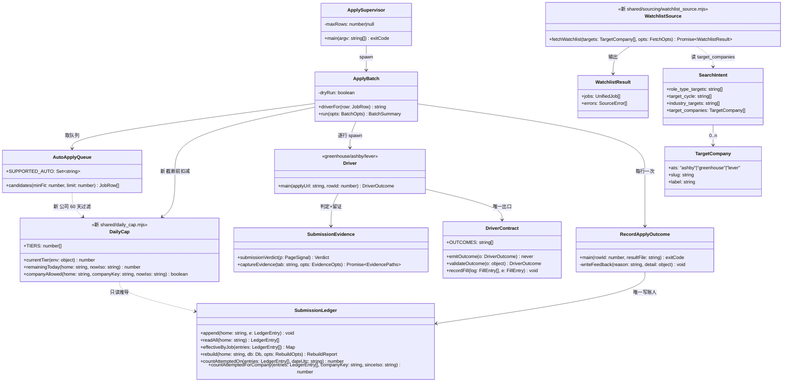
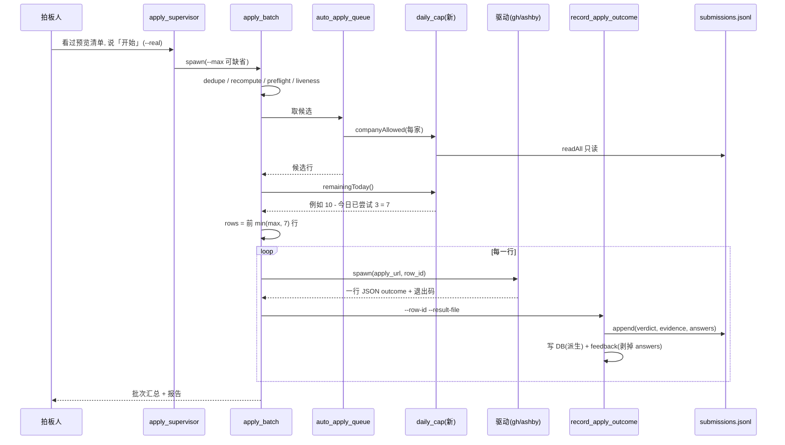

# 重启投递：代码现状地图 + 离「今天能替你投出去」还差什么

> **边界自证**：本轮只读。没改代码、没 commit/push、没真投递、没开浏览器碰招聘网站、没写 `~/.mrweirdo-jobs/`
> （`jobs.db` 跑前跑后 `mtime=1782006129 size=1728512` 同值；`profile.json` 只在进程内读）。
> 没读也没写 bug 并行产物 `..._BUG_REPORT.md`。
> 唯一对外动作：对 ~35 个公开招聘板接口（Ashby / Greenhouse / Lever 的公开 JSON，找岗代码平时就在调它们）发了只读 GET，用来核实「AI 视频公司用哪家 ATS」。
>
> **证据标签**：【实测】= 本轮亲手跑出来的；【读码】= 读代码推断；【沿用】= 上游文档的实测，本轮没重跑；【猜】= 没证据。

---

# 第一部分 · 给拍板人（人话）

## 0. 三句话结论

1. **代码本身是健康的**：测试 325 条今天全绿【实测】。7 月底那一大轮「让数字变真」的改造基本做完了，验收第 7 轮其实**已经跑完**（结果躺在还没提交的验收报告里）：4/5 分放行，带 **1 条投递前必须修的隐私 bug**。
2. **投不出去的主要原因不是「代码坏了」，是「三个月没动」**：岗位库最后一次进货是 **6 月 21 日**，最后一次真投是 **6 月 14 日**。库里现在「够格能自动投」的只剩 **19 条**，而且都是 3 个月前的岗位，大概率已经关了。
3. **你要的 AI 视频公司，平台不是问题，货源才是问题**：我实查了 25 家左右的 AI 视频/生成式媒体公司，**几乎全在 Ashby 或 Greenhouse 上**——这恰好是我们仅有的两个能自动投的平台。但这些公司今天挂出来的**实习岗加起来只有 6 个左右**。只投 AI 视频公司，一天 10 家是做不到的——这事得你拍板，工程拍不了（见第 5 节）。

## 1. 代码现状地图（这东西由哪几块拼起来）

打个比方：它是一条装在你电脑上的**求职流水线**——简历进去，流水线自己找岗、打分、排队，你点一次「开始」，它开浏览器挨个填表提交，最后给你一份报告。

| # | 这一块 | 干什么用的 | 今天的状态 | 依据 |
|---:|---|---|---|---|
| 1 | 装机与开机 | 装环境、每次跑之前体检 | 🟢 能用 | 【沿用】7-25 全新环境装过；`demo:check` 7-30 exit 0 |
| 2 | 认识你 | 简历 → 三份档案 + 身份问答 | 🟢 能用（7 月修完一整轮） | 【实测】今天用你的真档案跑身份关卡函数：`ok:true`，没有缺项 |
| 3 | 找岗 | 从 5 个公开来源抓岗位进本地库 | 🟡 能跑，但**3 个月没跑**，而且**不认你的目标公司** | 【实测】库里最新入库 2026-06-21；【读码】每次随机轮转抓 1000 家，不看你想去哪家 |
| 4 | 挑岗 | 模型给每个岗位打分 | 🟡 能跑，但旧分数有一大块系统不认 | 【实测】够格(分≥5)没投的 264 条里，244 条缺「推不推荐」这一格，被系统扣着 |
| 5 | 出发前的关卡 | 把「准备投这些」给你看，等你说「开始」 | 🟡 你看到的清单 ≠ 真跑的清单；**每天上限没人管** | 【读码】`apply_batch.mjs:255` 四道检查只在真跑时做；不传上限 = 全投 |
| 6 | 真投递 | 开浏览器填表、点提交、判断投没投上 | 🟡 判定已换成「看不懂就说不确定」的新版，**但新版还从没在真网页上跑过一次** | 【读码】+ 验收第 7 轮「未覆盖：无活 Chrome」 |
| 7 | 记账与报告 | 「投了几家」只数一本账 | 🟢 主体做完（三个数已统一成一个出口：182）；历史账迁入还没做 | 【沿用】验收第 7 轮 A 项，真实库副本实跑 |
| 8 | 回音 | 读确认邮件、跟进 | 🔴 从没跑起来过 | 【实测】库里「已确认」0 行 |

**死代码 / 半成品（留着不碍事，但别当资产算）**：
- `shared/sourcing/_unwired/`：6 个没接线的找岗模块（BambooHR / Personio / Recruitee / Rippling / SmartRecruiters / 电脑操控定位器），有说明书隔离着。【读码】
- `shared/sourcing/_executors/ashby_plan_executor.mjs`：5 月的单文件目录，至今没人说清用途。【读码】
- 5 个「投递半成品」：Workday / iCIMS / JobVite / SmartRecruiters / Handshake——只有「给人手动用的技能说明书 + 注入网页的辅助脚本」，**没有能被批量流水线调用的驱动**，文件头自己写着「从未实盘验证」。Workday 更是只有 5 份**占位公司配置**（`placeholder_company_1..5.json`），一家真公司都没配。【读码】

## 2. 各投递平台成熟度

「能填」= 代码能把表填上；「能提交」= 历史上真点过提交且有投成的；「能判定」= 接入了新版统一判定器（看不懂就说不确定、绝不默认成功）；「进自动队列」= 批量流水线会不会派它。

| 平台 | 能填 | 能提交 | 能判定 | 进自动队列 | 一句话 |
|---|:-:|:-:|:-:|:-:|---|
| **Greenhouse** | ✅ | ✅（历史 87 条，均「历史账、未验证」） | ✅ 新版（未上过真网页） | ✅ | 主力之一 |
| **Ashby** | ✅ | ✅（历史 83 条；其中 Directive 7 条确认是假成功） | ✅ 新版（假成功那条规则已拔掉） | ✅ | 主力之一，**AI 视频公司最常用** |
| **Lever** | ⚠️ 三处无条件答 Yes 没修（`lever_apply_driver.mjs:268/274/279`） | ✅（历史 11 条） | ✅ 新版 | ❌ 被排除 | 红线还在，排除得对 |
| Workday | ⚠️ 需要逐公司写配置，现有 5 份全是占位 | ❌ 从未 | ❌ | ❌ | 只是骨架 |
| iCIMS | ⚠️ 辅助脚本在，未实盘 | ❌ 从未 | ❌（自带一份判定，已拔毒枝） | ❌ | 骨架，还要注册账号 |
| JobVite | ⚠️ 同上 | ❌ 从未 | ❌ 同上 | ❌ | 骨架 |
| SmartRecruiters | ⚠️ 同上 | ❌ 从未 | ❌ | ❌ | 骨架，且平台在迁移 |
| Handshake | ⚠️ 同上 | ❌ 从未 | ❌ | ❌ | 骨架 |

依据：自动队列只认两个平台 `shared/sourcing/apply_url_classification.mjs:3`（`SUPPORTED_AUTO_PLATFORMS = greenhouse, ashby`）；流水线派单只认三个驱动 `shared/apply_batch.mjs:156-161`；历史提交数按平台的只读查询【实测】。

## 3. 五阶段总计划做到哪了

| 阶段 | 要交付什么 | 做到哪 | 还剩什么 |
|---|---|---|---|
| 0 收尾 | 身份问答做完 + 推送消灭版本分叉 | ✅ 完成（7-30 推到 `e124773`） | 无 |
| 1 数字变真 | 唯一账本 + 不会说谎的判定器 + 整页留证 + 三个数变一个 | 🟡 约 80%：包 1 已推（`987a4f0`）；包 2 施工完（`1880fd0`），**验收第 7 轮已完成 4/5 可推**，带 1 条必修 bug；本地领先 5 提交未推 | ① 修第 7 轮那条隐私 bug ② 包 3：历史 183 条迁入账本 + Directive 7 条更正 + 源码守卫 ③ 整页截图从没在真浏览器上验过 |
| 2 恢复投递 | 修 Lever / 预览=实投 / 日上限真执行 / 260 条旧分处置 | ❌ 没开始 | 全部 |
| 3 回音+提速 | 邮件分类 + 爬坡升档 | ❌ 没开始 | 全部 |
| 4 铺开 | 找岗加来源 / 半成品驱动转正 / 日处理 100 | ❌ 没开始 | 全部 |

**lead 的情报需要更正一处**：派遣单说「verify 第 7 轮已派但未回报」。实际上第 7 轮已经写完了，在工作区里未提交的 `docs/active/2026-07-23_product-blueprint_VERIFY_REPORT.md:2620-2750`：**质量分 4/5、可推、真 bug 1 个（P2 级）**——每次投递「当时填了什么」被整段抄进了数据库的 feedback 表，而数据库是同机其他账号能读的（644 权限）。验收明写「恢复投递前必修」。

## 4. 差距清单：离「每天稳定真投 10 家、且数字是真的」还差什么

按「不做就投不出去 / 投出去了数字也是假的 / 能投但投不稳」排序。工作量：小 = 半天内一个提交；中 = 1-2 天；大 = 多天且要设计。

| # | 差距 | 为什么卡你 | 工作量 | 依据 |
|---:|---|---|:-:|---|
| **1** | **岗位库过期 3 个月，必须重新进货 + 重新打分** | 能自动投的只剩 19 条（Greenhouse 11 / Ashby 8），都是 6 月的岗位；真跑时存活检查会把关了的全踢掉，很可能剩个位数甚至 0 | 小（跑一遍，不是写代码）+ 打分耗时按模型批次算 | 【实测】`jobs.created_at` 最大 2026-06-21；`source_cursor.json` 最后一跑 06-21；队列 SQL 同口径只读查询 |
| **2** | **你的求职方向文件过期了** | `search_intent.json` 里投递季还写着「2026 夏」「2026 秋」，行业是泛 AI/SaaS，**没有「AI 视频」**；不改，重新进货也是按旧方向打分 | 小（你说一句，改档案） | 【实测】`target_cycle=['Summer 2026','Fall 2026','Spring 2027']`、`industry_targets` 四项无视频 |
| **3** | **找岗不认「目标公司」** | 每次随机轮转抓 1 万多家里的 1000 家，Runway / Pika / Synthesia 什么时候轮到全看运气。库里 950 个岗位，AI 视频公司只有 2 家（Creatify、OpusClip） | 小-中（按单个公司抓岗的零件已经有了，缺一个「先抓名单」的入口） | 【读码】`shared/sourcing/source_window.mjs:8`、`discover_candidates.mjs:390`（默认窗口 1000）；【实测】库内公司名只读查询 |
| **4** | **验收第 7 轮那条隐私 bug** | 不修就投 = 每投一家，你在表上答的工作授权等答案就明文落进一个 644 的库文件 | 小（验收已给出修法） | 验收报告第 7 轮 C 项；`shared/record_apply_outcome.mjs:160`、`:214` |
| **5** | **每天投几家，代码不管** | 不传上限参数 = 队列里有多少投多少；「每天」计数只往文件里写、全仓库没人读；看板写死 50。「10→25→50 爬坡」「同公司 60 天最多 2 次」两条已拍板的规矩**一行代码都没有** | 小-中 | 【读码】`batch_limit.mjs` 不传即 `null`=全部；`apply_supervisor.mjs:124,156`；`apply_batch.mjs:416` 只写；`scripts/dashboard.mjs:36` `DAILY_CAP=50`；全库 grep 无 60 天规则 |
| **6** | **新判定器从没在真网页上跑过** | 第一次真跑就是它的首秀。风险不是「假成功」（那条已钉死），而是「看不懂 → 记成不确定」太多，报告上投成数偏低、要人工翻截图 | 小（先跑 1-2 家试投，人盯着看） | 验收第 7 轮「未覆盖：整页像素高度与真实截图路（无活 Chrome）」 |
| **7** | **历史账没迁进新账本（包 3）** | 不做也能投；但「一共投了几家」这个总数在迁入前只由旧格子撑着，Directive 7 条假成功还算在里面 | 小-中（设计已写完：阶段一施工设计第 14.10 节提交 8-9） | 施工记录第 98 节；施工设计第 14.10 节 |
| **8** | **你看到的清单 ≠ 真跑的清单** | 去重、重算资格、体检、存活检查只在真跑那条分支里做，你点头的清单可能在点头后被删/换 | 中 | 【读码】`shared/apply_batch.mjs:255-283` |
| **9** | **开放式问答题（essay）没人写** | AI 初创在 Ashby 上很爱加「为什么想来我们这」这类题；驱动遇到就停下标「需要人」，批量流水线里没有代写环节。历史上这类 + 表没填全是**第一大跳过原因** | 中-大 | 【读码】`ashby_apply_driver.mjs:1089,1135` 返回 `needs_user/essay_pending`；【实测】历史 `feedback.jsonl`：`incomplete_form` 24、`essay_pending` 21+4、`stuck_on_same_missing` 13 |
| **10** | **签证要求只是打分里的一个软分项** | 你需要 sponsorship；岗位描述写明「不办签证」的只会被扣点分，仍可能进队列，投出去等于白投 | 小（加一条硬过滤）——**但要不要硬拦是产品决定** | 【读码】`shared/scoring/score_prompt.md:72` `visa_compatible` 维度，全仓库无硬过滤 |
| 11 | Lever 三处无条件答 Yes | 目前靠排除 Lever 来守住红线，所以不卡你；AI 视频圈只查到 Kapwing 用 Lever，而且它今天 0 个岗位 | 小-中 | 【读码】`lever_apply_driver.mjs:268/274/279`；【实测】kapwing Lever 接口 0 岗 |
| 12 | 回音（确认邮件）从没跑起来过 | 不影响投出去，影响「投了之后有没有人理」 | 中-大（阶段 3） | 【沿用】7-29 结构地图：`confirmed_at` 0 行 |

**不在清单上、但要明说的一条**：**不需要为 AI 视频公司补新平台**。Workday / iCIMS 这些半成品转正是阶段 4 的活，对你当下的目标公司几乎没用（见下节）。

## 5. AI 视频公司用什么 ATS（本轮实查公开接口，2026-09-25）

| 平台 | 实测有在招的公司（括号里是当前在招岗位数） |
|---|---|
| **Ashby** | Runway(4)、Pika(14)、Synthesia(50)、Luma AI(30)、ElevenLabs(208)、Higgsfield(72)、Hedra(8)、Tavus(14)、Genmo(5)、Creatify(5)、OpusClip(10)、Krea(10)、Ideogram(2)、Suno(63)、Viggle(7)、Black Forest Labs(15)、mirage(12) |
| **Greenhouse** | HeyGen(17)、Descript(9)、Stability AI(6)、Lightricks(1) |
| **Lever** | Kapwing(0) |
| 没查到 | Captions、VEED、InVideo、D-ID、Arcads、Moonvalley——可能在自建页面或别家 ATS【猜】 |

- 「mirage」就是 Captions 改名后的公司——**这是我的猜测，没核实**。Runway 在 Ashby 上只挂 4 个岗，**可能还有别的招聘入口【猜】**。
- **实习岗供给（按岗位标题粗筛 intern / new grad）**：Pika 1、Creatify 2、OpusClip 1、Viggle 1、Genmo 1（New Grad）——**总共约 6 个**【实测，标题粗筛，可能漏掉标题里没写 intern 的】。
- **结论**：平台覆盖不成问题（查到招聘板的 22 家里 21 家在 Ashby + Greenhouse），**供给才是天花板**。「每天 10 家」要么把范围从「AI 视频」放宽到「AI 公司 / 创作者工具」，要么加上全职岗，要么接受「AI 视频每周几家 + 其余放宽」。这是方向问题，得你定。

## 6. 架构层面该先还的债（只列直接影响「能投出去」的）

1. **两个投递驱动太大，已被锁死「只许变短」**：`greenhouse_apply_driver.mjs` 1894 行、`ashby_apply_driver.mjs` 1149 行、`ashby_helpers.js` 1243 行，都超过 800 行上限。后果：修「表没填全」「essay」这类提升投成率的活，每改一处都得同时删掉等量的行——7 月施工记录里 hook 为此拦过好几次。**差距 #9 动手之前，建议先把 Greenhouse 驱动里「填空」那部分拆出去**。工作量：中。
2. **「这道题怎么答」有三份实现**：Ashby 走 `answer_buckets.mjs`、Greenhouse 走 `answer_routing.mjs + greenhouse_value_rules.mjs`、Lever 走驱动里自带的一串规则（Lever 那三处无条件 Yes 就是出在这里）。修 Lever 的正路是让它也走 `answer_routing`，而不是在第三份里再打补丁。工作量：中。只在要恢复 Lever 时才需要。
3. **「每天投了几家」有两本账**：`daily_count.jsonl`（只写没人读）和新账本 `submissions.jsonl`。做日上限（差距 #5）时应直接数新账本，并把旧的那本停写，否则又多一个「同一件事两个数」。工作量：小，和 #5 一起做。
4. **不建议现在动的**：`shared/` 70 多个文件平铺、说明书与代码两头管——看着乱，但不挡投递（7-29 结构地图已判过，本轮复查结论不变）。

---

# 第二部分 · 技术附录（给 lead / builder / verify）

## 1. Implementation Approach

本产物是「现状盘点 + 差距设计」，不是某一功能的施工设计。思路是**从「今天替拍板人真投 10 家」倒推**：沿主链（找岗 → 打分 → 排队 → 关卡 → 驱动 → 判定 → 记账）逐环问「现在这一环能不能用真实数据过去」，用只读查询和读码回答，最后把断点排序。

**需求难点与取舍**：
- **难点一：「投不出去」有两类原因混在一起**——代码坏了 vs 运营停了。这两类的处置完全不同：前者要施工，后者只要跑。本轮的判据是：用今天的真实档案和真实库做只读推演，凡推得过去的环节归「运营停摆」，推不过去的归「代码缺口」。结论：主因是运营停摆（差距 #1/#2），代码缺口集中在「上限 / 定向 / 吞吐」三处。机器层面为什么具体失败由并行的 bug 岗负责，本产物不重叠。
- **难点二：「10 家/天」的约束是供给不是驱动**。用公开板接口实测目标公司 ATS 与在招数，把「要不要补平台」这个猜测变成数据。取舍：只做 ~35 次只读 GET，不做全量扫描（全量是找岗模块的活）。
- **难点三：新增设计要守住字段克制**。提出的三件新能力（日上限、同公司 60 天、目标公司优先抓）**全部可以从现有数据推导**：日上限与 60 天规则由 `submissions.jsonl` 推导（不新建计数文件、不加列）；目标公司优先抓挂在已有的 `search_intent.json` 上（加一个可选字段，而不是新建配置文件）。

**推荐的恢复顺序（一句话）**：修第 7 轮隐私 bug → 推送 → 你改方向（search_intent）→ 加日上限 + 目标公司优先抓 → 重新进货打分 → **试投 2 家人盯** → 包 3 历史迁入 → 每天 10 家。essay 与预览=实投放在「能稳定投」之后（它们决定投成率，不决定能不能投）。

## 2. File List

**本轮新建（仅文档）**：`docs/active/2026-09-25_restart-apply_ARCH_AUDIT.md`（本文件）。

**差距对应的将改文件（给 builder 的施工面，不含实现代码）**：

| 差距 | 要改 | 要新建 | 行数影响（估） | 文件大小档 |
|---|---|---|---|---|
| #4 隐私 bug | `shared/record_apply_outcome.mjs`（`:160`/`:214` 写 feedback 前剥掉 `answers`）；全问答测试补反向断言 | — | ±10 | 220 行，有余量 |
| #5 日上限 + 60 天 | `shared/apply_batch.mjs`（队列截断前扣减当日已尝试）；`shared/auto_apply_queue.mjs`（同公司 60 天计数过滤）；`scripts/dashboard.mjs:36`（读同一上限）；`shared/submission_ledger.mjs`（导出按日/按公司计数的只读函数） | `shared/daily_cap.mjs`（~60 行：从账本推导今日已尝试、档位读取） | +~120 | 全部 < 800 |
| #5 旧计数停写 | `shared/apply_batch.mjs:414-424` 删 `daily_count.jsonl` 写入；两份 -auto 说明书（greenhouse-auto `:202` / ashby-auto `:178`）相关一句 | — | -~12 | — |
| #3 目标公司优先抓 | `shared/sourcing/dispatcher.mjs`（新增一个 source）；`shared/intelligence/intent_schema.json`（`target_companies` 可选字段） | `shared/sourcing/watchlist_source.mjs`（~80 行：逐个调现成的 `ashby_board_api` / `greenhouse_board_api`） | +~100 | 全部 < 800 |
| #8 预览=实投 | `shared/apply_batch.mjs:255-283`（把只读的检查挪到分支外，写库的 dedupe/recompute 改为预览时只算不写） | — | ±40 | 478 行，有余量 |
| #9 essay 吞吐 | 先拆 `greenhouse_apply_driver.mjs` 填空部分（债 #1） | 待设计 | 大 | 超档，**净增 0** |
| #10 签证硬过滤 | `shared/eligibility.mjs` 或 `function_relevance.mjs` | — | +~20 | 有余量 |

**模块拆分映射**：本轮无用户界面改动；用户可见变化只有看板上「今日 N/上限」的上限来源变成已拍板的档位。

## 3. 数据结构与接口

现有主链路模块（实线 = 本轮核实过的真实调用），加上差距设计新增的接口（标「新」）：



**签名约束（写死，不留给 builder 猜）**：
- `ApplySupervisor.maxRows`：现状不传即 `null` = 全部（`batch_limit.mjs` 的 `parseMaxRows` 回退值）。加 DailyCap 后，**实际截断 = min(maxRows, remainingToday)**，`maxRows` 缺省不再等于「无上限」。
- `DailyCap.remainingToday()` **只从账本推导**：计「已尝试提交」= 当日（UTC，与现有 `todayUtc()` 同口径）有效行中 `verdict ∈ {submitted, unknown}` 的条数。理由：防拉黑看的是公司那边收到了几次提交，`unknown` 可能真的投出去了。这与「已投」口径（只算 `submitted`）有意不同，见 ADR-R2（日上限口径决策）。
- `currentTier()` 档位**不写新文件**：读环境变量 `MRWEIRDO_DAILY_TIER`，缺省 10；值 > 30 且没有显式确认参数时响亮失败（master-plan 规矩 1「超 30 档须拍板人亲自点头」）。不实现自动升档（阶段 3 的活）。
- `companyAllowed()`：窗口 60 天，上限 2，计数口径同上；`company_key` 复用账本已有字段。
- `fetchWatchlist()`：单个公司接口失败只进 `errors[]`，不连坐整批（dispatcher 现有约定）；`target_companies` 缺失 = 不跑这个 source，**不是报错**（它是用户可选字段，不是内部传参）。

## 4. 调用流

### 4.1 正常路：一天的真投（加上差距 #5 之后）



### 4.2 失败路 1：今天额度已用完

```mermaid
sequenceDiagram
    participant B as apply_batch
    participant C as daily_cap(新)
    participant U as 拍板人
    B->>C: remainingToday()
    C-->>B: 0
    B-->>U: 响亮退出(非 0): 「今日已尝试 10/10, 档位 10; 升档需你显式同意」
    Note over B: 不许静默投 0 家然后报成功; 预览里也要显示同一句
```

### 4.3 失败路 2：新判定器首秀大面积「不确定」（差距 #6 的风险形态）

```mermaid
sequenceDiagram
    participant D as 驱动
    participant SE as submission_evidence
    participant R as record_apply_outcome
    participant U as 拍板人
    D->>SE: submissionVerdict({bodyText,url})
    SE-->>D: unknown(确认/否认两组都没命中)
    D->>R: outcome=unknown, exit 2
    R->>R: 账本记 unknown, DB 走 skip
    R-->>U: 人工核对清单 + 整页截图路径
    Note over U: 试投 2 家时人盯: 看截图确认真投上没; 若是真成功文案没被认出, 给判定器补一条规则+夹具
```

### 4.4 失败路 3：目标公司接口挂了

`fetchWatchlist` 对单个 slug 拿到非 200 / 超时 → 记入 `errors[{source:'watchlist', slug, error}]`，其余公司照常；dispatcher 汇总时 `errors` 非空要打到进度输出里（不许静默吞掉）。

## 5. Anything UNCLEAR

1. **（产品，拍板人定）只投 AI 视频，还是放宽？** 实测 AI 视频公司今天挂出的实习岗约 6 个。「每天 10 家」和「只投 AI 视频」二选一，或者定比例（比如 AI 视频优先、其余补 AI 公司/创作者工具）。这直接决定差距 #2/#3 怎么填。
2. **（产品）实习还是全职/new grad 也投？** 你 2027 届，档案里 `role_type_targets=['intern','part_time']`。PM 调研时要问清。
3. **（产品）要不要把「岗位描述写明不办签证」设成硬拦？** 硬拦 = 少投但不白投；软扣分 = 现状。我倾向硬拦，但会让供给再少一截。
4. **（工程，未核实）** Captions ↔ mirage、Runway 是否另有招聘入口——都是【猜】。
5. **（工程）重新进货后，那 244 条 6 月旧分数怎么办？** 我倾向**不重打、直接让存活检查淘汰**（3 个月前的实习岗大多已关，花模型批次重打不值），但这改的是 master-plan 阶段 2 的一项，需要 lead / 拍板人确认。
6. **（工程）日上限按「已尝试」还是「已投成」计？** 我设计成按「已尝试（submitted ∪ unknown）」计。代价：看板上「今日已尝试 N」和报告上「已投 N」是两个口径的数，**界面必须用不同的名字**，否则又是一个「同一件事两个数」。请 lead 确认。
7. **我没验证的**：新判定器、整页截图、统一退出契约在真实 Greenhouse/Ashby 页面上的表现——全部只有替身测试，没有一次真跑。另外本轮只跑了 `npm test`，**没跑 CI 其余三步**（`role_guard_smoke` / `public_alpha_gate` / `node --check`）；lead 7-30 在 tip `1880fd0` 干净检出上跑过全绿【沿用】，此后没有代码改动。
8. **需要和 bug 岗对账**：我把主因判为「运营停摆 + 上限/定向缺失」，依据是**只读推演**，不是真跑。bug 岗如果发现机器层面的硬故障（比如 Chrome 起不来、Ashby 表单结构变了），以它的实跑为准，我的排序要跟着改。

## 6. 8 项质量属性取舍表（针对「重启到每天 10 家」这段路）

| 属性 | 目标（量化） | 牺牲了什么 |
|---|---|---|
| Reliability 可靠性 | 假成功 0（已有 6 张夹具钉死）；日上限超投 0 次；同公司 60 天 >2 次 0 次 | 日上限按「已尝试」算，实际投成数会 < 10（unknown 占额度） |
| Performance 性能 | 单家投递 ≈ 1-3 分钟（整页截图多 1-2 秒）；10 家 + 防风控间隔 ≈ 30-60 分钟/批【读码估算，未实测】 | 不做并行投递（防封号，master-plan 反面清单） |
| Scalability 扩展性 | 10 → 25 → 50/天 靠档位变量，不改代码 | 自动升档不做（阶段 3） |
| Security 安全 | 表单答案只进 600 权限的账本，不进 644 的库（修完第 7 轮 bug 后） | 修后 feedback 表看不到当时填了什么，排查要翻账本 |
| Maintainability 可维护性 | 「每天几家」只有一个出处（账本）；旧 `daily_count.jsonl` 停写 | 6 月前的日计数只留在旧文件里，不迁移 |
| Interoperability 互操作 | 目标公司名单复用现成两个板接口模块，零新依赖 | 只支持 Ashby/Greenhouse/Lever 公开板；自建招聘页的公司抓不到 |
| Compliance 合规 | 「超 30 档须拍板人点头」落成代码拦截；每批真跑前仍需「开始」 | 多一步确认摩擦（故意的） |
| Cost 成本 | 重新打分约 N/50 批模型调用（N=新进货量，千级时约 20 批）；零新服务 | 这笔模型花费是恢复投递的必要成本 |

**最大的一笔显式牺牲**：**先窄后宽**——恢复期只用 Greenhouse + Ashby，不碰 Lever 修复和半成品转正，接受「有的岗位投不了」来换「投出去的都可信」。

## 7. ADR（架构决策记录）

### ADR-R1（恢复期平台范围）：只走 Greenhouse + Ashby，不为 AI 视频目标补新平台
- **Status**: proposed　**Date**: 2026-09-25
- **Context**: 实测 22 家查到招聘板的 AI 视频/生成式媒体公司里，17 家在 Ashby、4 家在 Greenhouse、1 家在 Lever（0 岗）；这两个平台是唯二在自动队列里的。
- **Decision**: 恢复期不修 Lever、不转正半成品；工程投入全压在「上限 / 定向 / 吞吐」。
- **Consequences**: 好——最短路径，不碰没验证过的驱动；坏——Lever 上的 16 条存量够格岗继续搁置。
- **Alternatives**: 先修 Lever（否：对目标公司几乎没收益）；先做 Workday（否：查到的 AI 初创没有一家用它，且需要逐公司写配置）。

### ADR-R2（日上限口径）：日上限与 60 天规则从账本推导，计数口径 = 已尝试提交
- **Status**: proposed（口径需 lead 确认，见未明点 6）　**Date**: 2026-09-25
- **Context**: `daily_count.jsonl` 只写不读；新账本已是「投出去了没有」的唯一正典（阶段一的账本决策）。
- **Decision**: 新建 `daily_cap.mjs` 只读账本推导；`submitted ∪ unknown` 占额度；旧 `daily_count.jsonl` 停写。
- **Consequences**: 好——不新建计数文件，不会出现第二本账；坏——「今日已尝试」和「已投」是两个数，界面要分开命名。
- **Alternatives**: 读 `daily_count.jsonl`（否：它只记 submitted，且是第二正典）；在 jobs 表加计数列（否：能推导的不物化）。

### ADR-R3（目标公司存放处）：挂在 `search_intent.target_companies`，不新建配置文件
- **Status**: proposed　**Date**: 2026-09-25
- **Context**: 拍板人要定向 AI 视频公司；现有找岗随机轮转，不认目标；`industry_targets` 只进打分提示词（`score_prompt.md:15`），不影响抓什么；`search_intent.json` 已是「你想找什么」的唯一档案。
- **Decision**: 可选字段 `target_companies[{ats,slug,label}]`；新 source 先抓名单再跑轮转。
- **Consequences**: 好——一个档案管方向；坏——`intent_schema.json` 与校验要同步一处。
- **Alternatives**: 新建 `target_companies.json`（否：多一个文件多一个真源）；只靠打分里的 `industry_targets`（否：抓不进来的岗位，打分再高也没用）。

### ADR-R4（首次真跑规模）：第一次真跑限 2 家、人盯
- **Status**: proposed　**Date**: 2026-09-25
- **Context**: 新判定器、整页截图、统一退出契约都只有替身测试（验收第 7 轮未覆盖真浏览器）。
- **Decision**: 修完第 7 轮 bug 并推送后，第一批 `--max 2`，拍板人或 lead 逐张看整页截图对照判定，再放到 10。
- **Consequences**: 好——首秀出问题只影响 2 家；坏——恢复晚一天。
- **Alternatives**: 直接 10 家（否：新判定器首秀，unknown 过多会把整批数字弄得不可读）。

## 8. 跨栈一致性字段对照表（本轮新概念）

| 概念 | 账本层（正典） | 推导层 | 队列/批次层 | 看板/报告层 |
|---|---|---|---|---|
| 今日已尝试 | `ts` 当日 ∧ `verdict ∈ {submitted, unknown}` | `DailyCap.remainingToday()` | `rows` 截断 | 「今日已尝试 N/档位」（**不能**叫「今日已投」） |
| 已投 | `verdict='submitted'`（有效行） | `rebuild` → `SUBMITTED_WHERE_SQL` | 防重投集合 | 「已投 N」 |
| 同公司 60 天次数 | `company_key` + `ts` 60 天内 ∧ 已尝试 | `companyAllowed()` | 队列过滤 | 跳过理由 `company_cooldown_60d` |
| 目标公司 | —（不入账本） | — | watchlist source | 进货统计 `by_source.watchlist` |

命名：全链 snake_case；`company_key` 复用账本已有字段与 `normalizeCompany()`，不另起一套公司名归一。

## 9. 本项目铁律对照

- `.claude/arnold/roles/architect.md` 不存在——项目未定义 architect 岗位补充说明。
- `builder.md` 三条（串行测试 / CI 每一步 / 主流程冒烟）：本轮 `npm test` 串行 325/325【实测】；CI 其余三步未跑（未明点 7）；本产物零代码改动，主流程冒烟不适用。
- 登记表 `ci_smoke.main_chain` 已对照：差距 #1-#10 全部落在「找岗 → 一键投递 → 投递报告」这一段；`schema_upgrade_path` / `isolation_field` 未填，跳过。**本轮设计零 DDL**（不加列、不加表）。
- master-plan 长期约束已对照：Lever 红线（ADR-R1 继续排除）、每批真跑需点头（4.1 保留）、超 30 档需亲自点头（DailyCap 设计内含）、不碰 LinkedIn、不许「点了按钮 = 成功」（沿用阶段一的判定器决策）。
- 文件膨胀：本轮新增设计全部落在 < 800 行的文件；三个超档文件（greenhouse/ashby 驱动、ashby_helpers）本批不动。

## 10. 拆分清单（给 lead 的派工建议）

**总改动量**：小修 1 处 + 新模块 2 个（~140 行）+ 改 6 个文件（~150 行）+ 测试 ~250 行；不碰超档文件。essay 吞吐（差距 #9）另立设计，不在本批。

| 序 | 谁 | 内容 | 前置 |
|---:|---|---|---|
| 1 | builder | 修第 7 轮 bug（feedback 剥 answers + 全问答测试补反向断言）→ verify 小验 → ops 推送（共 6 提交） | 无 |
| 2 | 拍板人 | 回答未明点 1/2/3（方向、岗位类型、签证硬拦）→ 改 `search_intent.json` | 无，可与 1 并行 |
| 3 | builder | 日上限 + 60 天 + 目标公司优先抓 + 旧计数停写；一轮完成 | 1；未明点 6 口径确认 |
| 4 | lead（跑流程，非施工） | 重新进货 + 打分 | 2、3 |
| 5 | 拍板人点头 → lead 跑 | 试投 `--max 2`，人盯截图 | 4 |
| 6 | builder | 包 3：历史迁入 + Directive 7 条更正 + 源码守卫（阶段一施工设计第 14.10 节提交 8-9） | 可与 3-5 并行 |
| 7 | architect | 差距 #8（预览=实投）+ #9（essay）+ 债 #1（拆 Greenhouse 驱动）设计 | 5 跑通之后 |

建议 **分 3 次召唤 builder**（序 1 / 序 3 / 序 6），序 1 最先且最小。

## 讨论中辩驳过的方向

**❌ 方向 1：「投不出去是因为平台不够，先补 Workday / iCIMS」**。直觉上「平台越多投得越多」（master-plan 原话）。否决：目标公司实测 21/22 在 Ashby/Greenhouse；半成品从未实盘，转正本身就是阶段 4 的一整个工程。补平台对「今天投出去」几乎零贡献。

**❌ 方向 2：「先把 244 条旧分数重打，队列立刻就有货」**。看起来最快出量。否决：这些是 6 月的实习岗，3 个月后多数已关，存活检查会再砍一轮；花模型批次给过期岗打分，不如直接重新进货。（改不改方案仍需确认，见未明点 5。）

**❌ 方向 3：「日上限继续写 `daily_count.jsonl`，只是加一个读的地方」**。改动最小。否决：它只记 `submitted`，漏 `unknown`；而且它和账本是同一件事的第二本账——正是阶段 1 刚花一整轮消灭的病。

**❌ 方向 4：「先还架构债——合并三个驱动 / 重构 shared/ 目录」**。否决：它们不挡「今天能投」；合并驱动落在唯一能真投的路径上，风险最大。只把「拆 Greenhouse 填空部分」列成 essay 修复的前置，按需还。
