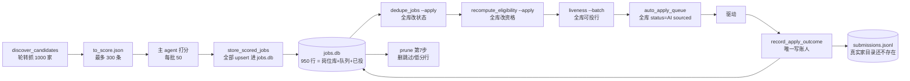
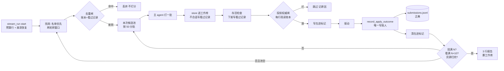

# 即找即投：架构设计（岗位库退役、跨运行去重、预算分层）

> **边界自证**：本轮只写设计。没改代码，没 commit，没真投，没写 `~/.mrweirdo-jobs/`。对真实 `jobs.db` 只做了只读查询（`DatabaseSync(..., {readOnly:true})`），跑前跑后 `mtime=1782006129 size=1728512` 一致【实测】。
> **证据标签**：【实测】是本轮亲手跑出来的；【读码】是读代码得出的；【沿用】是上游文档的实测，本轮没重跑；【推断】是有依据的推理；【猜】是没有证据的猜测。
> **对齐说明**：写到一半时 lead 放开了 PM 第 2 轮规格，我已通读，本设计按它的 R1-R7、N 的含义、N×10 看的上限、「本地只留账本 + 看过记录 + 扫描游标」和 D8-D12 的推荐默认值来设计。技术上和 PM 有分歧的地方单独列出（第 5 节第 1-3 条）。

---

## 0. 给拍板人（人话版）

**打个比方**：以前是「先进货囤满一仓库，再慢慢从仓库里挑着投」。仓库放了 3 个月，货全烂了（队列里 18 条有 16 条已经下架）。现在改成**「现买现做」**：你说「跑 10 个」，机器现去市场挑、当场尝、合适的立刻下锅。做完把灶台擦干净，**不囤货**。

机器只随身带两个小本子，外加一张书签：
- **收据本（投递账本，已经有了）**：记投过谁。有了它才能保证永不重投、同一家公司 60 天最多投 2 次、「一共投了几家」这个数是真的。
- **便签本（看过记录，新增）**：记看过但不合适的、已经下架的、卡在缺信息的。有了它，第二天就不会再花钱给同一批岗位打分。
- **书签（扫描游标，已经有了）**：记上次扫到哪家公司，下次接着往下扫。

**你原来那个 950 行的岗位库怎么办**：先把里面 **182 条已投** 抄进收据本，逐条核对数目；核对无误后，把整个库**原样搬到归档文件夹**（只搬不删），以后不再往里写。之后每次运行用一张一次性草稿纸，跑完就扔。

**要你拍板的只有 3 件事**（第 7 节 ADR 里标了「待拍板」）：
1. 岗位库退役成历史档，每次运行改用一次性草稿纸（ADR-S4）。
2. 收据本每一行多记一个「岗位链接」和一个「可能已经提交」标记。这是永久格式，加了就不能撤（ADR-S3）。
3. 历史 182 条抄进收据本，作为第一次正式运行前的硬前置（ADR-S9）。

---

## 1. Implementation Approach

### 1.1 现状数据流（今天的样子）【读码】



**病根**：`jobs.db` 一个文件同时当了三样东西：**仓库**（所有抓来的岗位）、**队列**（`status='🤖 AI sourced'` 的全部行）、**已投记录**（`status='✅ 已投'`）。队列从全库取，所以 6 月的旧岗今天还会被派出去；去重靠全库改状态；第 7 步 prune 默认 `--delete-low-fit --low-fit-days 0` 一跑就把「看过不合适」的行删了（`SKILL.md` Step 7【读码】），于是第二天同一批岗位又被当新岗打一遍分。这正是拍板人说的「两天跑的一模一样」的来源之一【推断】。

**本轮实测的几个关键数字**：
- `jobs` 950 行，其中已投 182、跳过 61、待投 707【实测】。
- 真实家目录**没有** `log/submissions.jsonl`【实测，`ls ~/.mrweirdo-jobs/log/`】。账本代码已经就位（`896026d`），但一次都没真正写过。**182 条历史投递目前只活在 `jobs.db` 里**。
- 岗位身份可以从链接推出来：182 条已投里，从 `apply_url` 抽出「平台 + 岗位编号」的成功率 **182/182**（Ashby 83 / Greenhouse 78 / Greenhouse `gh_jid` 自定义域名 9 / Lever 12）；全库 **950/950**，指纹互不重复，同一个编号也从没出现在两个招聘板下【实测】。
- 已投记录里「公司+标题」完全重复的有 0 组；同一公司投过 3 次及以上的有 12 家（directive 8、valency 6……），都集中在 5-6 月，离今天已超过 60 天【实测】。

### 1.2 新数据流（即找即投）

**一句话**：一次运行 = 开一张一次性草稿纸（工作库）→ 先扫目标公司名单，再按轮转往下扫 → **投前去重闸**（查收据本和便签本，命中的不打分）→ 每批 50 条现场打分 → 合适的当场过**投前权威闸**（重投 / 60 天 / 日额度 / 连续故障熔断），闸过了才进驱动 → 唯一写账人记账 → 投满 N 个或看满上限就停 → 输出 3 行报告 → 扔掉草稿纸。



### 1.3 每一步谁删、谁留、谁改（施工面总表）

| 环节 | 模块 | 处置 | 一句话理由 |
|---|---|---|---|
| 找岗 | `discover_candidates.mjs` / `dispatcher.mjs` / 各 `*_board_api.mjs` | **留**，小改 | 抓岗逻辑本身没问题；加上「名单来源」和「按窗口被调用」两个口子 |
| 找岗 | 新 `sourcing/watchlist_source.mjs` | **新建** | 目标公司每次必扫（ARCH_AUDIT 的 ADR-R3 原样沿用） |
| 去重 | `dedupe_jobs.mjs`（全库改状态） | **从运行链路里摘掉**，文件暂留 | 工作库里只有本次运行的行，全库去重没有对象；去重改由去重闸和投前权威闸负责 |
| 去重 | 新 `apply_guard.mjs` + 新 `seen_log.mjs` | **新建** | 「投过 / 看过」的唯一判断处 |
| 打分 | `score_prompt.md` + 主 agent 分批 | **留** | 不动 |
| 入库 | `store_scored_jobs.mjs` | **留**，小改 | 写进工作库（由环境变量指定路径，零改动）；不合适的另写一行看过记录 |
| 资格 | `recompute_auto_apply_eligibility.mjs`（全库重算） | **从运行链路里摘掉**，文件暂留 | 资格已在入库那一刻按当下意图算好；工作库没有历史行需要重算 |
| 队列 | `auto_apply_queue.mjs` | **留，逻辑零改动** | 读的是工作库，天然只含本次运行的行。「队列从全库取」这个病因为换了库而消失，不用改代码 |
| 存活 | `liveness_gate.mjs` | **留**（builder 小修包正在改它的 Ashby 判法） | 本设计不改它；「下架写看过记录」由 `apply_batch` 读它的 JSON 结果来做，和它的文件不重叠 |
| 投递 | `apply_batch.mjs` | **改** | 真跑路径去掉 dedupe/recompute 两步；每行派单前过投前权威闸；在途标记；停写 `daily_count.jsonl` |
| 投递 | 三个驱动 | **不动**；只有 greenhouse 驱动两处写死 `jobs.db` 的地方**必须改**（净减行） | 见 1.4 第 3 条，这是换草稿纸之后会出错的暗雷 |
| 记账 | `record_apply_outcome.mjs` | **改**（排在 builder 小修包 P2 之后） | 账本行多记 `apply_url` 和 `may_have_submitted`；「投后才查重」那段改成违反不变量就响亮报错 |
| 账本 | `submission_ledger.mjs` | **改** | 新增 `backfill-legacy`（历史迁入）和 `attemptIndex()`（去重索引）；`rebuild` 只对历史档有意义 |
| 清理 | `prune_job_pool.mjs` / 第 7 步 prune | **从运行链路里摘掉** | 工作库跑完就删；看过记录自己按 60 天压缩 |
| 报告 | `apply_report.mjs` / `job_report.mjs` | **留** | 本次报告读工作库即可；总数改读账本 |
| 看板 | `scripts/dashboard.mjs` | **改** | 「今日 / 累计」改数账本，写死的 `DAILY_CAP=50` 改读档位 |
| 编排 | onboard `SKILL.md` 第 4-7 步 | **重写** | 由「找 → 全部打分 → 入库 → 看清单 → 开始 → 投 → prune」改为「start → (next → 打一批 → submit-scores)×k → finish」 |
| 编排 | 新 `stream_run.mjs` | **新建** | 把「即找即投」循环做成可测的状态机，主 agent 只负责打分；PM 的 V1-V13 离线替身测试也靠它 |
| 历史 | `jobs.db` | **冻结 → 核数 → 搬到 `archive/`**（待拍板，ADR-S4） | 不再当仓库或队列 |
| 旧计数 | `daily_count.jsonl` | **停写**，文件留着 | 第二本账（ARCH_AUDIT ADR-R2） |

### 1.4 需求难点与取舍（每条对应一个设计选择）

1. **难点一：账本按 `job_id`（岗位库行号）认岗，岗位库一退役，行号就没了来源**（PM 点名【读码 `submission_ledger.mjs:38`】）。
   **选择**：账本新行**自带 `apply_url`**，岗位指纹用纯函数从链接推（实测 950/950 可推），不另存指纹列（字段克制）。`job_id` 仍然写，但改为「工作库行号，从账本最大号往上续编」。这样 `effectiveByJob()` / 更正行这些按 `job_id` 工作的既有机制**一行不改也不会串号**（ADR-S3）。
2. **难点二：「同一个岗位」怎么认**。PM 推荐「公司+标题」为主键，理由是重发岗位会换编号。我同意这个理由，同时补一点：**只认「公司+标题」也会漏**，比如同一个岗位编号但标题被改了一个字，或者公司名在不同来源里写法不同。
   **选择**：**双键「或」匹配**：「平台:岗位编号」命中，或「公司归一::标题归一」命中，任意一个命中就算同一岗位（ADR-S2）。代价和 PM 接受的那条一样：同公司同标题、不同地点的两个岗位只投一个。
3. **难点三：换成一次性工作库后会触发一颗暗雷**【读码】。`greenhouse_apply_driver.mjs:561` 和 `:758` **绕过 `dbPath()`，把 `~/.mrweirdo-jobs/jobs.db` 写死了**：
   - `rowCompanyFromDb()` 拿工作库的行号去历史库里查公司名，会**查到别家公司**；
   - `hasPriorApplicationToCompany()` 回答表单上「你以前投过我们吗」这道题。
   前者可能把错误的公司名带进表单，后者需要改为查账本（账本里有迁入的历史）。
   **选择**：两处都改。前者改走 `dbPath()`，后者改为调用 `apply_guard.priorApplicationToCompany()`。这是超档文件，只准净减，而这次改动恰好是净减。**这一条必须和换工作库放在同一个包里，不许拆开上线。**
4. **难点四：「投后才查重」来得太晚**【读码 `record_apply_outcome.mjs:183-199`】。现在的重投检查放在驱动**已经点了提交之后**：发现重复就把库行标成跳过，可账本那行早已写成 `submitted`。结果是重投照样发出去了，而且账本和库对不上。
   **选择**：查重前移到派单前，也就是投前权威闸，这是在不可逆动作前信息最全的位置。投后那段改成「不变量被违反：真发生了一次重投」，响亮报错，不再静默标成跳过。
5. **难点五：崩溃窗口**。驱动点了提交、账本还没写，这时进程死了：下次运行账本里没有这一条，就会**重投**。
   **选择**：派单前写一个在途标记 `locks/inflight.json`，记账成功后再删；下次运行开始时发现这个标记，就补记一条 `unknown`，并把它当作「可能已提交」处理，永不自动重投（ADR-S8）。
6. **难点六：打分是主 agent 在对话里做的，不是代码**。「即找即投」的循环无法全写进一个脚本里。
   **选择**：`stream_run.mjs` 做成**分步状态机**（`start` / `next` / `submit-scores` / `finish`），状态放在本次运行目录里；主 agent 只负责「拿到批次文件 → 打分 → 交回」。离线测试用一个假打分器替代主 agent，PM 的 V1-V13 全部可以脚本化跑。

---

## 2. File List

**工作量口径**：小 = 半天内；中 = 1 天左右；大 = 多天。行数都是估算。

### 2.1 新建

| 文件 | 约行数 | 干什么 | 包 |
|---|---:|---|---|
| `shared/apply_guard.mjs` | ~180 | 纯函数为主。`attemptIndex(entries)` 建「投过」索引；`checkDispatch()` 是投前权威闸（重投 / 公司+标题 / 60 天 / 日额度 / 投前失败次数）；`dailyTier()`、`budgetLine()`、`priorApplicationToCompany()`、`breaker()`（连续故障熔断） | S2 |
| `shared/seen_log.mjs` | ~140 | 看过记录 `log/seen.jsonl` 的唯一读写模块：`recordSeen()` / `readSeen()` / `seenIndex()` / `compact()`；以及两个依据版本号 `scoringBasisVersion(home)` / `fillBasisVersion(home)` | S3 |
| `shared/stream_run.mjs` | ~260 | 即找即投状态机 CLI：`start` / `next` / `submit-scores` / `finish`；负责开工作库、续编行号、崩溃恢复入口、去重闸、分批、停止条件、3 行报告 | S3 |
| `shared/sourcing/watchlist_source.mjs` | ~80 | 读 `search_intent.target_companies`，逐家调用现成的 `ashby_board_api` / `greenhouse_board_api`；单家失败只记进 `errors`，不连累其他家 | S4 |
| `test/job_fingerprint.test.mjs` | ~90 | 链接 → 指纹：覆盖 4 种链接形状（含 `gh_jid`）、大小写、查询串、无法识别时返回 null | S1 |
| `test/ledger_backfill.test.mjs` | ~150 | 历史迁入：行数守恒、幂等、`--dry-run` 不写文件、指纹全部可推 | S1 |
| `test/apply_guard.test.mjs` | ~200 | 投前闸每条规则至少各有一正一反两个用例；日档位；超过 30 档没有确认参数就响亮失败 | S2 |
| `test/inflight_recovery.test.mjs` | ~100 | 崩溃在点击提交之后、写账之前：下次运行补记 `unknown`，且不再重投 | S2 |
| `test/stream_run_e2e.test.mjs` + `test/fixtures/stream/` | ~350 | PM 验收 V1-V12，用假招聘板、假驱动、计数的假打分器，全部在临时家目录里跑 | S3/S5 |

### 2.2 修改

| 文件 | 现行数 → 约束 | 改什么 | 包 | 与并行小修包重叠 |
|---|---|---|---|---|
| `shared/job_identity.mjs` | 45 | 加 `jobFingerprint(url) → {ats, job_id, fp} \| null`（纯函数，正则规则就是本轮实测用的那 4 条） | S1 | 否 |
| `shared/submission_ledger.mjs` | 210 → ~300 | `append` 对 v2 行要求 `apply_url` 能推出指纹，推不出就 throw；新增 CLI `backfill-legacy [--apply]`；导出 `maxJobId()`；`rebuild` 在文件头注明「只作用于历史档」 | S1 | 否 |
| `shared/record_apply_outcome.mjs` | 220 → ~230 | 账本行加 `apply_url`、`may_have_submitted`；投后查重段改为不变量违反时响亮退出 | S1/S2 | **是**（builder P2 隐私修复在改 `:160/:214`）→ **排在 P2 之后** |
| `shared/apply_batch.mjs` | 478 → ~540 | 真跑去掉 dedupe/recompute；每行派单前调 `checkDispatch()`，而且每行都重新读账本；在途标记写/清/恢复；删掉 `:414-424` 的 `daily_count` 写入；读存活检查的 JSON 结果，把下架的写进看过记录；needs_user 写看过记录；接熔断器 | S2/S3 | 否（小修包没有列它）|
| `shared/local_db.mjs` | 541 → ~560 | 加 `initRunDb({ seqFloor })`：新建库后把 `sqlite_sequence` 设成 `max(账本最大 job_id, 100000)`，保证工作库行号全局不重复 | S3 | 否 |
| `shared/store_scored_jobs.mjs` | 222 → ~245 | 不合资格的行调 `recordSeen()`（`not_fit` / `visa_blocked`，带 `jd_hash`）；`--run-id` 已经支持 | S3 | 否 |
| `shared/discover_candidates.mjs` | 542 → ~580 | 接受 `--sources watchlist`；新增 `--no-cursor-advance`（由 stream_run 自己管游标）；产出里保留 `description` 供算 `jd_hash` | S3/S4 | 否 |
| `shared/sourcing/dispatcher.mjs` | 229 → ~245 | 注册 `watchlist` 适配器 | S4 | 否 |
| `shared/intelligence/intent_schema.json` | 小 | 加可选字段 `target_companies[{ats,slug,label}]` | S4 | 否 |
| `shared/greenhouse_apply_driver.mjs` | 1894，**超档，净增 0** | `:561` 的 `hasPriorApplicationToCompany` 函数体换成调用 `apply_guard.priorApplicationToCompany`（约 -18 行）；`:758` 改走 `dbPath()`（约 ±0）；加 1 行 import | S3 | 否（小修包只动 ashby 驱动）|
| `scripts/dashboard.mjs` | 小 | 「今日已尝试 / 档位」和「累计已投」改为从账本推导；删掉 `DAILY_CAP=50` | S5 | 否 |
| `shared/supervisor_preflight.mjs` | 321 | 「账本↔库一致性检查」只核本次运行的工作库行 | S5 | **是**（小修包在修 Mac 管道截断）→ 排在其后 |
| `.claude/skills/mrweirdo-onboard/SKILL.md` + `references/run-and-database.md` | 496 行文档 | 第 4-7 步重写成流式循环；去掉清单关卡（D8）和第 7 步 prune | S5 | 否 |
| `.claude/skills/mrweirdo-{greenhouse,ashby}-auto/SKILL.md` | 小 | 删掉提 `daily_count.jsonl` 的那一句 | S5 | 否 |

### 2.3 模块拆分映射（给 ui / verify）

本设计**没有新界面**。用户能看到的只有 3 处：① 运行第一行的预算行；② 结束时的 3 行报告；③ 看板上的计数来源（数字会变，因为改成数账本）。

### 2.4 文件膨胀分档

新增和修改的文件全部在 800 行以下。唯一碰到的超档文件是 `greenhouse_apply_driver.mjs`，那里是**净减**。`ashby_apply_driver.mjs` 和 `ashby_helpers.js` 不碰。

---

## 3. 数据结构与接口

```mermaid
classDiagram
    class JobIdentity {
        +normalizeCompany(s: string) string
        +normalizeTitle(s: string) string
        +jobFingerprint(url: string) Fingerprint|null
        +companyTitleKey(company: string, title: string) string
    }
    class Fingerprint {
        +ats: "greenhouse"|"ashby"|"lever"
        +job_id: string
        +fp: string  %% "ats:job_id" 小写
    }
    class LedgerEntry {
        +id: string
        +ts: string  %% ISO
        +era: "v2"|"legacy"
        +job_id: number  %% v2=工作库续编号(全局唯一) legacy=历史库行号
        +apply_url: string  %% 新 必填
        +company_key: string
        +title_key: string
        +ats: string|null
        +outcome: string  %% driver_contract 七选一 或 legacy_submitted/legacy_attempt
        +verdict: "submitted"|"not_submitted"|"unknown"|"legacy_unverified"
        +may_have_submitted: boolean  %% 新 必填
        +reason: string|null
        +evidence: EvidencePaths|null
        +answers: FillEntry[]
        +work_auth_provenance: object|null
        +correction_of: string|null
    }
    class SubmissionLedger {
        +append(home: string, e: LedgerEntry) LedgerEntry
        +appendCorrection(home: string, refId: string, patch: object, evidence: object) LedgerEntry
        +readAll(home: string) LedgerEntry[]
        +effectiveByJob(entries: LedgerEntry[]) Map~number,LedgerEntry~
        +maxJobId(entries: LedgerEntry[]) number
        +backfillLegacy(home: string, legacyDb: Db, opts: BackfillOpts) BackfillReport
        +rebuild(home: string, db: Db, opts: RebuildOpts) RebuildReport
    }
    class AttemptIndex {
        +byFp: Map~string,LedgerEntry[]~
        +byCompanyTitle: Map~string,LedgerEntry[]~
        +byCompany: Map~string,string[]~  %% company_key -> ts[] (投过口径)
        +todayCount: number
    }
    class ApplyGuard {
        +TIERS: number[]  %% [10,25,50]
        +attemptIndex(entries: LedgerEntry[], now: Date, tz: string) AttemptIndex
        +isAttempted(e: LedgerEntry) boolean  %% may_have_submitted===true
        +dailyTier(env: object, confirmOver30: boolean) number
        +budgetLine(idx: AttemptIndex, target: number, tier: number) Budget
        +checkDispatch(job: JobRef, idx: AttemptIndex, budget: Budget, now: Date) GuardVerdict
        +priorApplicationToCompany(home: string, company: string) boolean
        +breaker(recent: string[]) BreakerState
    }
    class JobRef {
        +apply_url: string
        +company: string
        +title: string
        +is_watchlist: boolean
    }
    class Budget {
        +target: number  %% 用户说的 N
        +tier: number
        +attempted_today: number
        +max_attempts: number  %% min(N, tier - attempted_today)
        +max_scored: number  %% max_attempts x 10
        +line: string  %% 第一行人话
    }
    class GuardVerdict {
        +ok: boolean
        +reason: "already_attempted_fp"|"already_attempted_company_title"|"company_cooldown_60d"|"daily_cap_reached"|"run_target_reached"|"pre_submit_retry_exhausted"|"needs_info_unchanged"|null
        +ref_ledger_id: string|null
    }
    class SeenRecord {
        +ts: string
        +code: "not_fit"|"visa_blocked"|"expired"|"needs_info"|"held_for_review"
        +fp: string
        +company_key: string
        +title_key: string
        +apply_url: string
        +jd_hash: string|null  %% sha256(规范化JD正文)前16位 needs_info 为 null
        +basis_version: string  %% not_fit/visa 用打分依据版本 needs_info 用填表依据版本
        +reason: string|null  %% 短代码 如缺项键名 禁放答案原文
    }
    class SeenLog {
        +recordSeen(home: string, r: SeenRecord) void
        +readSeen(home: string) SeenRecord[]
        +seenIndex(rs: SeenRecord[], now: Date) Map~string,SeenRecord~
        +stillSeen(r: SeenRecord, cand: Candidate, basis: BasisVersions, now: Date) boolean
        +compact(home: string, now: Date) CompactReport
        +scoringBasisVersion(home: string) string
        +fillBasisVersion(home: string) string
    }
    class StreamRun {
        +start(opts: StartOpts) RunState
        +next(runId: string) NextAction
        +submitScores(runId: string, batch: number, scoredFile: string) BatchResult
        +finish(runId: string) RunReport
    }
    class RunState {
        +run_id: string
        +run_dir: string
        +work_db: string
        +budget: Budget
        +attempted_this_run: number
        +scored_this_run: number
        +pool_fps: Set~string~
        +watchlist_done: boolean
        +windows_scanned: number
        +cursor_start: number
        +stop_reason: string|null
        +no_submit: boolean
    }
    class NextAction {
        +action: "score"|"done"
        +batch: number|null
        +batch_file: string|null
        +reason: "target_reached"|"score_budget_reached"|"supply_exhausted"|"breaker_open"|null
    }
    class RunReport {
        +submitted: string[]  %% "公司·岗位"
        +not_submitted: ReportLine[]
        +supply_line: string
        +lines: string[3]
    }
    class InflightMarker {
        +run_id: string
        +work_db: string
        +row_id: number
        +apply_url: string
        +result_file: string
        +started_at: string
    }
    JobIdentity --> Fingerprint
    SubmissionLedger --> LedgerEntry
    ApplyGuard ..> SubmissionLedger : readAll 每行现读
    ApplyGuard --> AttemptIndex
    ApplyGuard --> GuardVerdict
    ApplyGuard ..> JobIdentity : 指纹 公司标题键
    SeenLog --> SeenRecord
    SeenLog ..> JobIdentity
    StreamRun --> RunState
    StreamRun ..> ApplyGuard : 预算行 去重闸
    StreamRun ..> SeenLog : 去重闸 压缩
    StreamRun --> NextAction
    StreamRun --> RunReport
    StreamRun ..> InflightMarker : 恢复
```



**签名约束（写死，不留给 builder 猜）**：

- `jobFingerprint(url)` 的规则就是本轮实测过的 4 条，按顺序匹配，第一条命中即返回：
  1. `greenhouse.io/<board>/jobs/<digits>`
  2. `[?&]gh_jid=<digits>`
  3. `ashbyhq.com/<board>/<uuid>`
  4. `lever.co/<board>/<uuid>`

  `fp` 取 `"<ats>:<job_id>"` 并转小写，**不含 board**。理由：实测没有同一编号跨板出现，而 `gh_jid` 形式的链接本来就拿不到 board。四条都不中就返回 `null`。**派单路径上拿到 `null` 等于 bug，要响亮报错**，因为投递平台只有这三个。
- `isAttempted(e)` 等价于 `e.may_have_submitted === true`，历史行一律为 true。它是「投过」的**唯一口径**，重投拦截、60 天计数、日额度三处共用，不许写第二份。
- `may_have_submitted` 由 `record_apply_outcome` 在记账时推导，不改驱动：
  - `outcome ∈ {submitted, not_submitted, unknown, crashed}` → true；
  - 或者驱动产出里带了页面判定对象 `verdict`（说明读过提交后的页面）→ true；
  - 其余（`needs_user`、`captcha_blocked`、`rate_limited` 且没有页面判定）→ false。

  **拿不准一律算 true**。宁可少重试一次，也不许重投一次。
- `checkDispatch` 的判定顺序（全部都查，第一条命中的原因写进返回值）：
  1. 本次运行已到目标数，或今日额度已用完；
  2. 指纹命中「投过」；
  3. 公司+标题命中「投过」；
  4. 同公司 60 天内「投过」已经 ≥2 次；
  5. 同一指纹 `may_have_submitted=false` 的行已有 ≥2 条（PM R2：最多重试 1 次）；
  6. 同一指纹上次是 `needs_user`，并且 `fillBasisVersion` 没变过（PM R5）。
- `dailyTier()`：读 `MRWEIRDO_DAILY_TIER`，缺省为 10。值 >30 且没有 `--confirm-tier-over-30` 时**响亮失败**（master-plan 规矩 1）。**「今日」按本机时区（现在是 EDT）的自然日算**，不按 UTC。见未明点 6。
- `initRunDb({seqFloor})`：`seqFloor = max(maxJobId(账本), 100000)`。历史库最大行号约 3800，所以 v2 行号从 100000 起，和历史行号永不相交。**`append` 时要检查不变量：账本里如果已有同一 `job_id` 但 `apply_url` 不同的 v2 行，就 throw**。并发运行导致的撞号会在这里被抓住，不会静默串号。
- `SeenRecord` **禁止**存岗位描述正文、分数明细、表单答案（PM V13），只存上表列出的字段。
- `stillSeen()`：
  - `not_fit` / `visa_blocked`：60 天内，且 `jd_hash` 没变，且 `basis_version` 没变 → 仍算看过；
  - `expired`：`jd_hash` 没变就永久算看过；
  - `needs_info`：`fillBasisVersion` 没变就算看过；
  - `held_for_review`：7 天内算看过。
- `scoringBasisVersion(home)` = `sha256(resume.pdf 字节 ‖ search_intent.json 规范化 ‖ score_prompt.md 版本)` 取前 12 位。`fillBasisVersion(home)` = `sha256(profile.json 规范化 ‖ essay_profile.json ‖ answer_bank.json)` 取前 12 位。**打分到底读了哪些输入，需要 builder 核对 `score_prompt.md` 后定稿**（未明点 5）。

---

## 4. 调用流

### 4.1 正常路：「跑 10 个」

```mermaid
sequenceDiagram
    participant U as 拍板人
    participant A as 主 agent(技能)
    participant SR as stream_run
    participant G as apply_guard
    participant SL as seen_log
    participant DC as discover(watchlist→轮转)
    participant ST as store_scored_jobs
    participant AB as apply_batch
    participant D as 驱动
    participant RO as record_apply_outcome
    participant L as submissions.jsonl
    U->>A: 「跑 10 个」(= 本批开始, D8)
    A->>SR: start --target 10
    SR->>SR: 有 inflight.json? 没有
    SR->>L: readAll → maxJobId, attemptIndex
    SR->>G: budgetLine(target=10, tier=10, 今日已尝试 0)
    SR->>SL: compact(60 天)
    SR->>SR: 建 run-tmp/<run_id>/work.db, sqlite_sequence=seqFloor
    SR-->>A: 第一行「开始, 本次目标投 10; 今日额度剩 10」
    A-->>U: 转述第一行
    loop 直到 done
        A->>SR: next
        alt 候选池空
            SR->>DC: 名单(首次) 或 下一个轮转窗口
            DC-->>SR: 新抓岗位
            SR->>SL: 看过? (指纹或公司标题 + jd_hash + 依据版本)
            SR->>G: 投过? (attemptIndex)
            SR->>SR: 命中者丢弃不打分; 余下按 名单优先 → 正文长度 排序切 50 一批
        end
        SR-->>A: {action:score, batch_file}
        A->>A: 按 score_prompt 打这一批
        A->>SR: submit-scores --batch k --scored f
        SR->>ST: 本批入工作库 (MRWEIRDO_DB_PATH=work.db)
        ST->>SL: 不合格 → recordSeen(not_fit / visa_blocked)
        SR->>AB: apply_supervisor --real --max (本次剩余可投)
        AB->>AB: 存活检查(本批); 下架 → recordSeen(expired)
        loop 每一行可投
            AB->>L: readAll(现读)
            AB->>G: checkDispatch(行, 新索引, 预算)
            G-->>AB: ok
            AB->>AB: 写 locks/inflight.json
            AB->>D: spawn(apply_url, row_id)
            D-->>AB: 一行 outcome JSON + 退出码
            AB->>RO: --row-id --result-file
            RO->>L: append(apply_url, may_have_submitted, verdict…)
            RO-->>AB: exit 0
            AB->>AB: 删 inflight.json; 熔断计数
        end
        AB-->>SR: 本批汇总
    end
    A->>SR: finish
    SR->>SR: 生成 3 行报告; 删 run-tmp/<run_id>/
    SR-->>A: 3 行
    A-->>U: 3 行
```

### 4.2 失败路 1：驱动点了提交之后、写账之前进程死了（重投风险的核心保护）

```mermaid
sequenceDiagram
    participant AB as apply_batch(第 1 次运行)
    participant D as 驱动
    participant SR as stream_run(第 2 次运行)
    participant RO as record_apply_outcome
    participant L as 账本
    AB->>AB: 写 inflight.json{run_id, work_db, row_id, apply_url, result_file}
    AB->>D: spawn
    D->>D: 点提交
    Note over AB,D: 电脑休眠 / kill / 断电, 账本没记
    SR->>SR: start: 发现 inflight.json
    SR->>RO: MRWEIRDO_DB_PATH=旧 work_db, --result-file(文件不在就合成 crashed)
    RO->>L: append(outcome=crashed, verdict=unknown, may_have_submitted=true, reason=recovered_inflight)
    SR->>SR: 删 inflight.json; 这时才允许清理旧 run 目录
    Note over SR: 该岗位从此永不自动重投; 报告「没投成」里列出, 请人看截图
```

**不变量**：inflight 标记还在，它指向的 run 目录就不许删。

### 4.3 失败路 2：今日额度已用完 / N 超过档位

```mermaid
sequenceDiagram
    participant U as 拍板人
    participant SR as stream_run
    participant G as apply_guard
    U->>SR: start --target 50
    SR->>G: dailyTier()=10, 今日已尝试 10
    G-->>SR: max_attempts=0
    SR-->>U: 「你要 50, 今天档位 10, 今天已尝试 10/10, 本次投 0; 升档需要你明说」
    Note over SR: 直接 done(reason=daily_cap_reached), 不找不打分不花钱
```

N 超过档位但还有余额时（比如 N=50、档位 10、已用 3），第一行写「你要 50，今天档位 10，本次最多投 7」；打分上限按 **7×10=70** 算，不按 500 算。

### 4.4 失败路 3：连续故障熔断（PM：同一种错连续出现就停下问）

投前闸之后，最近 3 行的 `outcome` 如果全是 `unknown`，或全是 `crashed`，或全是 `captcha_blocked`，`breaker()` 就打开：`apply_batch` 立即停止，不再派单，`next` 返回 `done(reason=breaker_open)`，报告第一行写「连续 3 家判不确定，已停，请看截图 <路径>」。

### 4.5 失败路 4：两个会话同时运行

- 两个会话的工作库互相独立（按 `run_id` 分目录），打分可能重复，这只浪费钱，不会出错。
- 派单由 `locks/apply_batch.lock` 串行化（现有机制【读码 `apply_batch.mjs:163`】）。后到的 `apply_batch` 会响亮退出（现有行为）。
- 即使锁被绕过，`checkDispatch` 是**每行派单前现读账本**，前一个会话刚写入的账也能看到。
- 行号撞号由 `append` 的不变量抓住。

### 4.6 失败路 5：目标公司接口挂了

单家公司失败只记进 `errors[{source:'watchlist', slug, error}]`，其余照常。结束报告里列出失败的公司名（PM 次指标：名单 100% 扫到，挂掉的列名）。

---

## 5. Anything UNCLEAR

**和 PM 第 2 轮规格的技术分歧（待与 PM 规格对齐）**：

1. **岗位指纹**：PM 推荐「公司+标题为主、编号为辅」。我的设计是**两键「或」匹配，地位相同**（ADR-S2）。对 V3（重发换编号）效果一样；多拦住的一类是「同编号、标题改了一个字」。PM 如果坚持「编号只当辅助」，要说明编号命中而标题不同时该怎么处理。我倾向于拦下（不投）。
2. **`not_submitted`（页面明说没能提交）算不算「投过」**：PM 的 R1 只列了 submitted 和 unknown，R2 只覆盖「点提交之前」的失败，这一类两边都没落进去。我的设计是**算投过**（`may_have_submitted=true`）。理由：Directive 那 7 条就是「你已经投过了，没能提交」，公司那边其实收到过东西。代价是这类岗位不会自动重试。
3. **「今日」的边界**：现有代码用 UTC（`apply_batch.mjs:91`），美东晚上 8 点就算「明天」了。我改成本机时区。这只影响额度什么时候重置。

**需要 lead / 拍板人决定的**：

4. **历史 61 条「跳过未投」要不要迁进账本**：其中有驱动真跑过的（`stuck_on_same_missing` 13、`essay_pending` 4 等），也有纯去重跳过的（`duplicate_same_company_title_*` 约 19）【实测】。我的推荐：只迁**驱动真跑过的那些**，记成 `verdict:'unknown'`、`outcome:'legacy_attempt'`、`may_have_submitted=true`。这样它们永不自动重投，而且不计入「已投」。判断依据是 `feedback` 表里该行有没有驱动产出的结局。清单由 builder 在 `backfill-legacy --dry-run` 里列出来，给 lead 过目。
5. **打分依据版本具体包含什么**：`score_prompt.md` 读不读 `profile.json`，我没核实【未验证】。builder 在 S3 里核对后定下来。如果包含了 `profile.json`，那么每回答一道身份问题，所有「不合适」都会作废重看，费钱。
6. **D10（名单公司投前过目）的实现形态**：PM 说「答案已写好，回 1 投」，这需要一个「填好不提交、挂起等人」的驱动模式，现在三个驱动**都没有**【读码】。我建议第一版简化为：名单公司合格时**不自动投**，记一条看过记录 `held_for_review`，报告里给一行「Runway 有新岗 <链接>，回 1 我就投」；你回 1 以后，照常走驱动。「预先写好答案给你看」留到以后。这需要 PM 确认。
7. **`may_have_submitted` 的推导需要逐个核对**：Ashby 的 `stuck_on_same_missing`（`ashby_apply_driver.mjs:1098`）是**点过提交**以后被页面校验拦下的。按我的规则它会被判成 false，允许重试。「前端校验拦下 = 服务器没收到」这一点【推断】没有验证过。builder 在 S1 要把三个驱动里每个 `needs_user` / `captcha_blocked` 出口逐个标出是在点击前还是点击后，点击后的出口一律改判 true。
8. **一次运行看的上限 N×10**：这是 PM 定的默认值，没有数据支撑。我这边的约束是打分由主 agent 按每批 50 条做，N=10 时就是 2 批。**我没有打分花费的实测数字**，建议试投时顺便记录每批的 token 花费再校准。
9. **总数口径会变**：`jobs.db` 冻结后，看板和报告的「累计已投」改为数账本里 `verdict ∈ {submitted, legacy_unverified}` 的有效行。迁入 182 条后应当是 182。Directive 7 条的更正（阶段一设计 §14.11）仍然等拍板，更正后会变成 175。
10. **跟进/确认类功能会暂时失去数据源**：`mrweirdo-tracker` / `mrweirdo-confirm` / `v_followup_due` 都读 `jobs.db` 的 `outcome_status` 等列。冻结以后它们只能看到历史行。这些功能「从没跑起来过」（ARCH_AUDIT 差距 #12，`confirmed_at` 为 0 行），所以本设计不接它们，阶段 3 要基于账本重新设计。这一点**我在这里明说，不算静默降级**。
11. **我没验证的**：所有设计都没有真跑过。`initRunDb` 的 `sqlite_sequence` 预置在 `node:sqlite` 下是否生效，要 builder 在 S3 第一个测试里证明。账本读性能是【推断】：现在 182 行，每天增加 ≤10 行，一年约 4000 行，每行派单前读一次也在 10ms 量级。

---

## 6. 8 项质量属性取舍表

| 属性 | 目标（量化） | 牺牲了什么 |
|---|---|---|
| Reliability 可靠性 | 重复投递 0（投前闸 + 崩溃恢复 + 行号不变量）；「投过」口径全仓只有 1 份（`isAttempted`）；PM V1：连跑两次第二次打分调用 0、驱动调用 0 | 拿不准就算「可能已提交」，这类岗位永不自动重试。**宁可漏投，不可重投** |
| Performance 性能 | 每行派单前现读账本 <10ms（一年 4000 行内）【推断】；去重闸对 1000 条候选 <100ms【推断】；单家投递 1-3 分钟 + 防风控间隔 30-90 秒（现有）【读码】 | 每行都现读账本，不做缓存，多几毫秒 IO，换来并发正确 |
| Scalability 扩展性 | 日档位 10→25→50 只改环境变量；看过记录按 60 天压缩，日处理 100 家时上限约 6000 行（约 1.5MB） | 看过记录是 JSONL，不建索引；日处理上千时要换 SQLite（到阶段 4 再说） |
| Security 安全 | 看过记录不存 JD 正文、不存答案；账本 600 权限（已有）；工作库跑完就删，打分明细不在本地过夜 | 事后查不到「某条不合适的岗当时分数多少」，只剩原因代码 |
| Maintainability 可维护性 | 运行链路少 4 步（dedupe / recompute / 全库存活 / prune）；「队列从全库取」这类病因换库而消失，不靠改代码 | 多出 3 个新模块（guard / seen / stream_run）和 1 份历史档 |
| Interoperability 互操作 | 驱动契约、账本契约、打分提示词零改动；名单来源复用现成的两个招聘板接口模块 | greenhouse 驱动必须改两处写死路径（净减） |
| Compliance 合规 | 「超 30 档须亲自点头」落成代码拦截；「每批真跑须点头」改为「你说跑 N 就是点头」（D8，待拍板）；同公司 60 天最多 2 次落成代码 | 你失去「开跑前看清单再删几行」的能力（这是你自己要求去掉的） |
| Cost 成本 | 看的上限 = 本次可投数 ×10（按档位折算后的数）；重复打分 0；零新依赖、零新服务 | 新岗少的日子会「看满上限、投不满 N」，报告如实写出来 |

**最大的一笔显式牺牲**：岗位库退役以后，**跨运行的岗位明细不再保留**，只剩账本和看过记录里的最小字段。以后想做「按岗位回看分数、按岗位跟进」，要么从账本重建，要么阶段 3 另行设计。这是在执行你「不存」的要求，不是副作用。

---

## 7. ADR（架构决策记录）

### ADR-S1：运行模型 = 一次性工作库 + 分批打分即投（状态机编排）
- **Status**：proposed　**Date**：2026-09-25
- **Context**：关卡 1 否掉了「先入库、排队、下次再投」。打分由主 agent 在对话里完成，没法把整个循环塞进一个脚本。现有 30 个文件靠 `dbPath()` 和行号串起来工作【读码】。
- **Decision**：
  - 每次运行在 `run-tmp/<run_id>/work.db` 开一个一次性工作库，所有既有脚本通过 `MRWEIRDO_DB_PATH` 指向它，零改动继续工作。
  - `stream_run.mjs` 用 `start` / `next` / `submit-scores` / `finish` 四步驱动循环；每打完一批 50 条就立刻投这一批里合格的岗位。
  - 满足任一条件就停：投满、看满、货源扫完、熔断。
- **Consequences**：
  - 好：投递链路（驱动 / 契约 / 记账人 / 队列查询）几乎不动；「队列从全库取」和「旧岗被派出去」两个病随换库一起消失；每打一批就投，够数立刻停，省打分钱。
  - 坏：多一个状态机模块；运行目录要管好生命周期（ADR-S8）。
- **Alternatives**：
  - 保留全局 `jobs.db`，只给队列加 `discovery_run_id = 本次` 过滤：改动最小，但打分明细在本地过夜，违反 PM V12，也等于保留了拍板人否掉的「库」。否决。
  - 把运行循环写成一个整体脚本、打分回调主 agent：技术上做不到（打分在对话里）。否决。

### ADR-S2：岗位身份 = 「平台:岗位编号」与「公司归一::标题归一」双键「或」匹配；指纹从链接推导，不另存
- **Status**：proposed（与 PM 对齐中，见未明点 1）　**Date**：2026-09-25
- **Context**：实测 950/950 条链接都能推出唯一指纹，且同一编号从没跨板出现【实测】。PM 指出重发岗位会换编号【推断，PM】。`normalizeCompany` / `normalizeTitle` 已经是现有的「重复」口径（`eligibility.duplicateKey`）【读码】。
- **Decision**：
  - 投过和看过都按「指纹命中，或公司+标题命中」判定。
  - `jobFingerprint(url)` 是纯函数；账本和看过记录**只存 `apply_url`，不存指纹列**。
  - 同一家公司的 60 天计数按 `company_key` 算。
- **Consequences**：
  - 好：两类重复都能拦住；少一个需要同步的字段。
  - 坏：同公司同标题、不同地点的岗位只投一个（PM 已接受）；`company_key` 依赖来源里的公司名写法，所以**名单来源必须沿用板 slug 当公司名**，不允许用 `label` 覆盖（S4 的硬要求）。
- **Alternatives**：
  - 只认链接或编号：重发就漏。否决（PM 方向 9）。
  - 只认公司+标题：同编号改标题会漏，公司名写法不同也会漏。否决。
  - 另存 `job_fp` 列：能从链接推出来就不物化（字段克制）。否决。

### ADR-S3：账本新行自带岗位身份：必填 `apply_url` + `may_have_submitted`；v2 行号从账本最大号续编（**不可逆格式扩展，待拍板**）
- **Status**：proposed　**Date**：2026-09-25
- **Context**：账本是正典（ADR-13），但现在按岗位库行号认岗【读码 `submission_ledger.mjs:38`】。岗位库退役后，账本必须能自己判断「投过谁」（PM 硬要求）。PM R2（点提交前失败可重试）需要知道「点没点过提交」，而这件事**事后推不出来**，因为账本只存判定字符串，不存判定对象【读码 `record_apply_outcome.mjs:113-125`】。
- **Decision**：
  - 新的 v2 行必须带 `apply_url`（能推出指纹，否则 throw）和 `may_have_submitted`（按 §3 规则在记账时推导）。
  - `job_id` 保留，但改为「工作库行号，下限 100000，从账本最大号往上续编」，在 `append` 时校验不撞号。
  - 旧的 v2 行：真实家目录里没有，只有测试夹具里有，按需要补字段。
- **Consequences**：
  - 好：账本脱离岗位库也能独立完成去重；`effectiveByJob` / 更正行 / `rebuild` 的键不用改。
  - 坏：账本格式多两个永久字段；`job_id` 的语义从「库行号」变成「运行内行号」，要在文件头写清楚。
- **Alternatives**：
  - 把 `effectiveByJob` 的键改成指纹：改的是更正机制的核心语义，风险更大，而且续编行号已经解决了撞号。否决。
  - 存整份判定对象（`confirmHits` / `denyHits`），事后再推「点没点过」：推导依赖「对象存在就等于点过」这个隐含约定，比一个显式布尔更脆。否决。

### ADR-S4：`jobs.db` 退役为冻结的历史档；迁入并核数之后搬到 `archive/`，不删（**动用户数据，待拍板**）
- **Status**：proposed　**Date**：2026-09-25
- **Context**：拍板人说「不需要存到本地」。PM 定了「本地只留账本 + 看过记录 + 游标」（V12）。`jobs.db` 里有 950 行，其中 182 条已投只存在于这里【实测】。
- **Decision**：
  - 迁移顺序：
    1. `backfill-legacy --dry-run` 列出迁入计划；
    2. 拍板以后 `--apply`；
    3. 核数：账本里有效的 `legacy_unverified` 行数 = 182，并且 182 个指纹一一对应；
    4. 核数通过后，把 `jobs.db` 原样**移动**到 `~/.mrweirdo-jobs/archive/jobs-legacy-2026-09-25.db`（保持 600 权限），**不删任何行**。
  - `dbPath()` 的缺省值不变。新运行一律显式设置 `MRWEIRDO_DB_PATH` 指向工作库。缺省的 `jobs.db` 不存在时，`stream_run` 不会隐式创建它。
  - `apply_batch` 在流式模式下如果发现 `dbPath()` 指向缺省的 `jobs.db`，**响亮失败**。
- **Consequences**：
  - 好：「岗位库」这个概念从运行里彻底消失；历史不丢；随时可以回查。
  - 坏：看板和跟进类工具要改数账本，或者暂时只看历史（未明点 10）。
- **Alternatives**：
  - 彻底删除 `jobs.db`：违反「只搬不删」，而且历史明细（分数、截图路径等）没有第二份。否决。
  - 保留成活的岗位缓存（看过记录直接用它）：打分明细在本地过夜，违反 V12；prune 一跑，「看过」就被删。否决。
  - 只保留去重表（在 `jobs.db` 里新建 `seen` 表，删掉 `jobs` 表）：要替换所有依赖行号的脚本，改动面大，而且那是 DDL，不可逆。否决。

### ADR-S5：看过记录 = `log/seen.jsonl`，单模块读写，按 60 天压缩，不存正文、不存答案
- **Status**：proposed　**Date**：2026-09-25
- **Context**：PM 的 R3-R5、R7 和 V7、V8、V13 要求：看过的不再打分，JD 变了或依据变了就重看。和账本不同，这是记忆，不是正典。
- **Decision**：
  - 字段见 §3 `SeenRecord`；同一个键以最后一行为准。
  - 写入方有三处，但全部通过 `seen_log.recordSeen()`：
    - `store_scored_jobs`：`not_fit` / `visa_blocked`；
    - `apply_batch`：`expired` / `needs_info`；
    - `stream_run`：`held_for_review`。
  - `compact()` 在每次 `start` 时执行：删掉过期行和被后来的行覆盖的行，先写临时文件，再原子 rename。文件权限 600。
- **Consequences**：
  - 好：重复打分为 0；丢了这个文件只会多花打分钱，**不会导致重投**，因为重投由账本管。
  - 坏：它不是 append-only，压缩会改写文件。这是有意的：它是记忆，不是正典。
- **Alternatives**：
  - 把看过也记进账本：会污染正典的计数语义，账本也会越来越大。否决。
  - 用 SQLite：当前量级用不上，JSONL 和账本同一套工具。否决。

### ADR-S6：「投过」唯一口径 = `may_have_submitted === true`；由它统一重投、60 天、日额度三处
- **Status**：proposed（`not_submitted` 的归属待与 PM 对齐，见未明点 2）　**Date**：2026-09-25
- **Context**：ARCH_AUDIT ADR-R2 用的口径是 `submitted ∪ unknown`；PM R1、R6 同口径。但「点提交前失败」和「点提交后看不懂」都是 `verdict=unknown`，现有字段分不开这两种【读码】。
- **Decision**：
  - 把判断从 `verdict` 挪到 `may_have_submitted` 上。
  - 看板必须用两个不同的名字：「今日已尝试 N / 档位」和「已投 N」（ARCH_AUDIT 跨栈表沿用）。
- **Consequences**：
  - 好：一份口径管三处；点提交前失败能按 R2 重试 1 次。
  - 坏：推导规则依赖驱动出口的位置，需要逐个核对（未明点 7）。
- **Alternatives**：
  - 沿用 `verdict ∈ {submitted, unknown}`：会把 needs_user 也算进日额度，而且 R2 无法实现。否决。

### ADR-S7：预算四层；投前权威闸放在「每行派单前」，每行现读账本
- **Status**：proposed　**Date**：2026-09-25
- **Context**：`--max` 缺省等于全部；日上限、60 天两条规矩都只在纸面上【读码，BUG_REPORT】。PM 定了 N = 投 N 个，看的上限 N×10。
- **Decision**：

  | 层 | 规则 | 放在哪 | 性质 |
  |---|---|---|---|
  | L1 运行目标 | `max_attempts = min(N, 档位 − 今日已尝试)` | `stream_run start` 算出；`apply_batch --max` 传入；`checkDispatch` 复核 | 权威 |
  | L2 看的上限 | `max_scored = max_attempts × 10`（按折算后的数算） | `stream_run next` | 省钱 |
  | L3 日档位 | 10 / 25 / 50；>30 需要确认参数 | `apply_guard.dailyTier` | 权威 |
  | L4 60 天 | 同公司「投过」<2 | 去重闸（省钱，打分前就丢）+ `checkDispatch`（权威） | 两处共用一个函数 |

- **Consequences**：
  - 好：不可逆动作前一定有一道现读的闸；打分前的闸只是为了省钱，漏了也不出错。
  - 坏：同一条规则在两处被调用，但只有一个实现（`apply_guard`）。
- **Alternatives**：
  - 只在打分前拦：本次运行里，前面投过的行可能让后面的行越过 60 天或日额度，并发时也会漏。否决。
  - 只在投后记账时拦（现状）：拦的时候已经投出去了。否决。

### ADR-S8：崩溃与并发：在途标记 + 派单锁 + 运行目录隔离 + 行号不变量
- **Status**：proposed　**Date**：2026-09-25
- **Context**：驱动点提交和记账之间有一个窗口；`/tmp` 会被重启清掉（onboard 临时目录在家目录下，但在途标记必须比它活得久）【读码 `onboard_tmp.mjs:14`】。
- **Decision**：
  - `locks/inflight.json`（600）在派单前写、记账成功后删；下次 `start` 时先恢复，恢复成功才清理旧运行目录。
  - 沿用 `apply_batch.lock`，并增加「持锁进程已经不存在」的检测（`process.kill(pid, 0)`）：如果进程不在了，提示后自动接管，并在输出里响亮说明。
  - 工作库按 `run_id` 分目录。
- **Consequences**：
  - 好：最坏的情况是「漏投 1 家」，永远不会是「重投 1 家」。
  - 坏：多一个标记文件；恢复逻辑本身需要测试（`test/inflight_recovery.test.mjs`）。
- **Alternatives**：
  - 每次派单前先往账本写一行「开始」：一次尝试变成两行，破坏「一次尝试一行」的计数语义。否决。

### ADR-S9：历史投递迁入账本是第一次正式运行的硬前置；Directive 更正解耦、随后做
- **Status**：proposed（`--apply` 待拍板）　**Date**：2026-09-25
- **Context**：真实家目录里还没有账本【实测】。去重只认账本，不迁入历史，6 月前投过的公司就会被重投（PM 2.4）。
- **Decision**：
  - `backfill-legacy`：182 条已投写成 `era:'legacy'`、`verdict:'legacy_unverified'`、`may_have_submitted:true`，`ts = COALESCE(submitted_at, auto_submitted_at, updated_at)`（有 24 行 `submitted_at` 为空【实测】），`apply_url` 取自库行。
  - 驱动真跑过的跳过行，按未明点 4 处理。
  - 幂等：已经迁过的 legacy 行不会重复写入（按 `job_id` + `era` 判断）。
  - `stream_run start` 发现账本里没有任何 legacy 行、而缺省的 `jobs.db` 仍然存在时，**拒绝开跑**（Fail Fast）。
  - Directive 7 条的更正走 `appendCorrection`，随时可以追加，不挡开跑。
- **Consequences**：
  - 好：开跑之前历史就已经受保护；两件事都是只追加的，互不阻塞。
  - 坏：迁入之后的看板数字暂时是 182，更正以后是 175（未明点 9）。
- **Alternatives**：
  - 迁入和更正放进同一个提交：更正要等拍板，会拖住开跑。否决。
  - 不迁移，开跑时临时去读 `jobs.db`：岗位库就退役不了。否决。

---

## 8. 跨栈一致性字段对照表

| 概念 | 找岗层（统一形状） | 工作库 `jobs` 列 | 账本 `LedgerEntry` | 看过记录 `SeenRecord` | 投前闸 / 状态机 | 报告 / 看板 |
|---|---|---|---|---|---|---|
| 岗位链接 | `apply_url` 或 `url`（GH 板只有 `url`）【读码】 | `apply_url` | `apply_url`（新） | `apply_url` | `JobRef.apply_url` | 「公司·岗位」旁不显示链接；「没投成」行显示 |
| 岗位指纹 | 由 `jobFingerprint(apply_url)` 推导，不存 | 不存 | 不存（读时推导） | 不存（读时推导） | `Fingerprint.fp` | 不显示 |
| 公司键 | `company`（= 板 slug） | `company` | `company_key = normalizeCompany(company)` | `company_key` | `AttemptIndex.byCompany` | 跳过原因 `company_cooldown_60d` |
| 标题键 | `title` | `title` | `title_key = normalizeTitle(title)` | `title_key` | `byCompanyTitle` | — |
| 投过 | — | 不再承担 | `may_have_submitted === true` | — | `isAttempted()` | 「今日已尝试 N/档位」 |
| 已投（计数） | — | 不再承担（历史档冻结） | 有效行 `verdict ∈ {submitted, legacy_unverified}` | — | — | 「已投 N」 |
| JD 指纹 | `description` → `jd_hash` | 不存 | 不存 | `jd_hash` | `stillSeen()` | — |
| 依据版本 | — | — | — | `basis_version` | `scoringBasisVersion` / `fillBasisVersion` | — |
| 运行内行号 | — | `id`（≥100000，续编） | `job_id` | — | `row_id` | — |

**命名**：全链 snake_case，没有驼峰转换层。`verdict`（页面判定）、`outcome`（驱动结局）、`may_have_submitted`（投过口径）是三个不同的概念，**禁止互相代用**。「今日已尝试」和「已投」在界面上**必须用不同的名字**。

---

## 9. 本项目铁律对照

- `.claude/arnold/roles/architect.md` 不存在，项目没有定义 architect 岗位补充说明。
- `builder.md` 三条：
  - 串行测试：新增测试沿用 `MRWEIRDO_HOME` 临时目录。
  - CI 每一步：每个包交活前都要把 CI 四步本地跑一遍。
  - 主流程冒烟：每个包都要跑 `stream_run_e2e`。
- 登记表 `ci_smoke.main_chain`：本设计动的是「各平台找岗 → 大批量一键投递 → 投递报告」这一段；「持续跟进」这一环在 `jobs.db` 冻结后暂时失去数据源（未明点 10），明确登记为阶段 3 的待办。`schema_upgrade_path` / `isolation_field` 没填，跳过。
- **数据表结构**：`jobs` 表**零 DDL**。工作库沿用现有建表语句，只额外预置 `sqlite_sequence`。本设计的不可逆变更只有两处：账本新增两个字段（ADR-S3），以及历史库搬家（ADR-S4）。两处都写成了 ADR，等拍板。
- master-plan 长期约束：
  - Lever 继续暂停（D6）；
  - 每批真跑须点头，改为「你说跑 N 就是点头」（D8，待拍板）；
  - 超 30 档须亲自点头，已落成代码；
  - 不碰 LinkedIn；
  - 不许任何「点了按钮 = 成功」的路径（契约不变）；
  - 驱动找不到元素要响亮报错（契约不变）。

---

## 10. 拆分清单

**总改动量**：新模块 4 个（约 660 行）、修改 13 个文件（约 +250 行，greenhouse 驱动净减）、测试约 900 行、技能文档改写约 150 行。builder 工作量约 **4-5 天**【估算】。

**前置**：builder 小修包 S0 已经在进行中，包括 P2 隐私、Ashby 存活检查改用公开接口、Ashby 旧词 `skip`、`demo:check` 在 Mac 上假报 0。验收并推送之后，下面的包才能开工。

| 包 | 内容 | 工作量 | 风险 | 与 S0 重叠 | 单独可验收 |
|---|---|:-:|:-:|---|---|
| **S1 账本自足 + 历史迁入** | `jobFingerprint`；账本新增两个字段 + `backfill-legacy`（默认 dry-run）；`record_apply_outcome` 写新字段；三个驱动的出口逐个标注是在点击前还是点击后（未明点 7） | 中 | 中（账本格式是永久的） | **是**：`record_apply_outcome.mjs` → 排在 P2 之后 | 沙箱库跑 dry-run → apply → 核数 182；幂等；测试全绿 |
| **S2 投前权威闸** | `apply_guard.mjs`；`apply_batch` 每行现读账本、在途标记、恢复、熔断、停写 `daily_count`；投后查重改成不变量 | 中 | 中 | 否（`record_apply_outcome` 的改动放在 S1 已经排好的位置之后） | `apply_guard.test` + `inflight_recovery.test`；替身驱动跑 V4、V5、V6、V9、V10 |
| **S3 一次性工作库 + 看过记录 + 状态机** | `seen_log.mjs`、`stream_run.mjs`、`initRunDb`；`store_scored_jobs` 写看过；`discover_candidates` 接受窗口调用；**greenhouse 驱动两处写死路径（必须同包）** | 中-大 | 中高（动主链路） | 否（liveness 只读它的 JSON 结果，不改它的文件） | `stream_run_e2e`：V1、V2、V3、V7、V8、V11、V12、V13 |
| **S4 名单优先** | `watchlist_source` + dispatcher 注册 + intent schema；公司名用 slug | 小 | 低 | 否 | 替身板：名单 100% 扫到；单家挂掉只记 errors |
| **S5 编排改写 + 退役** | onboard 第 4-7 步重写；看板改数账本；preflight 一致性检查只核本次运行；两份 -auto 说明书；D10 `held_for_review` | 中 | 中 | **是**：`supervisor_preflight.mjs` → 排在 S0 之后 | 真实档案只读物化进隔离家目录，按新第 4-7 步走一遍 `--no-submit` 全程 |

**顺序**：

```text
S0 → S1 → (S2 ‖ S4) → S3 → 试投 → S5
```

- 拍板人点头之后，由 lead 跑 `backfill-legacy --apply`、核数、搬历史档。
- 试投用 `stream_run --target 2`，拍板人在场，只投圈 3（D5）。
- 试投之后立刻跑一遍 `--no-submit` 复验，满足 PM 的真环境复验要求。
- S4 和 S2 没有文件重叠，可以并行。

**建议分 3 次召唤 builder**：
1. S1+S2：账本和闸，互相耦合，一轮做完。
2. S3+S4：流式主体。
3. S5：编排和收尾。

每一轮都要做完、verify 通过之后，才能开始下一轮。9 个 V 测试点和 PM 验收表的对应关系已经写在上表的「单独可验收」一列。

---

## 讨论中辩驳过的方向

**方向 1：保留 `jobs.db` 当活缓存，队列只加 `WHERE discovery_run_id = 本次`**
- 为什么诱人：改动最小（一个 WHERE 加上 prune 的参数），`discovery_run_id` 列和索引都已经存在【读码】。
- 否决理由：
  - 打分明细（`fit_score` / `key_gaps` / `user_note`）每天在本地过夜，违反 PM V12，也等于保留了拍板人亲口否掉的「库」。
  - 「看过」记忆会被第 7 步 prune 删掉，除非同时改 prune 的语义。结果是一个文件继续身兼三职，这正是本次的病根。

**方向 2：彻底删除 `jobs.db`，所有脚本改为直接读写 JSONL**
- 为什么诱人：最贴「不存」的字面意思，也最干净。
- 否决理由：
  - 30 个文件靠行号和 `dbPath()` 串起来，其中包括超档的 greenhouse 驱动【读码】，全部重写要多天，而且全落在唯一能真投的那条路径上。
  - 一次性工作库已经做到了「跨运行不留岗位明细」，删库对拍板人没有任何可见的额外好处。
  - 删除历史还违反「只搬不删」。

**方向 3：去重只在打分前做，投递时不再查**
- 为什么诱人：一处判断，逻辑简单。
- 否决理由：同一次运行里，前面投出去的岗位会改变 60 天和日额度的状态；两个会话并行时，打分前的判断已经过时。不可逆动作前必须有一道现读的闸。

**方向 4：在途保护改成「派单前先往账本写一行 started」**
- 为什么诱人：不用新文件，账本本身就能说明「开始过」。
- 否决理由：一次尝试变成两行，`effectiveByJob` / `rebuild` / 计数全都要学会忽略 started 行；而且账本是正典，塞进「意图」会污染「事实」。一个在途标记文件就够了。

**方向 5：`may_have_submitted` 让驱动自己上报**
- 为什么诱人：信息最准，驱动最清楚自己点没点。
- 否决理由：两个超档驱动只准净减，每个出口都要加字段，改动面落在最危险的文件上。改为在记账人处按「结局 + 有没有页面判定」保守推导，再由 builder 逐个核对出口位置来兜底（未明点 7）。以后驱动拆分时，可以再把这件事收归驱动上报。
